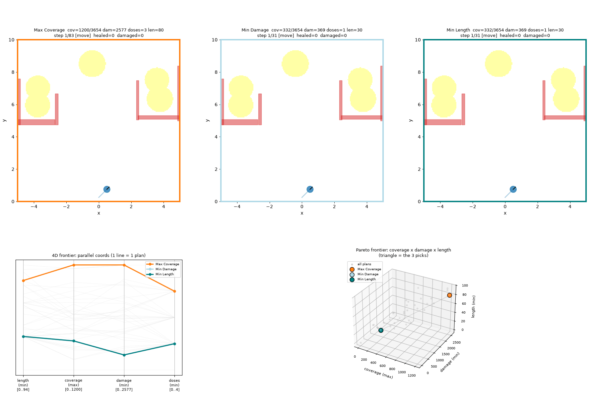
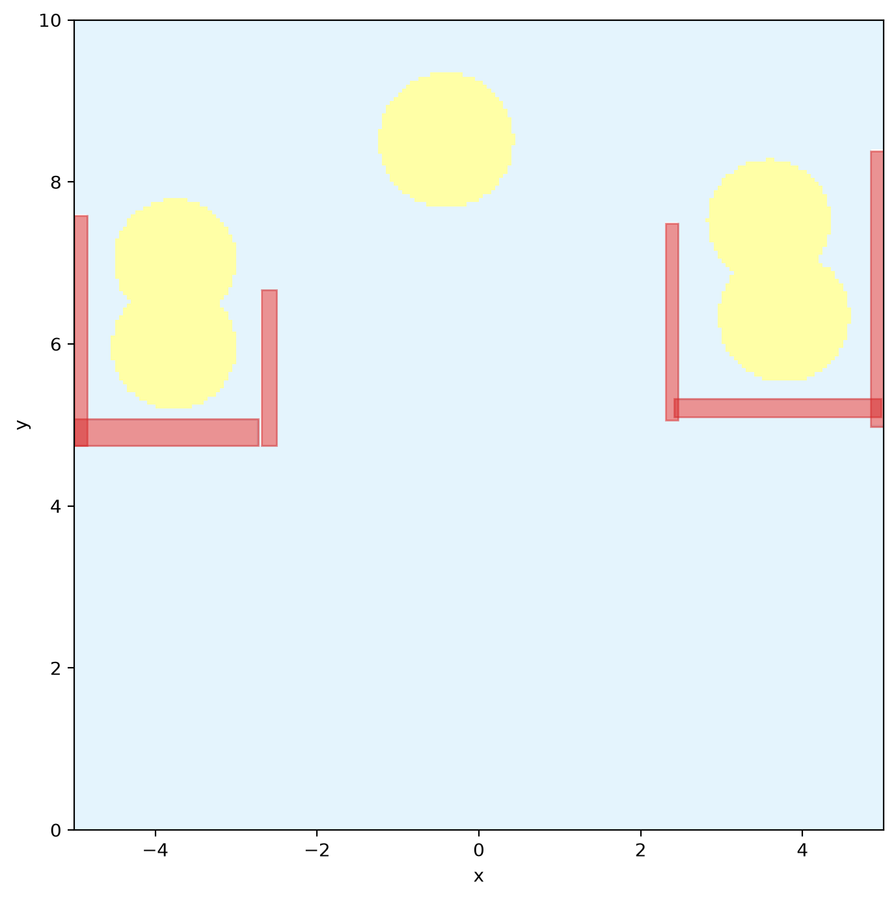
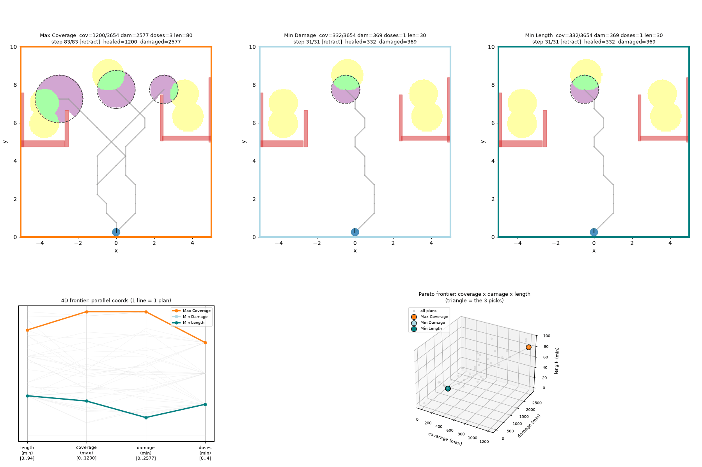
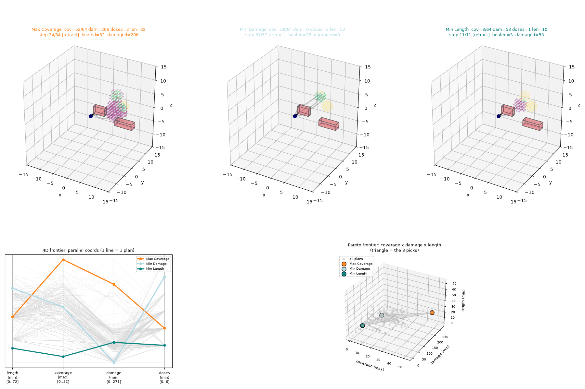
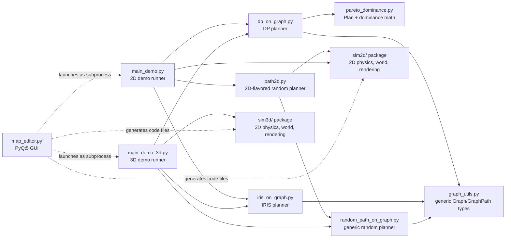

# Robotic Motion Planning Project

A robotic motion-planning sandbox with both 2D (`sim2d`) and 3D (`sim3d`)
simulation environments, sharing three planners that operate over the same
geometry-free roadmap graph:

- **`random`** ([random_path_on_graph.py](random_path_on_graph.py)) — a random-walk
  baseline with periodic injection.
- **`iris`** ([iris_on_graph.py](iris_on_graph.py)) — near-optimal single-answer
  inspection planning (maximize POI coverage, then minimize path length), from
  ["Toward Asymptotically-Optimal Inspection Planning via Efficient Near-Optimal
  Graph Search"](https://arxiv.org/abs/1907.00506) (Fu et al.). Full write-up:
  [docs/IRIS_INSPECTION_PLANNER.md](docs/IRIS_INSPECTION_PLANNER.md).
- **`dp`** ([dp_on_graph.py](dp_on_graph.py)) — a bottom-up dynamic-programming
  planner returning the full 4-objective Pareto frontier (length, tumor coverage,
  healthy-tissue damage, dose count) for a steerable-needle therapy tour. Full
  write-up: [docs/DP_THERAPY_PLANNER.md](docs/DP_THERAPY_PLANNER.md).

## See it in action

The DP planner's animated Pareto dashboard — three representative plans
(Max Coverage / Min Damage / Min Length) replaying side by side, with the
full multi-objective frontier plotted below:

| 2D | 3D |
|---|---|
|  |  |

Static snapshots (last dashboard frame, plus the 2D demo map itself) for
pasting into slides/reports where an animated GIF isn't practical:

| 2D map | 2D dashboard (frame) | 3D dashboard (frame) |
|---|---|---|
|  |  |  |

**A full-scale example, saved end to end**: [examples/full_run_3d_steps12/](examples/full_run_3d_steps12/)
is a real, uncapped 3D DP run (193,551 nodes, 897s total) with its complete
`dp_stats.json`/`dp_node_stats.csv` profiling output, dashboard/simulation
GIFs, and saved Pareto frontier — reopen its dashboard without recomputing
anything via `python replay_dashboard.py examples/full_run_3d_steps12/frontier_3d.pkl`.
The findings from analyzing it (where the DP planner's time actually goes,
down to individual roadmap nodes) are written up in
[docs/DP_THERAPY_PLANNER.md](docs/DP_THERAPY_PLANNER.md) §10c.

All three planners consume/produce the same geometry-free types in
[graph_utils.py](graph_utils.py) (`Graph`, `GraphPath`, `GraphPathStep`) and are
themselves geometry-free — they only need a roadmap graph plus per-node
coverage/dosage callbacks, so the exact same planner code runs unmodified over
either the 2D roadmap built by [sim2d/paths_graph.py](sim2d/paths_graph.py) or
the 3D lattice built by [sim3d/paths_graph3d.py](sim3d/paths_graph3d.py).

## How it fits together



`graph_utils.py` and `pareto_dominance.py` know nothing about 2D vs. 3D,
obstacles, or tumors — just abstract nodes and numbers. `sim2d`/`sim3d` know
nothing about planning algorithms — just geometry and physics. The planners
sit in between and know nothing about *either* — they just need "a graph"
and "a function that tells me what a node covers." `main_demo.py`/
`main_demo_3d.py` are the only files that plug all three pieces together.
This separation is why the exact same DP/IRIS code works unchanged in both
2D and 3D — see [docs/CODE_WALKTHROUGH.md](docs/CODE_WALKTHROUGH.md) for a
full, diagram-by-diagram tour of every file in the project.

## Setup

Requires Python 3.10+ (developed and tested on 3.13). Everything below is run
from the repository root; no path in the code depends on where you clone it.

```bash
python -m venv .venv
source .venv/bin/activate   # on Windows: .venv\Scripts\activate
pip install -r requirements.txt              # numpy, matplotlib, imageio, heapdict
pip install -r requirements-map-editor.txt    # + PyQt5, for the map editor GUI
```

**Verify the install** (headless, no GUI needed, finishes in a few seconds):

```bash
python main_demo.py --algo random --steps 20 --no-gui
```

## Running it

**2D demo** — builds a roadmap over the demo map, runs one of the three
planners, and replays the resulting path:

```bash
python main_demo.py --algo dp --steps 15 --seed 0
python main_demo.py --algo iris --steps 60 --seed 0
python main_demo.py --algo random --steps 60 --seed 0
```

**3D demo** — same three planners over a 3D lattice environment; the DP
planner needed zero code changes to work in 3D, confirming the
geometry-free design:

```bash
python main_demo_3d.py --algo dp --steps 12 --no-gui
python main_demo_3d.py --algo iris --steps 12 --no-gui
python main_demo_3d.py --algo random --steps 12 --no-gui
```

**Map editor** — a PyQt5 GUI for authoring maps without writing Python by hand:

```bash
python map_editor.py
```

### Shared demo flags

- **`--algo`**: `iris` (default) | `random` | `dp`.
- **`--steps`**, **`--seed`**, **`--step-size`**: control roadmap generation.
- **`--run-name`**: fixed output folder name; omit to get a unique
  timestamped name per run.
- **`--no-gui`**: headless (still saves the GIF, doesn't open a window).

DP-only flags (see [docs/DP_THERAPY_PLANNER.md](docs/DP_THERAPY_PLANNER.md)
for what each controls): `--eps-len`, `--eps-cov`, `--eps-dam`,
`--eps-ndose`, `--dosage-levels`, `--max-plans-per-node` (pass `none` for an
uncapped frontier), `--depth-scaled-eps`, `--no-reorder-children` (disable
the default strongest-first child-merge order — a scheduling optimization
with no effect on solution validity; see §9.10 of the DP doc).

IRIS-only flags (see [docs/IRIS_INSPECTION_PLANNER.md](docs/IRIS_INSPECTION_PLANNER.md)):
`--max-outer-iters`, `--max-expansions`, `--p0`, `--epsilon0`, `--retract`
(enable retract actions; off by default — can be dramatically slower on maps
with real coverage-seeking search, since it requires the trail-dominance check).

3D-only flags: `--start-x/-y/-z` (override the needle's entry point),
`--no-rotate` (disable the GIF's orbiting camera). Dosage levels are fixed at
`sim3d.paths_graph3d.DOSAGE_LEVELS = (0, 1, 2, 3)` in 3D, so there's no
`--dosage-levels` override there. `view_3d.py` is a standalone interactive
viewer (`matplotlib` slider) for replaying a saved `path.json` without
rerunning the planner.

### Output layout

Every demo run writes under `outputs/<algo>/<dim>/<run_name>/`, e.g.
`outputs/dp/2d/20260716-153000_seed0_steps15/` or `outputs/iris/3d/.../` —
grouped by algorithm first, then dimension, so every run of a given planner
sits together regardless of which demo script produced it. Each run folder
contains `path.json`, a `simulation[_3d].gif` replay, and (DP only)
`frontier[_3d].pkl` + `dashboard[_3d].gif` — reopen a saved DP frontier
anytime with `python replay_dashboard.py <path-to-frontier.pkl>`, no
recomputation needed. Every run (2D and 3D) also appends one summary row to
the shared `outputs/runs_index.csv`.

**DP runs also get profiling output**: `dp_stats.json` (per-phase timing,
total dominance comparisons, peak Pareto-frontier size, peak memory) and
`dp_node_stats.csv` (the same breakdown per individual graph node) — see
[docs/DP_THERAPY_PLANNER.md](docs/DP_THERAPY_PLANNER.md) §11a for the full
field list and what each answers about where the DP planner's time/space
actually goes.

## 2D and 3D simulation packages

- **`sim2d`** — `World2D` (obstacles + a circular robot), 8-way discrete
  motion primitives, tumor/healthy-tissue grids for the DP dosage objective.
- **`sim3d`** — mirrors `sim2d` in three dimensions: `World3D` (box/sphere
  obstacles, voxel-grid tumors + healthy tissue), a 26-direction lattice of
  motion primitives, and `matplotlib` `Axes3D` rendering.

Both packages are purely geometry/physics — they know nothing about
planning algorithms. `path2d.py` is the thin 2D-flavored translation layer
between a planner's abstract `GraphPath` output and the `(x, y, theta)`
steps the 2D replay window draws; 3D has an equivalent converter in
`sim3d/path3d.py`.

## Map editor (`map_editor.py`)

A PyQt5 GUI for authoring maps without writing Python by hand: draw
obstacles/tumors on a 2D canvas, or (3D mode) add boxes/spheres/tumors via
numeric-entry dialogs and then manipulate them live in an embedded,
interactive 3D canvas (`matplotlib`'s `Qt5Agg` backend) — select a shape from
the list, then use the arrow keys + PageUp/PageDown to move it, the mouse
wheel to resize it, and Q/W, A/S, Z/X to tilt a box's yaw/pitch/roll. Box
rotation is a real geometric property (it affects collision checks and the
healthy-tissue damage voxel mask, not just the rendering — see
`sim3d.obstacles3d.rotation_matrix`), not a cosmetic preview effect.

Save+Run writes `sim2d/demo_map.py` or `sim3d/demo_map3d.py`, snapshots the
map under `maps/map_NNN/`, and launches `main_demo.py`/`main_demo_3d.py` with
the chosen planner's flags (`dp`/`iris`/`random` are all available in both
2D and 3D mode via the shared planner panel). See the module docstring for
the full key map.

**Look and feel**: a single centralized theme (`map_editor_theme.py`) drives
the whole app's colors and typography — dark by default, with a light theme
available from the settings dialog (gear icon in the toolbar). Font size is
adjustable (toolbar A-/A+, or a slider in settings) and persists across
restarts. Every toolbar icon is drawn programmatically at startup
(`map_editor_icons.py` — no external image assets), and switching modes or
opening settings uses a subtle fade rather than an instant cut.

## Documentation

- [docs/CODE_WALKTHROUGH.md](docs/CODE_WALKTHROUGH.md) — a full,
  diagram-by-diagram, function-by-function tour of every file in the
  project, written to be readable without prior Python experience.
- [docs/DP_THERAPY_PLANNER.md](docs/DP_THERAPY_PLANNER.md) — complete
  implementation guide for the DP multi-objective planner.
- [docs/IRIS_INSPECTION_PLANNER.md](docs/IRIS_INSPECTION_PLANNER.md) —
  complete implementation guide for the IRIS inspection planner.

## Repository map

| Path | Role |
|---|---|
| `sim2d/` | 2D world/robot/obstacle simulation, roadmap graph construction, replay & logging |
| `sim3d/` | 3D mirror of `sim2d` — voxel-grid tumors/healthy tissue, 26-direction lattice motion, `Axes3D` rendering |
| `graph_utils.py` | Geometry-free `Graph`, `GraphPath`, `GraphPathStep` shared by every planner (2D and 3D) |
| `random_path_on_graph.py`, `path2d.py` | Random-walk baseline planner + its 2D replay-format translation layer |
| `iris_on_graph.py` | Single-answer inspection planner (§ [docs/IRIS_INSPECTION_PLANNER.md](docs/IRIS_INSPECTION_PLANNER.md)) |
| `pareto_dominance.py`, `dp_on_graph.py` | Multi-objective DP planner (§ [docs/DP_THERAPY_PLANNER.md](docs/DP_THERAPY_PLANNER.md)) |
| `main_demo.py` | CLI entry point wiring 2D map → graph → planner → replay for all three planners |
| `main_demo_3d.py`, `view_3d.py` | 3D CLI entry point + standalone path viewer |
| `replay_dashboard.py` | Reopen a saved DP Pareto-frontier dashboard without recomputing |
| `map_editor.py` | PyQt5 GUI map authoring (2D canvas + 3D numeric-entry mode) |
| `map_editor_theme.py`, `map_editor_icons.py` | Centralized colors/typography and programmatically-drawn toolbar icons for the map editor |
| `docs/` | Deep-dive documentation (code walkthrough, DP and IRIS implementation guides) |
| `examples/` | Curated sample outputs (Pareto dashboard GIFs, static frames, demo map, and a full-scale profiled 3D run) |
