# Code Walkthrough

A step-by-step, function-by-function tour of the codebase, written for someone
who isn't yet fluent in Python. Each function/class gets: a diagram showing
its shape or logic, short pseudocode, and a brief explanation of the core
idea plus any genuinely non-obvious Python concepts.

**How to read the diagrams:**
- A single box listing fields (a "structure card") describes a *data shape*
  — what fields something holds. It doesn't show behavior over time, just
  structure. Used for classes that are mainly just "bags of data."
- Multiple connected boxes with arrows describe *logic* — the step-by-step
  decisions a function makes when it runs, in order, top to bottom. Diamond
  shapes are yes/no decision points.

**How to read the pseudocode:** it's not real Python — type hints,
decorators, and Python-specific syntax are dropped so the logic itself
stays front and center. Open the actual file if you want exact syntax.

**Progress:**
- [x] 0. How the files connect
- [x] 1. `graph_utils.py`
- [x] 2. `sim2d/` package
- [x] 3. `sim3d/` package
- [x] 4. `pareto_dominance.py`
- [x] 5. `dp_on_graph.py`
- [x] 6. `iris_on_graph.py`
- [x] 7. `path2d.py` / `random_path_on_graph.py`
- [x] 8. `main_demo.py` / `main_demo_3d.py`
- [x] 9. `view_3d.py` / `replay_dashboard.py`
- [x] 10. `map_editor.py`

---

## 0. How the files connect

An arrow from A to B means "A imports code from B" (A can't run without B).
Dashed arrows are *not* Python imports — `map_editor.py` never actually
imports the simulation code; it generates Python source files as text, and
separately launches the demo runners as brand-new processes.

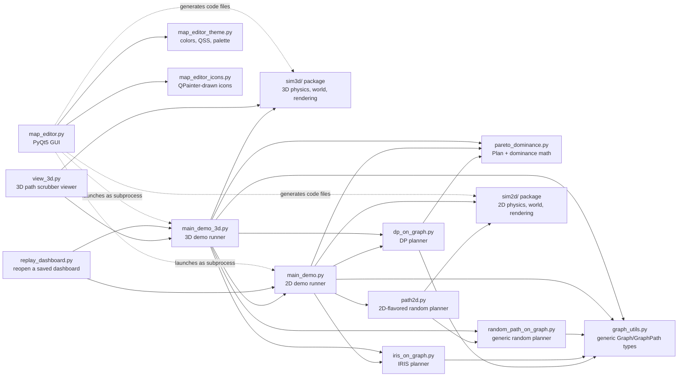

**The key idea:** `graph_utils.py` and `pareto_dominance.py` know nothing
about 2D vs. 3D, obstacles, or tumors — just abstract nodes and numbers.
`sim2d/`/`sim3d/` know nothing about planning algorithms — just geometry
and physics. The planners sit in between and know nothing about *either* —
they just need "a graph" and "a function that tells me what a node
covers." `main_demo.py`/`main_demo_3d.py` are the only files that plug all
three pieces together. This separation is why the exact same DP/IRIS code
works unchanged in both 2D and 3D.

---

## 1. `graph_utils.py`

**What this file is for:** the generic graph representation the DP, IRIS,
and random planners all share. Knows nothing about coordinates, physics, or
dimensions — just "nodes" and "which nodes connect to which." The
foundation everything else builds on.

`from __future__ import annotations` (seen at the top of nearly every file
in this project) tells Python not to evaluate type hints immediately — this
matters for classes that reference themselves, or each other, in their own
type hints. `NodeId` is a **generic type placeholder** — a stand-in that
gets filled in with a concrete type later (here, `(x, y, orientation)`
tuples in 2D or `(x, y, z, orientation)` in 3D); this file doesn't need to
know which.

### `Graph`

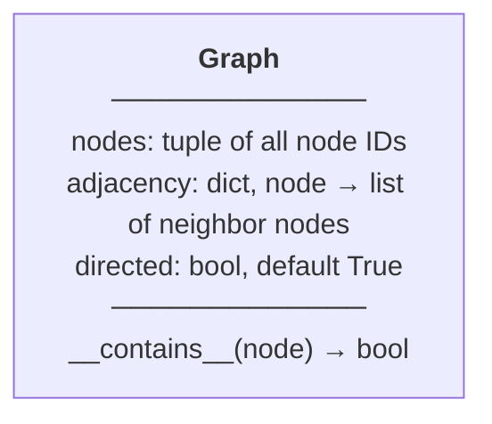

```
class Graph (immutable):
    nodes             # tuple of all node IDs
    adjacency         # dict: node -> list of neighbor nodes
    directed = True

    contains(node):
        return node in set(nodes)
```

**Core purpose:** the entire graph — a list of nodes plus, per node, its
neighbors. Deliberately "dumb" (no geometry) so the same class works for 2D
and 3D.

- Immutable (`frozen`) so nothing downstream can accidentally corrupt it.
- `contains` backs Python's `in` operator (`node in my_graph` runs this
  automatically) — converts to a set first for O(1) lookup instead of
  scanning the whole tuple.

### `GraphPathStep`

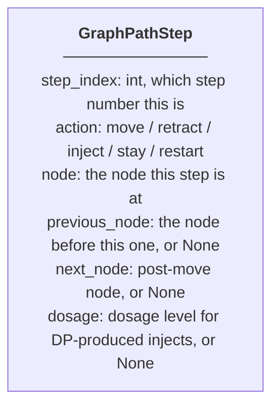

```
class GraphPathStep (immutable):
    step_index
    action              # "move" | "retract" | "inject" | "stay" | "restart"
    node
    previous_node       # or none, for the very first step
    next_node = none     # set only for "move" steps
    dosage = none         # set only for DP-produced "inject" steps
```

One single step the robot took. `next_node`/`dosage` are optional extras
only certain action types use — `None` is Python's "nothing here" value.

### `GraphPath`

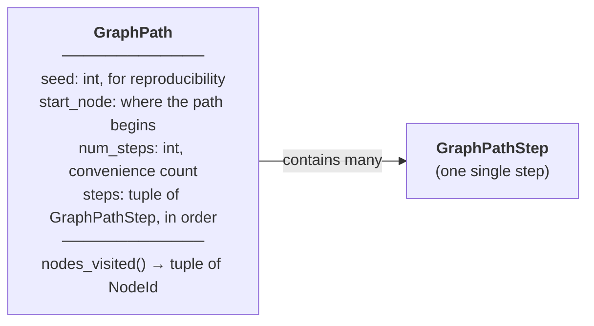

```
class GraphPath (immutable):
    seed, start_node, num_steps
    steps                # ordered tuple of GraphPathStep

    nodes_visited():       # a "property" -- called like an attribute, no parentheses
        return [s.node for each s in steps]
```

The whole plan, start to finish. `nodes_visited` is computed on demand
(via Python's `@property`) rather than stored — callers don't need to know
whether something is stored data or computed on the fly.

### `build_adjacency`

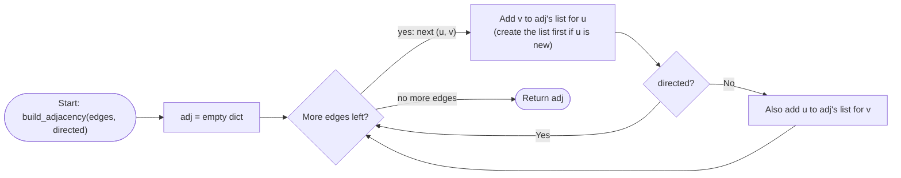

```
function build_adjacency(edges, directed=True):
    adj = {}
    for (u, v) in edges:
        adj[u].append(v)          # create adj[u] = [] first if new (dict.setdefault)
        if not directed:
            adj[v].append(u)      # undirected: also record the reverse edge
    return adj
```

Turns a flat edge list into the node→neighbors dict `Graph` expects. The
one Python idiom worth knowing: `dict.setdefault(key, default)` — "give me
`key`'s value, creating it as `default` first if it doesn't exist yet" —
is what makes `adj[u].append(v)` work without a separate
"if u not in adj: adj[u] = []" line.

### `graph_from_edges`

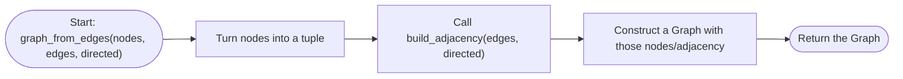

```
function graph_from_edges(nodes, edges, directed=True):
    return Graph(nodes=tuple(nodes), adjacency=build_adjacency(edges, directed), directed=directed)
```

A convenience wrapper combining the two steps above into one call.

---

## 2. `sim2d/` package

**What this package is for:** everything about the 2D physical world — the
robot, obstacles, the tumor grid, collision checking, rendering, and
turning "one step" into a graph of reachable positions. Knows nothing about
planning algorithms.

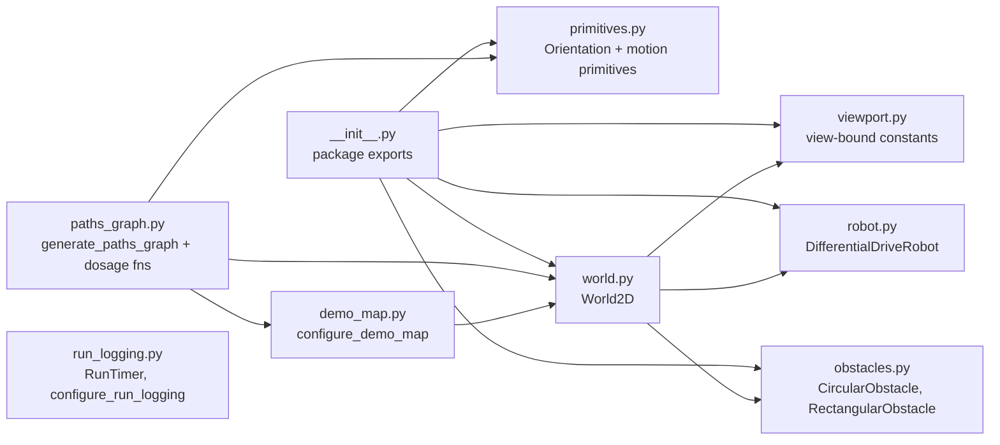

`run_logging.py` isn't in this diagram — it's a standalone logging utility
`main_demo.py` happens to import from here, not depended on by anything
else in the package.

### 2.1 `sim2d/viewport.py`

Two constants: `DEFAULT_VIEW_X_LIMITS = (-5, 5)`, `DEFAULT_VIEW_Y_LIMITS =
(0, 10)` — the default world rectangle. Used for the matplotlib view,
collision bounds, and tumor grid sizing, so the plot's visible area and the
world's actual physical bounds can never silently drift apart.

### 2.2 `sim2d/robot.py`

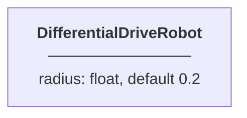

```
class DifferentialDriveRobot:
    radius = 0.2
```

The robot's physical footprint — just a circle of this radius, used
everywhere collision-checking or drawing needs to know "how much space does
the robot take up."

### 2.3 `sim2d/primitives.py`

Defines *what one step of motion can be*. Everything the planners do,
ultimately, is choose from these fixed options over and over.

#### `Orientation`

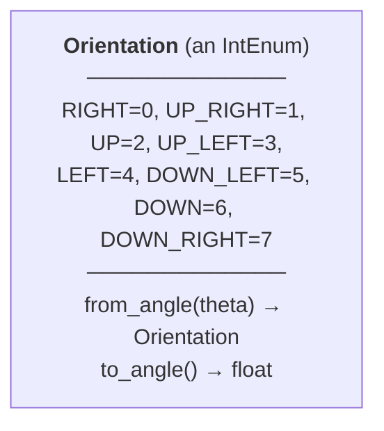

```
enum Orientation: RIGHT=0, UP_RIGHT=1, UP=2, UP_LEFT=3, LEFT=4, DOWN_LEFT=5, DOWN=6, DOWN_RIGHT=7

from_angle(theta):
    return round(theta / 45deg) mod 8      # nearest of the 8 headings

to_angle():
    return value * 45deg
```

The robot can only face one of 8 compass directions (45° apart), not a
continuous angle — keeps the branching factor small and finite. `IntEnum`
means these names *are* plain integers under the hood (`Orientation.UP ==
2`), so arithmetic like `(k + 1) % 8` works directly on them.

#### `MotionPrimitive`

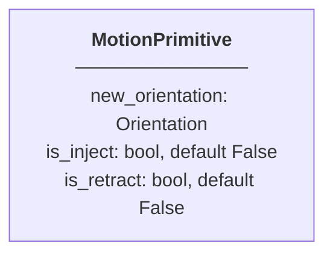

```
class MotionPrimitive (immutable):
    new_orientation
    is_inject = False
    is_retract = False
```

One atomic action: move (turn then step), inject (stay put), or retract
(step back through history). Neither flag set = a plain move.

#### `allowed_primitives`, `inject_primitive`, `retract_primitive`


```
function allowed_primitives(current_orientation):
    k = current_orientation as an integer
    return [turn(k-1), turn(k), turn(k+1)]      # each wrapped mod 8, no inject/retract flags

function inject_primitive(orientation): return MotionPrimitive(orientation, is_inject=True)
function retract_primitive(orientation): return MotionPrimitive(orientation, is_retract=True)
```

Exactly 3 legal moves from any heading (turn ±45° or go straight) — *the*
branching-factor decision for the whole 2D search space, and what
determines how fast the paths graph grows with `steps`. `% 8` wraps
negative/overflowing values back into range (Python's `%` always returns a
non-negative result here, unlike some other languages).

#### `apply_primitive`

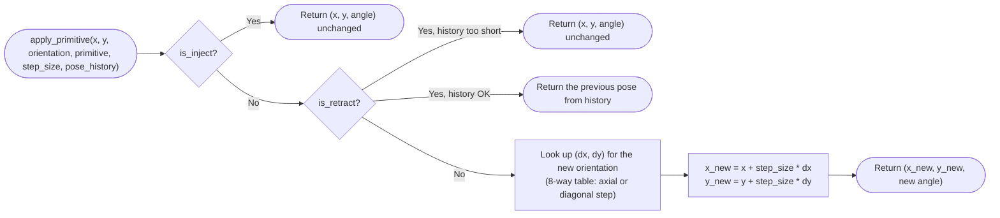

```
function apply_primitive(x, y, orientation, primitive, step_size, pose_history):
    if primitive.is_inject:
        return (x, y, orientation)                  # no movement

    if primitive.is_retract:
        if pose_history has fewer than 2 entries: return (x, y, orientation)   # no-op
        return the second-to-last pose in pose_history

    (dx, dy) = lookup table for primitive.new_orientation      # one of 8 fixed directions
    return (x + step_size*dx, y + step_size*dy, primitive.new_orientation.to_angle())
```

The actual physics — turns an abstract "move" decision into real
coordinates. Diagonal moves use `(1, 1)`, **not normalized** — a diagonal
step physically covers `sqrt(2) ≈ 1.41×` further than an axial one, a
deliberate grid-motion simplification rather than a unit-speed model.
`pose_history[-2]` (Python's negative indexing = "from the end") is the
pose *before* the current one, since `[-1]` would be the current pose
itself.

### 2.4 `sim2d/obstacles.py`

#### `CircularObstacle`

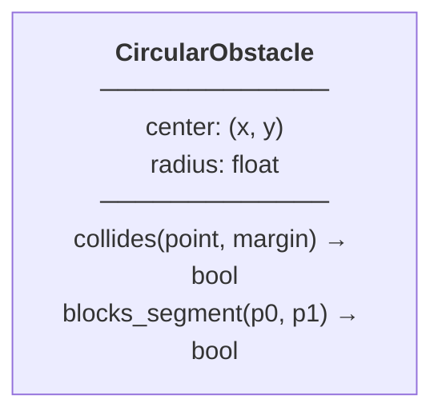

```
class CircularObstacle:
    center, radius

    collides(point, margin=0):
        return distance(point, center) <= radius + margin

    blocks_segment(p0, p1):
        if p0 and p1 are ~the same point: return collides(p0)
        find the closest point on segment p0->p1 to center (clamped to the segment's ends)
        return that closest point is within radius
```

**`collides`** = is a point (optionally padded by a safety `margin`, e.g.
the robot's own radius) inside this circle? **`blocks_segment`** is the
function behind the injection-radius/line-of-sight fix — "does this whole
line pass through the circle" instead of "is one point inside it." It
projects the circle's center onto the segment (clamped so the "closest
point" can't fall before/after the segment's actual endpoints), then
checks that projected point against the radius.

#### `RectangularObstacle`

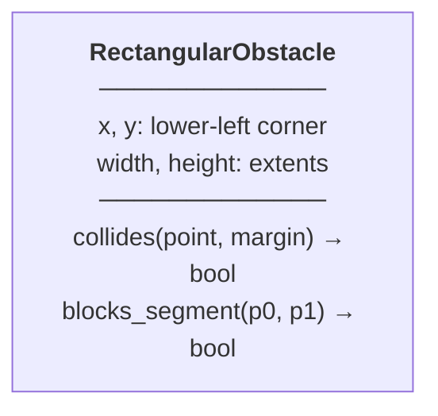

```
class RectangularObstacle:
    x, y, width, height

    collides(point, margin=0):
        return point's x and y both fall within the (padded) box edges

    blocks_segment(p0, p1):
        # Liang-Barsky clipping: narrow a "still possibly inside" range [t0, t1]
        # (as fractions along the segment, 0 = p0, 1 = p1) against each of the 4 box edges
        for each of the 4 edges:
            if segment runs exactly parallel to this edge and is on the wrong side: return False
            else narrow [t0, t1] to this edge's valid side; bail out early if it becomes empty
        return t0 <= t1
```

Same "does this line cross this shape" job as the circle's version,
different shape, via a standard computer-graphics algorithm (**Liang-Barsky
clipping**). Worth recognizing the pattern — shrink a valid range, bail out
the moment it's empty — rather than memorizing the formula.

---

### 2.5 `sim2d/world.py` — the `World2D` class

The biggest file in the package (21 methods). `World2D` owns everything
about a running simulation: robot state, obstacles/tumors, and how to draw
it all.

#### The class fields

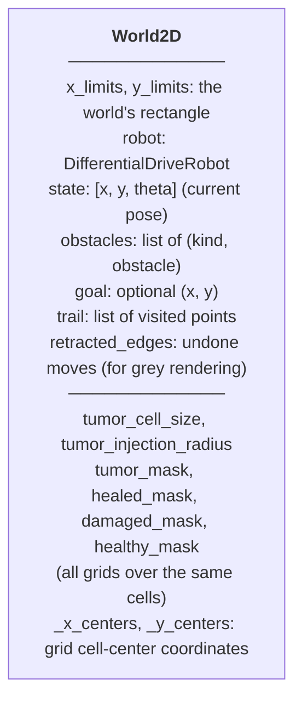

```
class World2D:
    x_limits, y_limits, robot, state = [0, 0, 0]
    obstacles = []              # list of (kind, obstacle) pairs
    goal = none
    trail = [], retracted_edges = []
    tumor_cell_size, tumor_injection_radius
    tumor_mask, healed_mask, damaged_mask, healthy_mask = none    # 2D grids, all same shape
    _x_centers, _y_centers = none
```

Owns everything about one running simulation. `tumor_mask`/`healed_mask`/
`damaged_mask`/`healthy_mask` are all boolean grids over the *same* cells —
same shape, same `[iy, ix]` indexing convention (image-style: row, then
column).

#### Simple setters

```
set_robot_state(x, y, theta): state = [x, y, theta]
add_circular_obstacle(center, radius): obstacles.append(("circle", CircularObstacle(...)))
add_rectangular_obstacle(x, y, w, h): obstacles.append(("rect", RectangularObstacle(...)))
set_goal(gx, gy): goal = (gx, gy)
```

Obstacles are stored as a tagged `(kind, object)` pair, not a bare object —
so later code (`in_collision`, `render`) can tell circles from rectangles
by checking a string, instead of type-checking every entry.

#### Trail bookkeeping

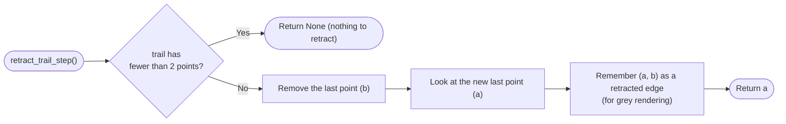

```
reset_trail(): trail = [], retracted_edges = []
append_trail_point(x, y): trail.append((x, y))

retract_trail_step():
    if trail has fewer than 2 points: return none
    b = remove the last point from trail
    a = new last point in trail
    retracted_edges.append((a, b))     # so it can render in grey, not just vanish
    return a
```

`trail` is the ongoing record of where the robot's physically been — used
both for the blue path line and (via `apply_primitive`'s `pose_history`)
for knowing where to retract back to.

#### `ensure_tumor_grid`

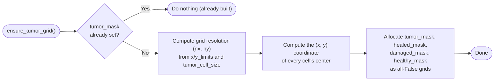

```
ensure_tumor_grid():
    if already built: return
    compute grid resolution (nx, ny) from world size / cell_size
    compute every cell's center coordinate (one vectorized array op, no loop)
    allocate tumor_mask, healed_mask, damaged_mask, healthy_mask as all-False grids
```

Lazy build — only runs the first time it's needed. Cell centers are
computed for the *whole grid at once* via a numpy array expression, not a
Python loop.

#### `reset_injection_paint`, `reset_tumor_grid`

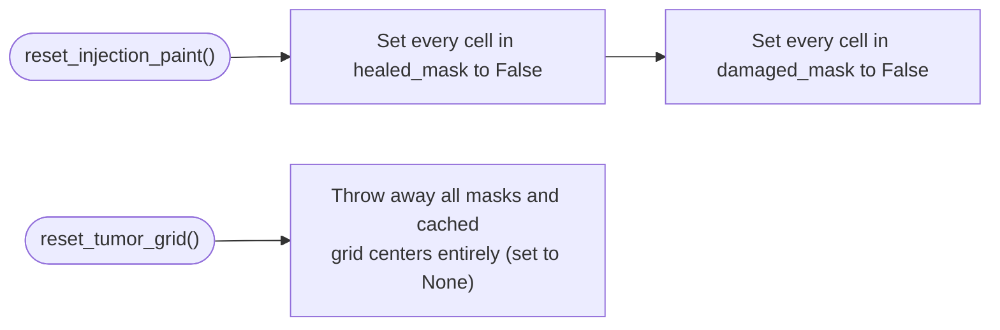

```
reset_injection_paint(): set every cell in healed_mask and damaged_mask back to False
reset_tumor_grid(): drop all masks/centers entirely, forcing a full rebuild next time
```

The difference matters: paint-reset keeps the grid and tumor locations,
just undoes what's *happened* to them (so a path can replay from scratch
without rebuilding the map). Grid-reset is for when the world's size itself
changes.

#### `add_circular_tumor`, `add_rectangular_tumor`

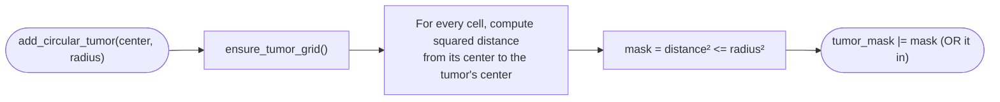

```
add_circular_tumor(center, radius):
    mask = every grid cell whose distance to center <= radius     # whole grid, one expression
    tumor_mask |= mask

add_rectangular_tumor(x, y, w, h):
    mask = every grid cell inside the box
    tumor_mask |= mask
```

First appearance of numpy **broadcasting**, which recurs constantly in this
codebase: reshaping the 1D x-center array into a "row" and the 1D y-center
array into a "column" lets `dx*dx + dy*dy` compute the distance for *every
cell in the grid* in one shot, no explicit loop. `|=` unions the new
tumor region in without erasing tumors added by earlier calls.

#### `compute_healthy_mask`

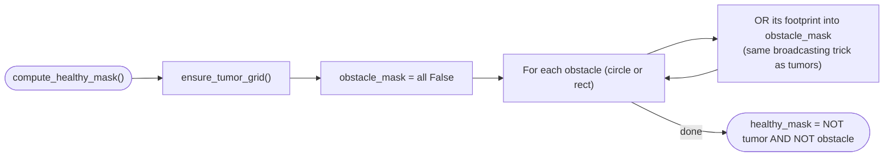

```
compute_healthy_mask():
    obstacle_mask = all False
    for each obstacle: obstacle_mask |= that obstacle's footprint (broadcasting, as above)
    healthy_mask = (NOT tumor_mask) AND (NOT obstacle_mask)
```

Healthy tissue = "neither tumor nor obstacle" — must run after both exist,
since it's defined by subtracting them out.

#### `inject_at`

The method behind the injection-radius/occlusion bug fix from earlier.

```mermaid
flowchart LR
    Start(["inject_at(x, y, radius)"]) --> Ensure["ensure_tumor_grid()"]
    Ensure --> Circle["radius_mask = every cell within radius of (x, y)<br/>(broadcasting distance check)"]
    Circle --> HasObs{"any obstacles<br/>in the world?"}
    HasObs -->|"Yes"| Occlude["For each cell inside the radius:<br/>if a wall blocks line-of-sight to it,<br/>remove it from radius_mask"]
    HasObs -->|"No"| Heal
    Occlude --> Heal["heal_targets = in-radius AND tumor AND not-yet-healed<br/>Mark those cells healed; make sure they're not purple"]
    Heal --> Damage(["purple_targets = in-radius AND NOT tumor<br/>Mark those cells damaged"])
```

```
inject_at(x, y, radius):
    radius_mask = every cell within radius of (x, y)
    if there are obstacles:
        for each cell currently in radius_mask:
            if a wall blocks line-of-sight from (x,y) to that cell: remove it from radius_mask
    heal_targets = radius_mask AND tumor AND not already healed
    mark heal_targets healed; make sure none are marked damaged
    purple_targets = radius_mask AND NOT tumor
    mark purple_targets damaged
```

Cells geometrically in range but blocked by a wall get excluded *before*
healing/damage is applied — that's the fix. `np.nonzero` on a boolean mask
returns the coordinates of every `True` cell, used here to iterate only
the in-radius cells instead of the whole grid.

#### `_center_to_index`, `paint_injection_cells`

```
_center_to_index(cx, cy):
    if grid not built: return none
    reverse the cell-center formula to recover grid indices (ix, iy)
    return (iy, ix) if in bounds, else none

paint_injection_cells(covered_centers, damaged_centers):
    for each center in covered_centers: mark that cell healed (not damaged)
    for each center in damaged_centers: if not tumor, mark that cell damaged
```

`_center_to_index` is the inverse of `ensure_tumor_grid`'s center
computation. `paint_injection_cells` paints an *explicit* set of cells
instead of a fixed radius — used to replay exactly what the DP planner
counted per dosage level, which a plain circle can't reproduce.

#### `in_collision`, `line_of_sight_blocked`, `distance_to_goal`

```mermaid
flowchart LR
    Start(["in_collision(state)"]) --> Bounds{"Outside world bounds<br/>(padded by robot radius)?"}
    Bounds -->|"Yes"| True1(["Return True"])
    Bounds -->|"No"| ObsLoop["For each obstacle: does it collide<br/>with the (padded) robot here?"]
    ObsLoop -->|"any yes"| True2(["Return True"])
    ObsLoop -->|"none"| False1(["Return False"])
```

```
in_collision(state = self.state):
    if outside world bounds (padded by robot radius): return True
    for each obstacle: if obstacle.collides(position, margin=robot radius): return True
    return False

line_of_sight_blocked(p0, p1): return any obstacle blocks_segment(p0, p1)

distance_to_goal(): return none if no goal, else straight-line distance to it
```

`in_collision` is the single yes/no question the whole planning pipeline
depends on. `line_of_sight_blocked` is the world-level entry point for the
occlusion check, delegating to whichever obstacle's `blocks_segment`.

#### `render`

```mermaid
flowchart LR
    Start(["render(ax, clear, show_*)"]) --> GetAxes{"ax given?"}
    GetAxes -->|"No"| NewFig["Create a new figure/axes"]
    GetAxes -->|"Yes"| UseGiven["Use the given axes"]
    NewFig --> ClearCheck
    UseGiven --> ClearCheck{"clear?"}
    ClearCheck -->|"Yes"| Clear["ax.cla() -- wipe previous drawing"]
    ClearCheck -->|"No"| SetLimits
    Clear --> SetLimits["Set axis limits + equal aspect ratio"]
    SetLimits --> HealthyLayer["Optionally draw a faint healthy-tissue overlay"]
    HealthyLayer --> TumorLayer["Draw the tumor grid: yellow / green / purple"]
    TumorLayer --> ObsLayer["Draw every obstacle (red circle/rectangle)"]
    ObsLayer --> TrailLayer["Draw the trail (blue line) +<br/>retracted edges (grey lines)"]
    TrailLayer --> RobotLayer["Draw the robot (blue circle + heading line)"]
    RobotLayer --> GoalLayer["Draw the goal (green circle), if any"]
    GoalLayer --> Labels["Set axis labels"]
    Labels --> Return(["Return ax"])
```

```
render(ax, clear, show_*):
    get or create axes; clear if requested
    set axis limits + equal aspect ratio
    optionally draw a faint healthy-tissue overlay
    draw tumor grid: yellow (tumor) / green (healed) / purple (damaged)
    draw every obstacle
    draw trail (blue) + retracted edges (grey)
    draw robot (circle + heading line)
    draw goal, if any
```

Mostly "draw layer A, then B, then C" in order — the diagram is the useful
part here. Two numpy details worth knowing: the tumor grid is built as one
RGBA image array (`img[yellow, 0] = 1.0`, etc. — boolean-mask indexing sets
color only where the mask is `True`) and shown via `imshow`, rather than
one shape drawn per cell; `ax.set_aspect("equal", "box")` forces circles to
actually look circular instead of squashed.

### 2.6 `sim2d/demo_map.py`

```mermaid
flowchart LR
    Start(["configure_demo_map(world, start_x, start_y)"]) --> Bounds["Set world.x_limits, y_limits"]
    Bounds --> AddObs{"add_obstacles?"}
    AddObs -->|"Yes"| Obs["Add 6 rectangular wall obstacles<br/>(hardcoded positions)"]
    AddObs -->|"No"| AddTum
    Obs --> AddTum{"add_tumors?"}
    AddTum -->|"No"| Done(["Done"])
    AddTum -->|"Yes"| Reset["reset_tumor_grid()"]
    Reset --> Tumors["Add 5 circular tumors<br/>(hardcoded positions)"]
    Tumors --> AddHealthy{"add_healthy?"}
    AddHealthy -->|"Yes"| Healthy["compute_healthy_mask()"]
    AddHealthy -->|"No"| Done
    Healthy --> Done
```

```
configure_demo_map(world, start_x, start_y, add_obstacles=True, add_tumors=True, add_healthy=True):
    set world bounds
    if add_obstacles: add ~6 hardcoded rectangular walls
    if not add_tumors: return
    reset_tumor_grid()
    add ~5 hardcoded circular tumors
    if add_healthy: compute_healthy_mask()
```

This file is *generated* by the map editor GUI, not hand-written — the
oddly-precise decimal coordinates are the giveaway. Whatever map you last
drew and saved becomes this file's contents.

### 2.7 `sim2d/paths_graph.py`

**What this file is for:** turns "one step of motion" into a full **graph**
of reachable positions, where each node also knows what it can heal and
damage. Where geometry (`world.py`) and the abstract planning graph
(`graph_utils.py`) actually meet.

#### `dosage_to_radius`

```mermaid
flowchart LR
    Start(["dosage_to_radius(dose)"]) --> Zero{"dose <= 0?"}
    Zero -->|"Yes"| ReturnZero(["Return (0.0, 0.0)"])
    Zero -->|"No"| Formula["radius = 0.5 + 0.25 * dose"]
    Formula --> ReturnBoth(["Return (radius, radius)"])
```

```
dosage_to_radius(dose):
    if dose <= 0: return (0, 0)
    r = 0.5 + 0.25*dose
    return (r, r)          # same radius used for both coverage and damage
```

The DP planner chooses not just *whether* to inject but *how much* (dose
0–3). Bigger dose = bigger radius = more tumor coverage but also more
healthy-tissue damage — the central trade-off the whole project is about.
Right after this function, a module-level check (running once at import
time, not inside any function) asserts the radius is non-decreasing in
dose — a standing sanity guard that would crash on import if ever broken.

#### `inject_coverage`, `make_inject_coverage_fn`

```
inject_coverage(node): return node["inject_coverage"] as a set
make_inject_coverage_fn(nodes): returns a function: node_id -> inject_coverage(nodes[node_id])
```

A *node* is just a plain dict (built by `_build_node_dict`, below).
`make_inject_coverage_fn` is a **closure factory** — it returns a brand
new function that "remembers" `nodes` even after the factory itself has
finished running, so planners can be handed a simple lookup function
without needing to know anything about dicts or geometry.

#### `_offsets_for_radius`

```mermaid
flowchart LR
    Start(["_offsets_for_radius(nx, ny, cell_size_x, cell_size_y, r)"]) --> Bound["rx, ry = how many cells<br/>r could possibly reach in x/y"]
    Bound --> LoopY["For each row offset diy in -ry..ry"]
    LoopY --> LoopX["For each column offset dix in -rx..rx"]
    LoopX --> Check{"Actual physical distance<br/>for (dix, diy) <= r?"}
    Check -->|"Yes"| Keep["Add (dix, diy) to the list"]
    Check -->|"No"| LoopX
    Keep --> LoopX
    LoopX -->|"row done"| LoopY
    LoopY -->|"done"| Return(["Return the offset list"])
```

```
_offsets_for_radius(nx, ny, cell_size_x, cell_size_y, r):     # cached
    for each candidate offset (dix, diy) in a bounding box sized to r:
        keep it if its actual physical distance <= r
    return the kept offsets
```

Precompute, once per radius, which *relative* grid-index offsets fall
inside a circle of that radius — so later scans only touch nearby cells
instead of the whole grid. `@lru_cache` memoizes: called again with the
same arguments, Python returns the cached result instantly.

#### `_scan_mask_within_radius`

```mermaid
flowchart LR
    Start(["_scan_mask_within_radius(x, y, world, mask, radius)"]) --> Guard{"grid/mask missing<br/>or radius <= 0?"}
    Guard -->|"Yes"| Empty(["Return empty set"])
    Guard -->|"No"| Nearest["Find the grid cell nearest (x, y)"]
    Nearest --> GetOffsets["Get precomputed offsets for this radius<br/>(_offsets_for_radius)"]
    GetOffsets --> Loop["For each offset (dix, diy)"]
    Loop --> InBounds{"Resulting cell in bounds<br/>and mask[cell] is True?"}
    InBounds -->|"No"| Loop
    InBounds -->|"Yes"| Occluded{"Line of sight<br/>to that cell blocked?"}
    Occluded -->|"Yes"| Loop
    Occluded -->|"No"| Add["Add that cell's center to the result set"]
    Add --> Loop
    Loop -->|"done"| Return(["Return the set of hit cell centers"])
```

```
_scan_mask_within_radius(x, y, world, mask, radius):
    find the grid cell nearest (x, y)
    for each precomputed offset within radius:
        cell = nearest cell + offset
        if in bounds AND mask[cell] AND not blocked by a wall:
            add that cell's center to the result
    return result
```

The shared engine behind both coverage and damage scans at graph-build
time — same occlusion idea as `inject_at`, but using the offset-list
shortcut instead of scanning the whole grid.

#### `compute_dosage_coverage_and_damage_for_xy`, `dosage_coverage`, `dosage_damage`, `make_dosage_fn`

```mermaid
flowchart LR
    Start(["compute_dosage_coverage_and_damage_for_xy(x, y, world)"]) --> Loop["For each dose in DOSAGE_LEVELS (0,1,2,3)"]
    Loop --> Radii["cov_r, dam_r = dosage_to_radius(dose)"]
    Radii --> ScanCov["Scan tumor_mask within cov_r → covered"]
    ScanCov --> ScanDam["Scan healthy_mask within dam_r → damaged"]
    ScanDam --> Store["result[dose] = (covered, damaged)"]
    Store --> Loop
    Loop -->|"done"| Return(["Return the whole dict"])
```

```
compute_dosage_coverage_and_damage_for_xy(x, y, world):
    for each dose level:
        (cov_r, dam_r) = dosage_to_radius(dose)
        covered = scan tumor_mask within cov_r
        damaged = scan healthy_mask within dam_r
        result[dose] = (covered, damaged)
    return result

dosage_coverage(node, dose): return node["dosage_coverage"][dose]
dosage_damage(node, dose): return node["dosage_damage"][dose]
make_dosage_fn(nodes): returns a function: (node_id, dose) -> (dosage_coverage, dosage_damage)
```

Precomputes the whole dose→(covered, damaged) table once per node, so the
DP planner never touches geometry again once the graph is built — it just
looks numbers up.

#### `_build_node_dict`

```mermaid
flowchart LR
    Start(["_build_node_dict(x, y, ori, world)"]) --> Legacy["Compute single-radius inject_coverage<br/>(for IRIS/random)"]
    Legacy --> Doses["Compute the full dosage-indexed<br/>coverage/damage table (for DP)"]
    Doses --> Assemble(["Return a dict with<br/>x, y, ori, inject_coverage,<br/>dosage_coverage, dosage_damage"])
```

```
_build_node_dict(x, y, ori, world):
    return {
        x, y, ori,
        inject_coverage: single-radius coverage (for IRIS/random),
        dosage_coverage, dosage_damage: the full dose table (for DP),
    }
```

A graph "node" in this project *is* just a plain dict, not a class —
carries both representations so either planner family can read whichever
one it needs.

#### `generate_paths_graph`

A **breadth-first search (BFS)** outward from the start position, one
primitive-move at a time, up to a depth of `steps`.

```mermaid
flowchart LR
    Start(["generate_paths_graph(steps, step_size, start_x, start_y, start_orientation, world)"]) --> NoWorld{"world given?"}
    NoWorld -->|"No"| Build["Build a default demo world"]
    NoWorld -->|"Yes"| CheckStart
    Build --> CheckStart{"start pose in collision?"}
    CheckStart -->|"Yes"| Empty(["Return empty graph"])
    CheckStart -->|"No"| Init["nodes = {start}, queue = [start], depth = 0"]
    Init --> Loop{"queue not empty?"}
    Loop -->|"No"| Return(["Return (nodes, edges, depth-per-node)"])
    Loop -->|"Yes"| Pop["Take the next node u off the queue"]
    Pop --> DepthCheck{"u's depth >= steps?"}
    DepthCheck -->|"Yes"| Loop
    DepthCheck -->|"No"| Expand["For each of u's 3 allowed primitives"]
    Expand --> Apply["Compute the resulting pose v"]
    Apply --> Collide{"v in collision?"}
    Collide -->|"Yes"| Expand
    Collide -->|"No"| Edge["Record edge u -> v"]
    Edge --> Seen{"v already discovered?"}
    Seen -->|"Yes"| Expand
    Seen -->|"No"| NewNode["Build v's node dict, add to nodes,<br/>push v onto the queue"]
    NewNode --> Expand
    Expand -->|"all 3 done"| Loop
```

```
generate_paths_graph(steps, step_size, start_x, start_y, start_orientation, world):
    if start position in collision: return empty graph
    nodes = {start}; queue = [start]; depth[start] = 0
    while queue not empty:
        u = pop from the front of the queue
        if depth[u] >= steps: continue          # don't expand past the step budget
        for each of u's 3 allowed primitives:
            v = apply_primitive(u, primitive)
            if v in collision: skip this option
            record edge u -> v
            if v not seen before:
                depth[v] = depth[u] + 1
                build v's node dict; add to nodes; push v onto the queue
    return (nodes, edges, depth)
```

Every planner in this project operates on a graph, never directly on the
continuous world — this is how that graph gets built. Coordinates are
rounded to 4 decimals so near-duplicate poses merge into one node. A
`deque` (not a plain list) is used for the queue because removing from its
front is cheap — what makes this breadth-first rather than depth-first.

#### `plot_paths_graph`

```
plot_paths_graph(nodes, edges, distances, ...):
    render the world background
    draw every edge as a thin grey line
    draw every node as a dot, shaded darker the farther it is from start
    draw a star at the start position
    save the figure
```

Debug/visualization only (steps ≤ 5, since the graph gets huge otherwise)
— reuses `World2D.render` for the background.

### 2.8 `sim2d/run_logging.py`

```mermaid
flowchart LR
    Start(["configure_run_logging(run_dir, level, filename, console_level)"]) --> MkDir["Create run_dir if missing"]
    MkDir --> RootLogger["Get Python's root logger"]
    RootLogger --> FileH["Ensure a file handler writing to run_dir/filename"]
    FileH --> StreamH["Ensure a console (stream) handler"]
    StreamH --> Return(["Return the log file's path"])
```

```
configure_run_logging(run_dir, level, filename, console_level):
    create run_dir if missing
    attach a file handler (writes run_dir/filename) and a console handler
    to Python's shared root logger, each at its own verbosity level
    return the log file path

class RunTimer:
    section(name):              # used as: with timer.section("dp"): ...
        record the start time
        yield control to the wrapped code
        always (even on error): add elapsed time to _durations[name]

    log_summary(logger): print total elapsed time + every section's own total
```

Every `run.log` file traces back to `configure_run_logging`; every "Timing
summary" log line traces back to `RunTimer`. `@contextmanager` is what
lets `section` be used with Python's `with` statement — do setup, hand
control to the wrapped code, then always run cleanup, error or not
(`try/finally`).

### 2.9 `sim2d/__init__.py`

Re-exports the package's commonly-used names (`World2D`, `Orientation`,
etc.) so other files can write `from sim2d import World2D` instead of
reaching into individual submodule files. `__all__` documents (and, for
`from sim2d import *`, controls) what counts as the package's public API.

---

## 3. `sim3d/` package

**What this package is for:** the same job as `sim2d/`, one dimension up —
a needle moving through a 3D volume instead of a robot on a 2D plane.
Where the 3D code is structurally identical to its 2D counterpart, we keep
it brief; full attention goes to what's genuinely *different*.

```mermaid
flowchart LR
    PRIM["primitives3d.py<br/>26-direction lattice + turn-limited moves"]
    OBS["obstacles3d.py<br/>SphericalObstacle, rotated BoxObstacle"]
    WORLD["world3d.py<br/>World3D"]
    MAP["demo_map3d.py<br/>configure_demo_map_3d"]
    PATHS["paths_graph3d.py<br/>generate_paths_graph_3d + dosage fns"]
    PATH3D["path3d.py<br/>Path3D, PathStep3D, replay helpers"]
    RENDER["render3d.py<br/>render_world_3d, highlight_obstacle"]
    INIT["__init__.py<br/>package exports"]

    WORLD --> OBS
    MAP --> WORLD
    PATHS --> PRIM
    PATHS --> WORLD
    PATH3D --> WORLD
    RENDER --> OBS
    RENDER --> PRIM
    RENDER --> WORLD
    INIT --> OBS
    INIT --> PRIM
    INIT --> WORLD
    INIT --> MAP
    INIT --> PATHS
    INIT --> PATH3D
    INIT --> RENDER
```

### 3.1 `sim3d/primitives3d.py`

#### The 26-direction lattice

```mermaid
flowchart LR
    Start(["_build_directions()"]) --> LoopXYZ["For every combination of<br/>dx, dy, dz in {-1, 0, 1}"]
    LoopXYZ --> SkipZero{"dx=dy=dz=0?"}
    SkipZero -->|"Yes (no movement)"| LoopXYZ
    SkipZero -->|"No"| Keep["Keep this direction"]
    Keep --> LoopXYZ
    LoopXYZ -->|"done"| Return(["Return all 26 directions"])
```

```
_build_directions():
    return every (dx, dy, dz) combination in {-1,0,1}^3 except (0,0,0)      # 26 directions

DIRECTIONS_3D = _build_directions()
NUM_ORIENTATIONS = 26
DEFAULT_MAX_TURN_DEG = 46 degrees

direction_vector(ori): return DIRECTIONS_3D[ori mod 26]
```

3D has no small named compass like 2D's 8 — instead all 26 neighbor
directions on a 3×3×3 cube are generated (27 combinations minus the
"don't move" one). An "orientation" is just an index into this table.

#### `direction_from_vector`, `orientation_to_heading`

```mermaid
flowchart LR
    Start(["direction_from_vector(vec)"]) --> Norm["Normalize vec to a unit vector u"]
    Norm --> Zero{"u is all zeros?"}
    Zero -->|"Yes"| ReturnZero(["Return orientation 0"])
    Zero -->|"No"| Loop["For each of the 26 lattice directions"]
    Loop --> Dot["Compute how aligned u is with this direction<br/>(dot product of unit vectors)"]
    Dot --> Best{"Better aligned<br/>than the best so far?"}
    Best -->|"Yes"| Update["Remember this as the new best"]
    Best -->|"No"| Loop
    Update --> Loop
    Loop -->|"done"| Return(["Return the index of the<br/>best-aligned direction"])
```

```
_unit(vec): return vec normalized to length 1 (unchanged if already zero-length)

direction_from_vector(vec):
    u = _unit(vec)
    return the index of whichever lattice direction has the highest dot product with u

orientation_to_heading(ori): return _unit(direction_vector(ori))
```

Converts between "an arbitrary real-world direction" and "the closest one
of the 26 fixed lattice directions" — needed because the map editor lets
you point the start heading anywhere. Dot product of two unit vectors =
cosine of the angle between them, so "highest dot product" means "smallest
angle" means "best match."

#### `allowed_orientations`, `allowed_primitives_3d` — the turn-limit cone

```mermaid
flowchart LR
    Start(["allowed_orientations(current_ori, max_turn_deg)"]) --> Cur["cur = unit vector of current direction"]
    Cur --> Thresh["cos_thresh = cos(max_turn_deg)"]
    Thresh --> Loop["For each of the 26 lattice directions"]
    Loop --> Dot["dot = alignment with cur"]
    Dot --> Check{"dot >= cos_thresh?<br/>(within the turn-angle cone)"}
    Check -->|"Yes"| Keep["Keep this direction"]
    Check -->|"No"| Loop
    Keep --> Loop
    Loop -->|"done"| Return(["Return the allowed orientation indices"])
```

```
allowed_orientations(current_ori, max_turn_deg):    # cached
    cur = unit vector of the current heading
    threshold = cos(max_turn_deg)
    return every lattice direction whose dot product with cur >= threshold
```

The 3D analog of 2D's fixed "3 options" — but here it depends on which of
the 26 directions you're currently facing, so it's computed instead of
hardcoded: keep every direction within `max_turn_deg` (46° by default) of
the current heading. This works via a **cosine threshold** rather than
comparing angles directly — cosine decreases as angle increases (over the
relevant range), so "angle ≤ 46°" becomes "dot product ≥ cos(46°)," which
is cheaper to compute for every candidate than a true arccos.

**Why 46°?** It's chosen so an axial heading can turn onto any of its 4
face-diagonal neighbors — the natural 3D generalization of 2D's "turn
±45°" rule. This turn-cone (~4-5 legal directions per step, vs. 2D's fixed
3) is *why* the 3D search space explodes combinatorially with `steps`.

`allowed_primitives_3d`, `inject_primitive_3d`, `retract_primitive_3d`, and
`apply_primitive_3d` otherwise match their 2D counterparts exactly — same
"inject: don't move," "retract: step back through history," "move: look up
direction, step `step_size` along it (not normalized)" structure, just with
a `z` component and 26 possible directions instead of 8.

### 3.2 `sim3d/obstacles3d.py`

#### `SphericalObstacle`

```mermaid
flowchart LR
    S["<b>SphericalObstacle</b><br/>─────────────<br/>center: (x, y, z)<br/>radius: float<br/>─────────────<br/>collides(point, margin) → bool"]
```

Directly the 3D version of `CircularObstacle.collides` — same
distance-vs-radius check, one more axis.

#### `rotation_matrix` and `BoxObstacle`

The genuinely new piece: boxes can be **tilted** (yaw, pitch, roll), real
geometry that affects collision and the healthy-tissue mask, not just
rendering.

```mermaid
flowchart LR
    Start(["rotation_matrix(yaw, pitch, roll)"]) --> Rz["Build Rz: rotation around the z-axis by yaw"]
    Rz --> Ry["Build Ry: rotation around the y-axis by pitch"]
    Ry --> Rx["Build Rx: rotation around the x-axis by roll"]
    Rx --> Combine(["Return Rz @ Ry @ Rx<br/>(apply roll first, then pitch, then yaw)"])
```

```
rotation_matrix(yaw, pitch, roll):
    return Rz(yaw) @ Ry(pitch) @ Rx(roll)      # standard 3x3 rotation matrices, combined

class BoxObstacle:
    x, y, z, width, depth, height, yaw=0, pitch=0, roll=0

    collides(point, margin=0):
        d = point - centroid()
        (lx, ly, lz) = rotation_matrix() transposed, applied to d     # un-rotate into local frame
        return (lx, ly, lz) within the box's half-extents (padded by margin)

    corners():
        take the 8 corners of an unrotated box, rotate them, shift to centroid
```

```mermaid
flowchart LR
    Start(["collides(point, margin)"]) --> Vec["d = vector from the box's center to the point<br/>(in world coordinates)"]
    Vec --> Unrotate["Rotate d backwards (using the rotation's transpose)<br/>to get (lx, ly, lz) in the box's own,<br/>unrotated local frame"]
    Unrotate --> Check(["Now it's a simple axis-aligned box test:<br/>is (lx, ly, lz) within the half-extents?"])
```

`@` is matrix multiplication. The trick in `collides`: instead of rotating
the box (hard), rotate the *point* backwards into the box's own unrotated
frame (easy) — for a pure rotation matrix, "undo the rotation" is just its
transpose, a cheap fact from linear algebra. `corners()` does the mirror
image — rotate an unrotated box's corners forward, then shift to the
box's actual position.

### 3.3 `sim3d/world3d.py` — the `World3D` class

Closely mirrors `World2D`. Same-shaped parts are summarized briefly; full
attention goes to the **voxel-index POI representation** and the
**windowing performance trick** — both genuinely new in 3D.

```mermaid
flowchart LR
    W["<b>World3D</b><br/>─────────────<br/>x/y/z_limits: the world's box<br/>robot: NeedleRobot3D<br/>state: [x, y, z], orientation: int<br/>obstacles: list of (kind, obstacle)<br/>trail, retracted_edges<br/>─────────────<br/>tumor_mask, healed_mask, healthy_mask,<br/>damaged_mask: all 3D voxel grids<br/>_x/_y/_z_centers: voxel-center coordinates"]
```

`set_robot_state`, `add_spherical_obstacle`, `add_box_obstacle`,
`set_goal`, `reset_trail`, `append_trail_point`, `retract_trail_step`,
`ensure_tumor_grid`, `reset_tumor_grid`, `add_ball_tumor` are all direct 3D
equivalents of the same-named `World2D` methods — one more axis, 3D voxel
grids instead of 2D grids. No 3D equivalent of `reset_injection_paint` — 3D
injections always repaint from explicit POI sets (below), so there's
nothing separate to reset.

#### `compute_healthy_mask` — plus rotated-box rasterization

```mermaid
flowchart LR
    Start(["compute_healthy_mask()"]) --> Ensure["ensure_tumor_grid()"]
    Ensure --> Loop["For each obstacle"]
    Loop --> Kind{"sphere or box?"}
    Kind -->|"sphere"| SphereMask["OR in: distance to center <= radius<br/>(broadcasting, same as 2D)"]
    Kind -->|"box"| BoxMask["Un-rotate every voxel's offset from the<br/>box's centroid into its local frame,<br/>then OR in the axis-aligned half-extent test"]
    SphereMask --> Loop
    BoxMask --> Loop
    Loop -->|"done"| Combine(["healthy_mask = NOT tumor AND NOT obstacle"])
```

```
compute_healthy_mask():
    obstacle_mask = all False
    for each obstacle:
        if sphere: OR in "distance to center <= radius" (whole grid at once)
        if box: un-rotate every voxel's offset into the box's local frame,
                OR in the axis-aligned half-extent test
    healthy_mask = (NOT tumor) AND (NOT obstacle_mask)
```

Same "neither tumor nor obstacle" idea as 2D; the box case reuses
`BoxObstacle.collides`'s "un-rotate the point, not the box" trick, applied
to the whole grid via broadcasting instead of one point at a time.

#### `window_bounds` — the performance trick

```mermaid
flowchart LR
    Start(["window_bounds(x, y, z, radius)"]) --> Cells["half_cells = how many grid cells<br/>the radius could possibly reach"]
    Cells --> PerAxis["For each axis (x, y, z):<br/>find the cell index nearest the point,<br/>then expand by half_cells in each direction,<br/>clamped to the grid's actual size"]
    PerAxis --> Return(["Return (ix_lo, ix_hi, iy_lo, iy_hi, iz_lo, iz_hi)"])
```

```
window_bounds(x, y, z, radius):
    half_cells = ceil(radius / cell_size) + 1
    for each axis: find the nearest cell index, expand by half_cells each way, clamp to grid size
    return the 6 bounds (ix_lo, ix_hi, iy_lo, iy_hi, iz_lo, iz_hi)
```

**The single most important performance idea in the 3D codebase.** The
grid can have tens of thousands of voxels total, but one injection only
reaches a handful nearby — this computes a small bounding *box* of indices
guaranteed to contain everything within `radius`, so callers only scan
that box, not the whole grid. It's a box, not the exact sphere — callers
still apply the real distance test within it; the point is shrinking how
much data that test has to touch.

#### `covered_pois_at`, `heal_pois`, `inject_at` — the POI representation

The other genuinely new idea: instead of `(x, y)` *coordinate* tuples like
2D's `inject_coverage`, 3D represents "what's covered" as a set of `(ix,
iy, iz)` **integer voxel indices** — a "POI" (point of interest).

```mermaid
flowchart LR
    Start(["covered_pois_at(x, y, z, radius)"]) --> Window["window_bounds(x, y, z, radius)<br/>-- shrink the search area"]
    Window --> Slice["Slice x/y/z_centers and tumor_mask<br/>down to just that window"]
    Slice --> Dist["Compute squared distance from (x,y,z)<br/>to every voxel IN the window (broadcasting)"]
    Dist --> Mask["covered = within-radius AND is-tumor<br/>(within the sliced window)"]
    Mask --> Indices["Find the (ix, iy, iz) indices<br/>of every True cell (np.nonzero)"]
    Indices --> ShiftBack["Shift those indices back by the window's<br/>offset, to get real grid indices"]
    ShiftBack --> Return(["Return as a frozenset of (ix, iy, iz) tuples"])
```

```
covered_pois_at(x, y, z, radius):
    (window) = window_bounds(x, y, z, radius)
    slice x/y/z_centers and tumor_mask down to that window
    mask = within radius AND tumor, computed only within the window
    return the (ix, iy, iz) indices of every True cell, shifted back by the window's offset

heal_pois(pois):
    for each (ix, iy, iz) in pois:
        if tumor and not already healed: mark healed; count it
    return count

inject_at(x, y, z, radius): return heal_pois(covered_pois_at(x, y, z, radius))
```

`covered_pois_at` is the *single source of truth* both graph-building and
replay use, so "what the planner counted" and "what actually gets healed"
can never disagree. The index-shift-back step (adding the window's offset
back on) is the easy-to-get-wrong part of windowed slicing — it was
checked against a brute-force reference across grid corners when this
optimization was added. Note `inject_at` in 3D is almost a one-liner
(compare to 2D's, which recomputes a fresh radius-mask and occlusion check
inline) — it just reuses the exact same POI-computation graph generation
already used.

`mark_damaged_pois`, `damaged_voxel_centers`, `tumor_voxel_centers` are
smaller visualization helpers following the same POI-indexing ideas, not
covered line-by-line. `in_collision` directly mirrors `World2D`'s version,
one more axis.

### 3.4 `sim3d/demo_map3d.py`

Same role as `sim2d/demo_map.py` — generated by the map editor. Currently:
2 box obstacles and 2 ball tumors (the current committed default 3D demo
scene).

### 3.5 `sim3d/paths_graph3d.py`

Mirrors `sim2d/paths_graph.py` closely. What's specifically *different*:

- **`dosage_to_radius_3d`** uses `radius = 1.25 * dose` (vs. 2D's `0.5 +
  0.25 * dose`) — anchored so dose 2 matches `World3D`'s pre-existing
  single-dose radius of 2.5, but flagged in its own docstring as a rough
  starting point, not carefully tuned (2D and 3D use very different grid
  resolutions, so the formulas aren't directly portable).

- **`compute_dosage_coverage_and_damage_for_xyz`** extends the windowing
  trick: it computes `max_r` (the largest radius across *all* requested
  doses), gets one window sized to fit even the biggest dose, slices
  `tumor_mask`/`healthy_mask`/coordinates to that window *once*, then
  reuses that same slice for every dosage level instead of re-slicing per
  dose.

  ```mermaid
  flowchart LR
      Start(["compute_dosage_coverage_and_damage_for_xyz(x, y, z, world)"]) --> MaxR["max_r = largest radius across all dosage levels"]
      MaxR --> Window["window_bounds(x, y, z, max_r) -- one shared window"]
      Window --> SliceOnce["Slice tumor_mask/healthy_mask/coords to that window, once"]
      SliceOnce --> Loop["For each dosage level"]
      Loop --> Within["within = distance <= this dose's own (smaller) radius"]
      Within --> CovDam["covered = within AND tumor<br/>damaged = within AND healthy"]
      CovDam --> Loop
      Loop -->|"done"| Return(["Return the dict: dose -> (covered, damaged)"])
  ```

  `np.nonzero` on the full grid used to be the single largest cost in graph
  generation; this windowing (plus `World3D.window_bounds`) is why it
  isn't anymore.

- **`_build_node_dict`** takes two extra flags, `compute_dosage` and
  `compute_inject_coverage`, letting a caller skip whichever representation
  its planner won't read (DP never reads `inject_coverage`; IRIS/random
  never read `dosage_coverage`/`dosage_damage`) — each costs its own grid
  scan.

- **`generate_paths_graph_3d`** is the same BFS shape as 2D's
  `generate_paths_graph`, plus **progress printing**: because the 3D search
  space grows so much faster with `steps` (~4-5 branches per step vs. 2D's
  fixed 3), a large `steps` can run for minutes with nothing to show for
  it. It prints a running count roughly once per second, using `\r`
  (carriage return) to overwrite the previous line in place instead of
  scrolling the terminal.

### 3.6 `sim3d/path3d.py`

```mermaid
flowchart LR
    PS["<b>PathStep3D</b><br/>─────────────<br/>step_index, action, x, y, z, ori<br/>is_inject: bool<br/>dosage: optional int<br/>covered_pois, damaged_pois: optional POI lists"]
    P3["<b>Path3D</b><br/>─────────────<br/>seed, num_steps, start pose, step_size<br/>total_pois: size of the coverable universe<br/>steps: list of PathStep3D"]
    P3 -->|"contains many"| PS
```

The 3D equivalent of the `(GraphPath, GraphPathStep)` pair, adapted for
*replay*: each step carries an actual `(x, y, z, ori)` pose plus exactly
which POIs got healed/damaged.

```mermaid
flowchart LR
    Start(["path3d_from_iris_graph_path(graph_path, seed, step_size, nodes)"]) --> Loop["For each step in the abstract GraphPath"]
    Loop --> WhichAction{"move / retract / other?"}
    WhichAction -->|"move"| PostMove["post pose = the step's next_node"]
    WhichAction -->|"retract"| PostRetract["post pose = the step's previous_node"]
    WhichAction -->|"other (inject/stay)"| PostSame["post pose = same node"]
    PostMove --> IsInject
    PostRetract --> IsInject
    PostSame --> IsInject{"is this an inject step?"}
    IsInject -->|"Yes, DP-produced (has dosage)"| DoseLookup["Look up this dose's covered/damaged POIs"]
    IsInject -->|"Yes, legacy binary"| SingleLookup["Look up the node's single-radius inject_coverage"]
    IsInject -->|"No"| BuildStep
    DoseLookup --> BuildStep
    SingleLookup --> BuildStep["Build a PathStep3D at the post pose"]
    BuildStep --> Loop
    Loop -->|"done"| Universe["Union every node's inject_coverage<br/>= the total coverable POI universe"]
    Universe --> Return(["Return the assembled Path3D"])
```

```
path3d_from_iris_graph_path(graph_path, seed, step_size, nodes):
    for each step in the abstract GraphPath:
        figure out the resulting (post) pose from the action (move/retract/other)
        if inject: look up covered/damaged POIs (dosage-indexed if DP-produced, else single-radius)
        build a PathStep3D at the post pose
    total_pois = union of every node's inject_coverage (the whole coverable universe)
    return the assembled Path3D

init_world_for_path(world, path): reset world to the path's starting pose
apply_step(world, step): advance the world by exactly one recorded step (move/inject/retract)
```

Converts the abstract planning result into a concrete, replay-ready form
with real coordinates and exact POI sets — same job as `main_demo.py`'s 2D
converter, adapted to 3D's node keys and POI representation.

### 3.7 `sim3d/render3d.py`

```mermaid
flowchart LR
    Start(["render_world_3d(ax, world, show_*)"]) --> Clear{"clear?"}
    Clear -->|"Yes"| Cla["ax.cla()"]
    Clear -->|"No"| SetAxes
    Cla --> SetAxes["set_axes_equal: set x/y/z limits + equal box aspect"]
    SetAxes --> ObsLayer["Draw obstacles: boxes (Poly3DCollection)<br/>and spheres (plot_surface)"]
    ObsLayer --> TumorLayer["Draw tumor voxels: gold (unhealed),<br/>limegreen (healed)"]
    TumorLayer --> DamageLayer["Draw damaged voxels: purple"]
    DamageLayer --> TrailLayer["Draw the trail + retracted edges"]
    TrailLayer --> RobotLayer["Draw the robot + heading arrow"]
    RobotLayer --> GoalLayer(["Draw the goal, if any"])
```

```
render_world_3d(ax, world, show_*):
    clear axes if requested; set equal-aspect 3D limits
    draw obstacles (boxes as polygon meshes, spheres as parametric surfaces)
    draw tumor voxels (gold=unhealed, green=healed)
    draw damaged voxels (purple)
    draw trail + retracted edges
    draw robot + heading arrow (only for the real tracked pose, not a caller override)
    draw goal, if any

highlight_obstacle(ax, kind, obs):
    draw a bright cyan wireframe outline around the given shape
    (follows the box's tilt if it's a box)
```

The 3D counterpart of `World2D.render`, as free functions instead of a
method (a design choice). `_draw_sphere` builds a mesh by sweeping two
angles (`np.outer` combines them into a grid of surface points), since
matplotlib has no built-in "draw a 3D sphere." The heading arrow is
skipped when a caller supplies an explicit override position (like the map
editor's live preview), since there's no matching real orientation to
point it in. `highlight_obstacle` is used only by the map editor, to mark
the currently-selected shape.

### 3.8 `sim3d/__init__.py`

Same role as `sim2d/__init__.py` — re-exports `World3D`, obstacle classes,
primitive functions, `generate_paths_graph_3d`, `render_world_3d`, etc.

---

## 4. `pareto_dominance.py`

**What this file is for:** pure math over `Plan` values — no graph, world,
or geometry — so it works unchanged in 2D and 3D. Four objectives:
length (minimize), coverage (maximize), damage (minimize), dose count
(minimize). This is the file the DP planner's whole compression strategy
is built on.

### `EpsVec`

```mermaid
flowchart LR
    E["<b>EpsVec</b><br/>─────────────<br/>length_tol: float<br/>coverage_tol: float<br/>damage_tol: float<br/>dose_count_tol: float<br/>(0.0 = exact Pareto, 0.5 = within 50%)"]
```

Per-objective tolerance, as a fraction. `0.0` means "only exact Pareto
dominance counts"; `0.5` means "a plan up to 50% worse on this objective
still doesn't earn a separate frontier slot."

### `scale_eps_for_depth`

```mermaid
flowchart LR
    Start(["scale_eps_for_depth(eps, depth)"]) --> DepthOne{"depth <= 1?"}
    DepthOne -->|"Yes"| ReturnSame(["Return eps unchanged"])
    DepthOne -->|"No"| Rescale["For each of the 4 tolerances:<br/>new_tol = (1 + tol)^(1/depth) - 1"]
    Rescale --> Return(["Return the rescaled EpsVec"])
```

```
scale_eps_for_depth(eps, depth):
    depth = max(1, depth)
    if depth == 1: return eps
    rescale(tol) = (1 + tol)^(1/depth) - 1
    return EpsVec with rescale applied to each of the 4 tolerances
```

Shrinks a *global* tolerance down to a *per-node* one. The reasoning: if
each of `depth` DP merge steps allows `eps'` slack, the slack compounds
multiplicatively — `(1+eps')^depth` — so to land on a target global
tolerance `(1+eps)` at the root, each node needs the *depth-th root* of
that target, not the same `eps` repeated. Opt-in, off by default.

### `InjectionChoice`, `SubtourMerge`, `Plan`

```mermaid
flowchart LR
    IC["<b>InjectionChoice</b> (a leaf)<br/>─────────────<br/>node, dosage<br/>(0 = no injection)"]
    SM["<b>SubtourMerge</b> (a branch)<br/>─────────────<br/>node, child<br/>base: Plan (before visiting child)<br/>child_plan: Plan (the child's sub-tour)"]
    P["<b>Plan</b><br/>─────────────<br/>node<br/>length, coverage, damage, dose_count<br/>bound_length, bound_coverage,<br/>bound_damage, bound_dose_count<br/>coverage_count, damage_count (cached popcounts)<br/>origin: InjectionChoice or SubtourMerge"]
    P -->|"origin is one of"| IC
    P -->|"origin is one of"| SM
    SM -->|"base / child_plan"| P
```

**`Plan`** is the central object: one candidate plan, its 4 objective
values, and an `origin` — a small tree recording *how* this plan was built,
so the actual step-by-step path can be reconstructed later without
re-running the search. `coverage`/`damage` are stored as **bitsets**
(plain integers used as a set of bits — bit `i` set means "POI `i` is
covered/damaged") rather than Python sets, since union/intersection become
single fast integer operations (`|`, `&`) and "how many" becomes
`.bit_count()`, instead of set operations over possibly-large collections.

`bound_*` fields are the *optimistic best case* this plan could represent —
they start equal to the real values, then get widened (never improved
past reality, just loosened) whenever another plan is pruned/absorbed into
this one (see `absorb_discarded`). This is what lets pruning stay
*provably* safe: a plan is only discarded if some kept plan can vouch, via
its bounds, that it wasn't meaningfully better.

`InjectionChoice` = a leaf ("I injected dose X here, nothing else").
`SubtourMerge` = a branch ("I was at `base`, took a detour through `child`
running `child_plan`, then came back") — this is what lets a plan represent
a whole tour, not just one node.

### `make_local_plan`, `make_merge_plan`

```mermaid
flowchart LR
    Start(["make_local_plan(node, dosage, length, coverage, damage)"]) --> Count["dose_count = 1 if dosage > 0 else 0"]
    Count --> Build(["Build a Plan: bound_* = the actual values (nothing absorbed yet),<br/>origin = InjectionChoice"])
```

```
make_local_plan(node, dosage, length, coverage, damage):
    dose_count = 1 if dosage > 0 else 0
    return Plan(..., bound_* = the actual values, origin=InjectionChoice(node, dosage))

make_merge_plan(node, child, base, child_plan, round_trip_cost):
    length = base.length + child_plan.length + round_trip_cost
    coverage = base.coverage OR child_plan.coverage
    damage = base.damage OR child_plan.damage
    dose_count = base.dose_count + child_plan.dose_count
    return Plan(..., bound_* = the actual values, origin=SubtourMerge(...))
```

Two ways to construct a fresh `Plan` (bounds always start equal to the
real values — nothing's been absorbed into a brand-new plan yet).
`make_merge_plan` combines a `base` plan with a `child_plan` by OR-ing
their coverage/damage bitsets together and summing length/dose_count plus
the cost of the round trip out to the child and back.

### `_best_case_bound`, `eps_dominates` — the core dominance check

```mermaid
flowchart LR
    Start(["_best_case_bound(a, b)"]) --> Length["min(a.bound_length, b.bound_length)"]
    Length --> Cov["a.bound_coverage OR b.bound_coverage<br/>(best possible combined coverage)"]
    Cov --> Dam["a.bound_damage AND b.bound_damage<br/>(best possible combined damage, i.e. least)"]
    Dam --> Dose["min(a.bound_dose_count, b.bound_dose_count)"]
    Dose --> Return(["Return the 4-tuple"])
```

```
_best_case_bound(a, b):
    return (min(a.bound_length, b.bound_length),
            a.bound_coverage OR b.bound_coverage,
            a.bound_damage AND b.bound_damage,
            min(a.bound_dose_count, b.bound_dose_count))
```

The *joint* optimistic best-case if `a` and `b` were somehow combined —
min length, union coverage, intersection damage (fewest damaged cells
common to both bounds), min dose count.

```mermaid
flowchart LR
    Start(["eps_dominates(a, b, eps)"]) --> LenCheck{"a.length > (1+len_tol) * best possible length?"}
    LenCheck -->|"Yes"| False1(["Return False"])
    LenCheck -->|"No"| DoseCheck{"best possible dose_count == 0?"}
    DoseCheck -->|"Yes, but a.dose_count != 0"| False2(["Return False"])
    DoseCheck -->|"No (or a.dose_count == 0 too)"| DoseCheck2{"a.dose_count too high<br/>vs (1+dose_tol) * best?"}
    DoseCheck2 -->|"Yes"| False3(["Return False"])
    DoseCheck2 -->|"No"| CovCheck{"a's coverage count too low<br/>vs best possible / (1+cov_tol)?"}
    CovCheck -->|"Yes"| False4(["Return False"])
    CovCheck -->|"No"| DamCheck{"a's damage count too high<br/>vs (1+dam_tol) * best possible?"}
    DamCheck -->|"Yes"| False5(["Return False"])
    DamCheck -->|"No"| True1(["Return True -- a dominates b"])
```

```
eps_dominates(a, b, eps):
    best_length = min(a.bound_length, b.bound_length)
    if a.length > (1+eps.length_tol) * best_length: return False

    best_dose = min(a.bound_dose_count, b.bound_dose_count)
    if best_dose == 0 and a.dose_count != 0: return False
    if best_dose > 0 and a.dose_count > (1+eps.dose_count_tol) * best_dose: return False

    best_coverage_count = (a.bound_coverage OR b.bound_coverage).bit_count()
    if best_coverage_count > 0 and a.coverage_count < best_coverage_count / (1+eps.coverage_tol): return False

    best_damage_count = (a.bound_damage AND b.bound_damage).bit_count()
    if a.damage_count > (1+eps.damage_tol) * best_damage_count: return False

    return True    # a is "good enough" on all 4 objectives -- b isn't worth keeping separately
```

**Core purpose:** "is `a` within tolerance of the best `a`-or-`b` could
jointly achieve, on *every* objective?" If yes, `b` doesn't need its own
frontier slot — `a` (or whatever it later absorbs into) covers for it.
This is the single most important function in the DP planner's whole
compression strategy — the earlier session's ~2× speedup came from
optimizing exactly this function.

- Checks run cheapest-first (scalar length/dose comparisons) before the
  more expensive bitset population-counts (coverage/damage) — a length
  failure skips the rest entirely.
- The `best_dose_count == 0` special case: with tolerance applied as a
  *multiplier* (`(1+tol) * 0 == 0`), no positive `dose_count` could ever
  pass — so a zero best-case forces an exact match rather than silently
  allowing everything through.

### `absorb_discarded`

```mermaid
flowchart LR
    Start(["absorb_discarded(survivor, discarded)"]) --> Bound["Compute _best_case_bound(survivor, discarded)"]
    Bound --> Widen(["Return survivor with bound_* replaced by that --<br/>length/coverage/damage/dose_count/origin unchanged"])
```

```
absorb_discarded(survivor, discarded):
    (best_length, best_coverage, best_damage, best_dose) = _best_case_bound(survivor, discarded)
    return survivor, but with bound_* fields replaced by those values
```

When a plan gets pruned, its "potential" isn't just thrown away — it's
folded into whichever plan subsumed it, by widening that survivor's
bounds. This is what makes later dominance checks still account for
everything that was ever pruned, even though only one plan physically
remains.

### `insert_plan`, `compress`

```mermaid
flowchart LR
    Start(["insert_plan(survivors, p, eps)"]) --> Loop["For each existing survivor s"]
    Loop --> AlreadyAbsorbed{"p already absorbed<br/>by an earlier s?"}
    AlreadyAbsorbed -->|"Yes"| KeepS["Keep s as-is"]
    AlreadyAbsorbed -->|"No"| SDominatesP{"s eps_dominates p?"}
    SDominatesP -->|"Yes"| AbsorbP["Replace s with absorb_discarded(s, p);<br/>mark p as absorbed"]
    SDominatesP -->|"No"| PDominatesS{"p eps_dominates s?"}
    PDominatesS -->|"Yes"| DropS["Drop s; fold it into p via absorb_discarded(p, s)"]
    PDominatesS -->|"No"| KeepS
    KeepS --> Loop
    AbsorbP --> Loop
    DropS --> Loop
    Loop -->|"done"| StillNeeded{"p never absorbed?"}
    StillNeeded -->|"Yes"| Append["Append p to the result"]
    StillNeeded -->|"No"| Return
    Append --> Return(["Return the result list"])
```

```
insert_plan(survivors, p, eps):
    p_absorbed = False
    result = []
    for s in survivors:
        if p_absorbed: result.append(s)
        elif s eps_dominates p: result.append(absorb_discarded(s, p)); p_absorbed = True
        elif p eps_dominates s: p = absorb_discarded(p, s)     # s dropped, folded into p
        else: result.append(s)
    if not p_absorbed: result.append(p)
    return result

compress(plans, eps):
    survivors = []
    for p in plans: survivors = insert_plan(survivors, p, eps)
    return survivors
```

`insert_plan` is one step of frontier maintenance: try to insert a new
candidate `p` into the current set of non-dominated `survivors`, handling
all 3 possible outcomes (existing plan absorbs the new one; new one
displaces an existing one; neither dominates, both stay). `compress`
just runs this for every plan in a list, building the frontier up one
plan at a time. A size-*bounded* version (capping how many survivors are
kept) lives in `dp_on_graph.py`'s `_compress_with_cap`.

---

## 5. `dp_on_graph.py`

**What this file is for:** the actual dynamic-programming planner.
Processes the graph deepest-first, computing (and memoizing) a Pareto
frontier of plans at every node exactly once. Entirely geometry-free — it
takes a `Graph`, per-node dosage bitsets, and a depth map, which is why the
identical code runs unchanged in 2D and 3D.

### `bfs_depth`

```mermaid
flowchart LR
    Start(["bfs_depth(graph, start_node)"]) --> Init["depth[start] = 0, queue = [start]"]
    Init --> Loop{"more in queue?"}
    Loop -->|"Yes"| Pop["take next node u"]
    Pop --> Neighbors["for each neighbor v of u"]
    Neighbors --> Seen{"v already has a depth?"}
    Seen -->|"No"| Assign["depth[v] = depth[u] + 1; add v to queue"]
    Seen -->|"Yes"| Neighbors
    Assign --> Neighbors
    Neighbors -->|"done"| Loop
    Loop -->|"empty"| Return(["Return depth map"])
```

```
bfs_depth(graph, start_node):
    depth = {start_node: 0}; queue = [start_node]
    while queue not empty:
        u = pop from front
        for each neighbor v of u:
            if v has no depth yet: depth[v] = depth[u] + 1; add v to queue
    return depth
```

Plain breadth-first search giving each node its shortest-hop distance from
the start — this is the "deepest-first processing order" the DP needs (for
standalone/test use; the real roadmap-building code already tracks depth
as it goes).

### `build_dosage_masks`

```mermaid
flowchart LR
    Start(["build_dosage_masks(graph, dosage_fn, dosage_levels)"]) --> Collect["For every node and every dose level:<br/>call dosage_fn(node, dose) -> (covered points, damaged points)"]
    Collect --> Universe["Union all covered points across everything -> a global coverage index<br/>Union all damaged points -> a global damage index"]
    Universe --> Encode["For each node/dose: turn its covered/damaged point sets<br/>into integer bitsets using those global indices"]
    Encode --> Return(["Return (coverage_masks, damage_masks)"])
```

```
build_dosage_masks(graph, dosage_fn, dosage_levels):
    for each node, each dose: covered, damaged = dosage_fn(node, dose); remember them
    assign every distinct covered point a unique bit position (a global coverage index)
    assign every distinct damaged point a unique bit position (a global damage index)
    for each node, each dose: OR together the bits for its covered/damaged points
    return (coverage_masks, damage_masks)      # node -> {dose -> bitset}
```

Converts the world-specific `dosage_fn` callback (which returns actual
point/POI sets) into the integer-bitset representation `Plan` needs. Every
distinct point across the *whole graph* gets one fixed bit position, so
`Plan.coverage | other.coverage` (bitwise OR) really does mean "union of
covered points," and `.bit_count()` really does mean "how many distinct
points."

### `_trim_to_cap`, `_compress_with_cap`

```mermaid
flowchart LR
    Start(["_compress_with_cap(plans, eps, max_plans_per_node)"]) --> Loop["For each plan p"]
    Loop --> Insert["survivors = insert_plan(survivors, p, eps)"]
    Insert --> TooBig{"survivors > 2x the cap?"}
    TooBig -->|"Yes"| Trim["Trim back down to the cap<br/>(keep highest-coverage/lowest-damage/shortest)"]
    TooBig -->|"No"| Loop
    Trim --> Loop
    Loop -->|"done"| FinalTrim["One final trim to the cap"]
    FinalTrim --> Return(["Return survivors"])
```

```
_trim_to_cap(plans, max_plans_per_node):
    if under the cap: return plans unchanged
    rank plans by (most coverage, least damage, shortest, fewest doses)
    return only the top max_plans_per_node

_compress_with_cap(plans, eps, max_plans_per_node):
    survivors = []
    for p in plans:
        survivors = insert_plan(survivors, p, eps)
        if survivors > 2x the cap: survivors = _trim_to_cap(survivors, max_plans_per_node)
    return _trim_to_cap(survivors, max_plans_per_node)    # final trim
```

`compress` from `pareto_dominance.py` has no size limit — left alone, a
loose `eps` can let the frontier balloon arbitrarily large mid-run. This
wraps it with a **hard cap**: trim back down whenever the list grows past
2× the cap (not every single insert, which would be wasteful), so each
individual insertion stays cheap.

### `_forward_children`

```mermaid
flowchart LR
    Start(["_forward_children(graph, depth)"]) --> Loop["For each node u"]
    Loop --> Kids["Keep only u's neighbors v where depth[v] == depth[u] + 1"]
    Kids --> Loop
    Loop -->|"done"| Return(["Return u -> [strictly deeper neighbors]"])
```

```
_forward_children(graph, depth):
    for each node u: children[u] = neighbors of u whose depth is exactly depth[u]+1
    return children
```

The roadmap records an edge for *every* primitive move, including ones
that loop back to an already-discovered shallower/same-depth node. Those
would break the "process deepest first" ordering the DP relies on —
filtering to only strictly-deeper neighbors turns the roadmap into a clean
layered structure ("go deeper, then retract the way you came").

### `_dp_at_node` — the recurrence, the heart of the algorithm

```mermaid
flowchart LR
    Start(["_dp_at_node(v)"]) --> Local["Build one Plan per dosage level at v<br/>(0 length, 0 doses = no injection, up to the max dose)"]
    Local --> Compress1["Compress those into v's starting frontier"]
    Compress1 --> ReorderStep["Sort v's children strongest-first<br/>(_child_order_key, using each child's already-computed memo[c])"]
    ReorderStep --> ChildLoop["For each child c, in that order"]
    ChildLoop --> Candidates["Candidates = every current frontier plan unchanged (skip this child)<br/>PLUS every (base, child_plan) merge that actually adds new coverage"]
    Candidates --> Compress2["Compress all candidates into a new frontier"]
    Compress2 --> ChildLoop
    ChildLoop -->|"all children done"| Return(["Return v's final frontier<br/>(+ NodeStats, if a DPStats was passed in)"])
```

```
_dp_at_node(v, children_of, memo, dosage_levels, coverage_masks, damage_masks, eps_vec, max_plans_per_node,
            depth=0, reorder_children=True, stats=None):
    local_plans = [make_local_plan(v, dose, length=0, coverage[dose], damage[dose]) for each dose]
    frontier = compress(local_plans)

    children = children_of[v]
    if reorder_children: children = sorted(children, key=lambda c: _child_order_key(c, memo))

    for each child c in children:
        child_plans = memo[c]                    # already computed -- deepest-first guarantees this
        candidates = frontier                     # option: don't visit c at all
                    + { make_merge_plan(v, c, base, child_plan, round_trip_cost=2)
                        for base in frontier, for child_plan in child_plans
                        if child_plan adds coverage base doesn't already have }
        frontier = compress(candidates)

    if stats is not None: stats.per_node[v] = NodeStats(...)  # comparisons, frontier sizes, timing
    return frontier
```

**Core purpose:** this is the DP recurrence itself. At each node, start
with "just inject here (or don't), at every dose level" as the baseline
frontier. Then, one child at a time, consider *also* detouring to that
child and back, combining every surviving plan at `v` with every surviving
plan at the child — and re-compress after each child, so the frontier
never grows unboundedly across the whole loop.

- **Deepest-first ordering** is what makes `memo[c]` always already exist
  by the time `v` needs it — a child (by construction, from
  `_forward_children`) is always strictly deeper than `v`, and nodes are
  processed in decreasing-depth order (see `compute_dp` below).
- **The "no new coverage" skip** (`if child_plan.coverage | base_coverage
  == base_coverage: continue`) is a pure performance optimization, not a
  correctness one: such a merged plan would have identical coverage to
  `base` but strictly worse length/dose_count (it paid the round-trip cost
  for nothing) — it would be Pareto-dominated by `base` regardless, so
  building and inserting it would only waste time.
- The nested candidate-building is written as a **generator** (`yield`
  instead of building a list up front) so candidates are produced and fed
  into the compressor one at a time, rather than all being materialized in
  memory simultaneously first.
- **Reordering children (strongest-first, default on)**: since every
  `memo[c]` already exists, `_child_order_key` ranks each child by its own
  best plan (same ranking `_trim_to_cap` uses) *before* the merge loop
  starts, so children likely to contribute strong plans get merged in
  first. The final frontier isn't really "the same regardless of order" in
  the exact-math sense once `eps_vec` is non-zero (`eps_dominates` isn't
  transitive) — but it's still a fully valid eps-approximate frontier
  either way, just possibly a different one, usually with a bit less
  transient insert/evict work along the way. See
  `docs/DP_THERAPY_PLANNER.md` §9.10 for the measured numbers and the full
  reasoning.

### `_child_order_key`, `NodeStats`, `DPStats` — reordering heuristic and profiling

```
_child_order_key(child, memo):
    best = the child's own best plan, ranked (-coverage_count, damage_count, length, dose_count)
    return that same tuple  # sorting children by this puts the strongest child first

NodeStats:  depth, num_children, frontier sizes (local/final/peak), candidates built/skipped,
            comparisons, plans inserted/absorbed/rejected, time_seconds -- one instance per node

DPStats:    per_node: {node: NodeStats}, total_time_seconds, reordering_enabled, peak_memory_bytes
            + summary/rollup methods: total_comparisons(), peak_frontier_size(), top_n_by(metric), ...
```

**Core purpose:** `_child_order_key` is the one-line heuristic behind the
reordering above — free to compute since it only reads data that's already
sitting in `memo`. `NodeStats`/`DPStats` are pure bookkeeping (no
`Plan`-awareness, no effect on the actual computation) — pass a `DPStats()`
into `compute_dp(..., stats=...)` and every `_dp_at_node`/`insert_plan` call
along the way records into it as a side effect of work it was already
doing. `main_demo.py`'s `run_dp` and `main_demo_3d.py`'s
`build_world_and_path` both do this by default now, writing the result to
`dp_stats.json`/`dp_node_stats.csv` in every DP run's output folder — see
`docs/DP_THERAPY_PLANNER.md` §11a.

### `compute_dp`

```mermaid
flowchart LR
    Start(["compute_dp(graph, start_node, depth, ...)"]) --> ScaleEps{"depth_scaled_eps?"}
    ScaleEps -->|"Yes"| Rescale["eps_vec = scale_eps_for_depth(eps_vec, max depth)"]
    ScaleEps -->|"No"| Children
    Rescale --> Children["children_of = _forward_children(graph, depth)"]
    Children --> Order["order = every node, sorted deepest-first"]
    Order --> Loop["For each node v in that order"]
    Loop --> Compute["memo[v] = _dp_at_node(v, ...)"]
    Compute --> Progress{"progress=True and<br/>time to print?"}
    Progress -->|"Yes"| Print["Print a running % / frontier-size counter"]
    Progress -->|"No"| Loop
    Print --> Loop
    Loop -->|"done"| Return(["Return memo: node -> frontier"])
```

```
compute_dp(graph, start_node, depth, dosage_levels, coverage_masks, damage_masks, eps_vec,
           max_plans_per_node, progress, depth_scaled_eps, reorder_children=True, stats=None):
    if depth_scaled_eps: eps_vec = scale_eps_for_depth(eps_vec, max(depth))
    children_of = _forward_children(graph, depth)
    order = all nodes, sorted by depth, deepest first
    memo = {}
    for v in order:
        memo[v] = _dp_at_node(v, children_of, memo, ..., depth=depth[v], reorder_children, stats)
        if progress: occasionally print "%d/%d nodes (pct%%) frontier@node=%d"
    if stats is not None: stats.total_time_seconds = elapsed
    return memo
```

The driver: sorts every node deepest-first, then calls `_dp_at_node` once
per node in that order, storing each result in `memo` so children are
always ready before their parents need them. `progress=True` matters
because work is very uneven — the few shallow nodes near the start (which
have accumulated plans from the whole subtree beneath them) dominate total
runtime, so a plain "node count" progress bar would look almost done long
before it actually finishes.

### `select_plan`, `reconstruct_graph_path`

```mermaid
flowchart LR
    Start(["reconstruct_graph_path(plan, start_node, seed)"]) --> Emit["emit(plan.origin)"]
    Emit --> WhichType{"InjectionChoice or SubtourMerge?"}
    WhichType -->|"InjectionChoice, dosage > 0"| Inject["Append one 'inject' step"]
    WhichType -->|"InjectionChoice, dosage == 0"| NoStep["Append nothing"]
    WhichType -->|"SubtourMerge"| Recurse["emit(base.origin) -- recursively unfold the base first"]
    Recurse --> Move["Append a 'move' step to the child"]
    Move --> ChildEmit["emit(child_plan.origin) -- recursively unfold the child's own steps"]
    ChildEmit --> Retract["Append a 'retract' step back"]
    Inject --> Return
    NoStep --> Return
    Retract --> Return(["Return the assembled GraphPath"])
```

```
select_plan(plans): return the plan with (max coverage, tie-break: min length)

reconstruct_graph_path(plan, start_node, seed):
    steps = []
    emit(origin):
        if origin is InjectionChoice:
            if origin.dosage > 0: steps.append an "inject" step
            return
        if origin is SubtourMerge:
            emit(origin.base.origin)                          # unfold everything before the detour
            steps.append a "move" step to origin.child
            emit(origin.child_plan.origin)                     # unfold the child's own steps
            steps.append a "retract" step back to origin.node
            return
    emit(plan.origin)
    return GraphPath(seed, start_node, steps)
```

**Core purpose:** `Plan.origin` is a compact *tree* describing how a plan
was built (recall `SubtourMerge` nests a `base` and a `child_plan`, each
themselves full `Plan`s with their *own* origins) — `reconstruct_graph_path`
walks that whole tree and **unfolds** it into the flat, ordered sequence of
move/inject/retract steps a `GraphPath` needs for actual replay. This is a
**recursive function** — `emit` calls itself (both directly, for nested
`SubtourMerge`s, and indirectly via `origin.base.origin`/
`origin.child_plan.origin`), walking arbitrarily deep merge trees the same
way regardless of how many detours-within-detours a plan represents.

### `generate_dp_plan_on_graph`

```
generate_dp_plan_on_graph(graph, start_node, seed, dosage_fn, dosage_levels, eps_vec, ...):
    depth_map = bfs_depth(graph, start_node)                 # if not already provided
    (coverage_masks, damage_masks) = build_dosage_masks(graph, dosage_fn, dosage_levels)
    memo = compute_dp(graph, start_node, depth_map, ..., coverage_masks, damage_masks, eps_vec, ...)
    best = select_plan(memo[start_node])
    return reconstruct_graph_path(best, start_node, seed)
```

The one-call convenience wrapper: build the masks, run the DP, pick one
representative plan (max coverage by default), turn it into a replayable
`GraphPath`. `main_demo.py`/`main_demo_3d.py` actually call the individual
pieces directly instead (so they can keep the *whole* frontier around for
the multi-solution dashboard, not just one selected plan) — this wrapper
exists for simpler standalone use.

---

## 6. `iris_on_graph.py`

**What this file is for:** a graph-search implementation of the IRIS
inspection-planning algorithm (Fu et al., arXiv:1907.00506) — a best-first
search that tries to cover as many POIs as possible using approximate
`(epsilon, p)`-dominance to prune the search space, rather than DP's
frontier-compression strategy. This is the most algorithmically dense file
in the project; see `IRIS_INSPECTION_PLANNER.md` for the full paper-to-code
mapping.

### `IrisLogger`, `log_iris_planner_metrics`, `get_iris_planner_metrics`

```mermaid
flowchart LR
    IL["<b>IrisLogger</b> (class-level counters, reset per run)<br/>─────────────<br/>trail_dominance_checks/pass/fail (+ 5 failure-reason breakdowns)<br/>injection_delta_time, dominates_time, strict_dominates_time<br/>duplicate_state_collisions, pap_subsumptions<br/>─────────────<br/>reset(), should_sample_log(key), log_pap_subsumption()<br/>record_trail_dominance_result(), log_planning_complete()"]
```

Not an algorithm — a shared scoreboard. Every dominance check and every
trail-dominance attempt bumps a counter here; `log_iris_planner_metrics`
prints them all at the end of a run (these are exactly the
`trail_dominance_checks=... pass=... fail=...` lines you've seen in
`run.log` output). Worth knowing it exists so the counters in those logs
make sense, not worth reading line by line.

### `IrisPlanner` — tunable parameters

```
P0 = 0.80, EPSILON0 = 2.0            # initial (p, epsilon) -- starts very loose
TIGHTENING_F = 0.05                   # how much to tighten toward (1, 0) each outer iteration
MAX_OUTER_ITERS = 3                   # how many tightening rounds to run
MAX_EXPANSIONS = 1,000,000            # search budget per outer iteration
MAX_INJECTIONS_PER_RUN = 7            # inject budget per plan
TRAIL_DOMINANCE_EPSILON = 3.0          # separate tolerance, only for retract-soundness
INJECTION_COST = RETRACT_COST = MOVE_COST = 1
```

IRIS is not exact/vanilla — it uses **`(epsilon, p)`-approximate
dominance**, starting deliberately loose (`epsilon=2.0`, `p=0.80`) and
tightening toward exact (`epsilon=0`, `p=1`) over `MAX_OUTER_ITERS`
rounds. `TRAIL_DOMINANCE_EPSILON` is a *separate* tolerance specific to the
retract-soundness check below — unrelated to the coverage/length
approximation.

### `_tighten`

```mermaid
flowchart LR
    Start(["_tighten(p, epsilon, f)"]) --> P["p = p + f * (1 - p)  -- moves p toward 1"]
    P --> Eps["epsilon = epsilon + f * (0 - epsilon)  -- moves epsilon toward 0"]
    Eps --> Clamp["clamp p to [0,1], epsilon to >= 0"]
    Clamp --> Return(["Return (p, epsilon)"])
```

```
_tighten(p, epsilon, f):
    p = p + f*(1 - p)              # move p a fraction f of the way toward 1
    epsilon = epsilon + f*(0 - epsilon)   # move epsilon a fraction f of the way toward 0
    return (clamp(p, 0, 1), max(0, epsilon))
```

Called once per outer iteration to shrink the approximation slack —
exponential decay toward `(p=1, epsilon=0)` (exact dominance), never quite
reaching it within `MAX_OUTER_ITERS=3` rounds by design (the search stays
approximate/fast throughout, just progressively less so).

### `_build_node_pois`

```mermaid
flowchart LR
    Start(["_build_node_pois(graph, coverage_fn)"]) --> Collect["For every node: covered = coverage_fn(node)<br/>Union all of them into one set of every POI that exists anywhere"]
    Collect --> Empty{"no POIs anywhere?"}
    Empty -->|"Yes"| ReturnEmpty(["Return ({}, 0)"])
    Empty -->|"No"| Index["Assign every distinct POI a fixed bit position"]
    Index --> Encode["For each node: OR together the bits for its own covered POIs"]
    Encode --> Return(["Return (node_masks, all_mask)"])
```

```
_build_node_pois(graph, coverage_fn):
    for each node: pts = coverage_fn(node); union into all_pois
    if all_pois is empty: return ({}, 0)
    assign each distinct POI a bit index (sorted by repr, for determinism)
    all_mask = every bit set (the full POI universe)
    for each node: node_masks[node] = OR of bits for that node's own covered POIs
    return (node_masks, all_mask)
```

Same bitset-encoding idea as `dp_on_graph.py`'s `build_dosage_masks`, but
simpler (IRIS has no dosage levels — a node either covers a POI on inject
or it doesn't). POIs are treated as fully **opaque** — this file never
assumes they're `(x, y)` pairs specifically, so the exact same code handles
2D coordinate tuples and 3D voxel-index tuples identically.

### `_trail_dominates` — why retract is hard

```mermaid
flowchart LR
    Start(["_trail_dominates(trail_a, trail_b)"]) --> Empty{"either trail empty?"}
    Empty -->|"Yes"| False1(["Return False"])
    Empty -->|"No"| Head{"same current node<br/>(last element)?"}
    Head -->|"No"| False2(["Return False"])
    Head -->|"Yes, identical trails"| True1(["Return True"])
    Head -->|"Yes, but different"| Loop["For every node on B's trail (working backward):"]
    Loop --> Cost["cost_b = cost to retract straight along B to here"]
    Cost --> Anchor["Find the best 'anchor': the deepest node on A's trail<br/>that also appears on B's trail, reachable within budget"]
    Anchor --> NoAnchor{"no valid anchor found?"}
    NoAnchor -->|"Yes"| False3(["Return False"])
    NoAnchor -->|"No"| Hybrid["cost_hybrid = (retract on A to the anchor) + (move forward along B from there)"]
    Hybrid --> TooCheap{"retracting on A alone would already<br/>beat moving forward on B?"}
    TooCheap -->|"Yes"| False4(["Return False -- suspicious, reject"])
    TooCheap -->|"No"| TooExpensive{"cost_hybrid > (1+epsilon) * cost_b?"}
    TooExpensive -->|"Yes"| False5(["Return False"])
    TooExpensive -->|"No"| Loop
    Loop -->|"every node on B checked"| True2(["Return True -- A trail-dominates B"])
```

```
_trail_dominates(trail_a, trail_b):
    if either trail is empty: return False
    if trail_a's current node != trail_b's current node: return False
    if trail_a == trail_b: return True

    for each position on B's trail (from the end backward):
        cost_b = cost of retracting straight along B to reach this position
        find the deepest node shared by both trails that A could reach
             by retracting no more than (1+epsilon) * cost_b
        if no such shared node exists: return False
        cost_hybrid = (A's retract cost to that shared node) + (B's forward-move cost from there)
        if A's retract-only cost already beats the forward-move cost: return False   # suspicious
        if cost_hybrid > (1+epsilon) * cost_b: return False
    return True
```

**Why this function exists at all:** ordinary dominance pruning assumes the
future is "memoryless" — if A dominates B on (length, coverage, ...), B is
safely discardable because anything B could still do, A could do at least
as well. **Retract breaks that assumption** — retracting depends on
*where you've been* (the trail), not just your current numbers. Two states
tied on everything else can have completely different trails, so B might
have a much cheaper retract option than A does; discarding B could
silently lose that. `_trail_dominates` is the patch: before A is allowed
to dominate B, it must *also* prove its own retract options are no worse
than B's, for every point along B's history. This is a much stronger,
much rarer condition than plain numeric dominance — which is exactly why
enabling `allow_retract` makes the search dramatically slower (far less
gets pruned).

### `_approx_dominates`, `_strict_dominates`

```mermaid
flowchart LR
    Start(["_approx_dominates(a, b, epsilon, p)"]) --> Inj{"a has fewer injections<br/>remaining than b?"}
    Inj -->|"Yes"| False1(["Return False"])
    Inj -->|"No"| Len{"a.g > (1+epsilon) * b.g?"}
    Len -->|"Yes"| False2(["Return False"])
    Len -->|"No"| Cov{"a's coverage >= p fraction<br/>of (a union b)'s coverage?"}
    Cov -->|"No"| False3(["Return False"])
    Cov -->|"Yes"| CheckTrail{"check_trail_dominance?"}
    CheckTrail -->|"Yes"| Trail["result = _trail_dominates(a's trail, b's trail)"]
    CheckTrail -->|"No"| True1(["Return True"])
    Trail --> ReturnTrail(["Return that result"])
```

```
_approx_dominates(a, b, epsilon, p, check_trail_dominance):
    if a.injections_remaining < b.injections_remaining: return False
    if a.g > (1+epsilon) * b.g: return False
    union_count = (a.covered OR b.covered).bit_count()
    if union_count > 0 and a.covered.bit_count() < p * union_count: return False
    if check_trail_dominance: return _trail_dominates(a.trail, b.trail)
    return True

_strict_dominates(a, b, check_trail_dominance):
    return _approx_dominates(a, b, epsilon=0, p=1, check_trail_dominance)   # no slack at all
```

`(epsilon, p)`-dominance, the paper's core relation, plus two
repo-specific extras: A only dominates B if A also has at least as many
injections left (otherwise A might not be able to finish what B could),
and — when retract is enabled — A must trail-dominate B too (the fix
above). `_strict_dominates` is just this with the tolerance parameters
forced to their "no slack" values — used for the exact final closed-list
check.

### `_State`

```mermaid
flowchart LR
    S["<b>_State</b> (one search node)<br/>─────────────<br/>node, g (cost so far), covered (bitset)<br/>pap_g, pap_covered: optimistic potential<br/>(absorbed from pruned states, like DP's bound_* fields)<br/>injections_remaining<br/>trail: tuple of visited nodes (for retract)<br/>last_action, from_parent: what move produced this state<br/>parent: the previous _State (forms a chain back to the start)"]
```

One point in the search — conceptually close to DP's `Plan`, but tracking
only 2 objectives (`g`, `covered`) instead of 4, plus the retract-specific
`trail`. `pap_g`/`pap_covered` play the same role as `Plan`'s `bound_*`
fields: the optimistic potential of everything ever pruned into this
state. The dataclass is marked `eq=False` — deliberately opting *out* of
Python's normal "two objects are equal if their fields match" behavior, so
that a search priority queue keyed by these states uses object identity
(`is`), not field comparison — comparing full `trail` histories (which can
be deep) on every queue operation would be far more expensive, and two
*different* search branches that happen to have identical fields should
still count as distinct entries.

### `_iris_search_best_state` — the search itself

```mermaid
flowchart LR
    Start(["_iris_search_best_state(...)"]) --> Init["start_state = the initial _State at start_node"]
    Init --> Outer["For each outer iteration (tightening round):"]
    Outer --> Reset["Reset OPEN/CLOSED lists; push start_state"]
    Reset --> Loop{"OPEN not empty<br/>and under the expansion budget?"}
    Loop -->|"No"| NextOuter
    Loop -->|"Yes"| Pop["Pop the best state (lowest cost, then most coverage)"]
    Pop --> Stale{"stale queue entry<br/>(already pruned)?"}
    Stale -->|"Yes"| Loop
    Stale -->|"No"| Close["Move it to CLOSED; track it if it's the best coverage seen"]
    Close --> Full{"covers every POI?"}
    Full -->|"Yes"| NextOuter(["Tighten (p, epsilon); loop to next outer iteration"])
    Full -->|"No"| Budget{"injections remaining > 0?"}
    Budget -->|"No"| Loop
    Budget -->|"Yes"| Inject["Try inject here (if it adds new coverage);<br/>try retract (if allowed and history permits);<br/>try moving to every neighbor"]
    Inject --> KeepEach["For each candidate: if not dominated by CLOSED,<br/>insert into OPEN under (epsilon,p)-dominance pruning"]
    KeepEach --> Loop
    NextOuter --> Outer
    Outer -->|"all iterations done"| Return(["Return the best state found overall"])
```

```
_iris_search_best_state(graph, start_node, node_masks, all_mask, max_injections_per_run,
                         p0, epsilon0, tightening_f, max_outer_iters, max_expansions, allow_retract):
    (p, epsilon) = (p0, epsilon0)
    best_any = the trivial start state

    repeat max_outer_iters times:
        OPEN = priority queue containing just the start state
        CLOSED = {}
        while OPEN not empty and expansions < budget:
            cur = pop the highest-priority state from OPEN   # lowest g, then most coverage
            if cur is a stale/already-pruned queue entry: skip it
            move cur to CLOSED; update best_any if cur covers more than anything seen so far
            if cur covers every POI: stop this outer iteration early (found a full solution)
            if cur has no injections left: skip expanding it further

            candidates = []
            if injecting at cur.node would add new coverage: candidates += that inject state
            if allow_retract and history permits: candidates += the retract state
            for each neighbor: candidates += the move state to that neighbor

            for each candidate:
                if strictly dominated by something already in CLOSED: discard it
                else: insert into OPEN (dominance-pruning may absorb it into, or replace, an existing entry)

        (p, epsilon) = _tighten(p, epsilon, tightening_f)   # loosen less, next round

    return best_any
```

**Core purpose:** a **best-first graph search** (similar in spirit to A*,
but with a zero heuristic — `h` always returns 0, so it's really uniform
best-first ordered by cost-then-coverage) that repeatedly tries the 3
possible actions (inject / retract / move) from the current best state,
pruning newly-generated candidates against both the already-`CLOSED` list
(strict dominance) and the current `OPEN` list (approximate dominance) so
the search doesn't keep every state it ever generates — only the
non-dominated ones survive to be expanded later. It runs the whole search
`MAX_OUTER_ITERS` times, tightening the approximation each round, keeping
whichever run's result covers the most POIs.

The nested helper functions (`subsume_pap`, `_push_to_open_pq`,
`maybe_keep_open_state`, `_strictly_dominated_by_closed`, etc.) implement
the bookkeeping this needs: a priority queue (`heapdict`, which supports
efficient "change this item's priority" — needed because pruning can
update an existing OPEN entry's PAP bounds without a full remove+reinsert)
plus separate per-node OPEN/CLOSED lists (since dominance is only ever
checked between states *at the same node* — a state at a different node
can never dominate or be dominated by this one). `maybe_keep_open_state` is
where the actual pruning happens: check the new state against every
existing OPEN entry at that node; if dominated, its potential gets
absorbed (`subsume_pap`) into the entry that beat it and it's discarded;
otherwise it may itself absorb (and remove) weaker existing entries before
taking its place in OPEN.

### `_reconstruct_graph_path`, `generate_iris_plan_on_graph`

```
_reconstruct_graph_path(last_state, seed, start_node):
    walk the parent chain from last_state back to the root, then reverse it
    for each consecutive pair in that chain:
        emit a "move" / "inject" / "retract" GraphPathStep, based on from_parent
    return the assembled GraphPath
```

Same idea as `dp_on_graph.py`'s `reconstruct_graph_path`, but walking a
flat parent-pointer chain (`_State.parent`) instead of a nested
`SubtourMerge` tree — IRIS's search naturally produces one linear sequence
of states, not a tree of sub-tours, so there's no recursion needed here.

```mermaid
flowchart LR
    Start(["generate_iris_plan_on_graph(graph, start_node, coverage_fn, ...)"]) --> Params["Resolve parameters (use class defaults for any not passed)"]
    Params --> Validate["Validate parameter ranges (p in (0,1], epsilon >= 0, etc.)"]
    Validate --> Build["_build_node_pois(graph, coverage_fn)"]
    Build --> Trivial{"no POIs anywhere (all_mask == 0)?"}
    Trivial -->|"Yes"| ReturnTrivial(["Return a trivial 0-step path"])
    Trivial -->|"No"| Search["_iris_search_best_state(...)"]
    Search --> Log["Log coverage/injection stats"]
    Log --> Return(["Return _reconstruct_graph_path(best, ...)"])
```

The public entry point: resolve/validate parameters (falling back to the
class-level defaults for anything not explicitly passed), build the POI
bitsets, handle the degenerate "nothing to cover" case directly, otherwise
run the search and reconstruct the final path. `generate_iris_plan_on_graph
= IrisPlanner.generate_iris_plan_on_graph` at the bottom of the file is a
plain **backward-compatible alias** — lets other files write
`from iris_on_graph import generate_iris_plan_on_graph` as a bare function,
without needing to know it's actually a classmethod on `IrisPlanner`.

---

## 7. `path2d.py` / `random_path_on_graph.py`

The baseline planner: no optimization, no dominance, no search — just a
random walk over the graph, used as a sanity-check floor that DP and IRIS
should always beat. Same two-layer split as everything else in this
project: `random_path_on_graph.py` is geometry-free (works on any `Graph`,
2D or 3D); `path2d.py` is the thin 2D-flavored translation layer
that turns a graph walk into the `(x, y, theta)` steps `main_demo.py`'s
`PathSimulator` can replay and draw. 3D doesn't need its own translation
layer — `main_demo_3d.py` calls `generate_random_path_on_graph` directly
and hands the result straight to `path3d_from_iris_graph_path` (the same
converter IRIS/DP use in 3D).

```mermaid
graph LR
    RPG["random_path_on_graph.py<br/>generate_random_path_on_graph<br/>(geometry-free graph walk)"]
    RPD["path2d.py<br/>random_path_from_paths_graph<br/>(2D translation layer)"]
    GU["graph_utils.py<br/>Graph / GraphPath"]
    S2D["sim2d.paths_graph<br/>make_inject_coverage_fn"]

    RPD -- "calls, num_steps+1" --> RPG
    RPG -- "built on" --> GU
    RPD -- "uses" --> S2D
```

### `_fmt_seq`, `format_covered_points`, `_choose_uniform`

Three small private helpers, all logging/RNG plumbing rather than planning
logic:

```
_fmt_seq(items, max_items=12):
    format a list for a log line; if too long, show the first N and "+K more"

format_covered_points(pts, max_items=8):
    same idea, but for a set of POIs -- uses repr() so it works whether a
    POI is a 2D (x, y) tuple or a 3D (ix, iy, iz) voxel index

_choose_uniform(rng, items):
    return one uniformly-random item from a non-empty sequence
```

**Core purpose:** keep `generate_random_path_on_graph`'s main body readable
by pulling out "how do I print this nicely" and "how do I pick one item"
into named one-liners. `format_covered_points` uses `repr()` deliberately
instead of unpacking `(x, y)` directly, since the exact same random-walk
code has to run unmodified on 3D's `(ix, iy, iz)` POIs too.

### `generate_random_path_on_graph`

```mermaid
flowchart LR
    Start(["generate_random_path_on_graph(graph, start_node, num_steps, seed, ...)"]) --> Validate["Validate num_steps, retract_probability, dead_end_policy, inject_every_n_steps"]
    Validate --> Init["history = [start_node]; rng = Random(seed)"]
    Init --> Loop{"more steps to take?"}
    Loop -->|"No"| Return(["Return GraphPath(steps)"])
    Loop -->|"Yes"| InjectCheck{"time to inject?<br/>(i+1) % inject_every_n_steps == 0"}
    InjectCheck -->|"Yes"| Inject["Emit inject step at current node (no move)"]
    Inject --> Loop
    InjectCheck -->|"No"| HasNbrs{"current node has neighbors?"}
    HasNbrs -->|"No"| DeadEnd["Dead end: retract if possible,<br/>else follow dead_end_policy<br/>(stay / restart / terminate)"]
    DeadEnd --> Loop
    HasNbrs -->|"Yes"| RetractRoll{"can retract AND<br/>random() &lt; retract_probability?"}
    RetractRoll -->|"Yes"| Retract["Emit retract step; history.pop()"]
    Retract --> Loop
    RetractRoll -->|"No"| Pick["Pick a random neighbor<br/>(avoid the node just came from, if others exist)"]
    Pick --> Move["Emit move step; history.append(next)"]
    Move --> Loop
```

```
generate_random_path_on_graph(graph, start_node, num_steps, seed,
                               retract_probability=0.30,
                               avoid_immediate_backtrack=True,
                               dead_end_policy="stay",
                               inject_every_n_steps=5,
                               coverage_fn=None):
    validate arguments
    rng = Random(seed)
    history = [start_node]
    steps = []
    covered_union = {}

    for i in range(num_steps):
        current = history[-1]
        previous = history[-2] if len(history) >= 2 else None

        if it's time to inject:
            covered_union |= coverage_fn(current)
            steps.append(inject step at current)
            continue

        neighbors = graph.adjacency[current]
        can_retract = len(history) >= 2

        if no neighbors:                       # dead end
            if can_retract: emit retract, history.pop(), continue
            elif policy == "stay": emit stay, continue
            elif policy == "restart": emit restart, history = [start_node], continue
            else: break                        # "terminate"

        if can_retract and rng.random() < retract_probability:
            emit retract, history.pop(), continue

        candidates = neighbors minus previous (if avoid_immediate_backtrack and others exist)
        next_node = _choose_uniform(rng, candidates)
        emit move to next_node, history.append(next_node)

    return GraphPath(seed, start_node, num_steps, steps)
```

**Core purpose:** simulate a robot that has no idea what a good path looks
like — it just wanders, occasionally backtracking, occasionally injecting
on a fixed schedule. This is the "what if we didn't plan at all" baseline
against which DP's and IRIS's coverage/damage numbers are judged.

A few non-obvious points:
- **`history` is the retract mechanism.** There's no explicit graph edge
  for "go back the way you came" — `history` is a stack of visited nodes,
  and retract just pops it. This is exactly the same trick DP's
  `SubtourMerge`/reconstruct and IRIS's parent-chain walk both rely on:
  retracing steps doesn't need reverse edges in the graph, just a record
  of where you've been.
- **Inject doesn't consume a "real" step's move/retract logic** — it's
  checked first, before neighbors/dead-ends/retract are even looked at,
  and it `continue`s immediately. It never moves and never touches
  `history`, matching how DP and IRIS also treat inject as a stationary
  action.
- **`dead_end_policy` only matters when retract is impossible** — i.e. only
  on the very first step or two, before `history` has built up enough to
  retract from. In practice this is a rare edge case, not the common path.

### `PathStep`, `RandomPath` (dataclasses)

```mermaid
flowchart LR
    PS["<b>PathStep</b><br/>─────────────<br/>step_index: int<br/>action: move / retract / inject<br/>from_orientation, to_orientation: str<br/>x, y, theta: float<br/>is_inject: bool<br/>inject_covered_points(_cumulative)<br/>inject_damaged_points(_cumulative)<br/>inject_radius: float or None"]
    RP["<b>RandomPath</b><br/>─────────────<br/>seed: int<br/>num_steps: int<br/>start_x, start_y: float<br/>start_orientation: str<br/>step_size: float<br/>steps: list of PathStep"]
    RP -- "holds a list of" --> PS
```

**Core purpose:** the 2D replay format every planner's output eventually
gets converted into (see `_iris_randompath_from_graph_path` and
`_dp_randompath_from_graph_path` back in `main_demo.py` — same shape, three
different sources). `PathSimulator` (also in `main_demo.py`) only knows how
to play back a `RandomPath`; it has no idea whether the steps came from a
random walk, DP, or IRIS. The damage/radius fields are `None` for a random
walk's inject steps (random has no dosage concept), populated only for DP.

### `random_path_from_paths_graph`

```mermaid
flowchart LR
    Start(["random_path_from_paths_graph(seed, num_steps, start_key, nodes, edges, ...)"]) --> Build["graph = graph_from_edges(nodes, edges)"]
    Build --> Walk["walk = generate_random_path_on_graph(graph, start_node=start_key, num_steps+1, ...)"]
    Walk --> CheckLen{"walk has enough steps?"}
    CheckLen -->|"No"| Raise(["Raise RuntimeError (terminated early)"])
    CheckLen -->|"Yes"| Loop["For each consecutive (pre, post) pair in walk.steps:<br/>look up pre/post node's (x, y, ori)<br/>if action == inject: compute covered points"]
    Loop --> Return(["Return RandomPath(steps=[PathStep, ...])"])
```

```
random_path_from_paths_graph(seed, num_steps, step_size, start_key, nodes, edges):
    graph = graph_from_edges(nodes.keys(), edges)
    # ask for one EXTRA step so every step has both a "before" and "after" node
    walk = generate_random_path_on_graph(graph, start_key, num_steps + 1, seed,
                                          coverage_fn=make_inject_coverage_fn(nodes))
    if walk too short: raise RuntimeError

    steps = []
    for i in range(num_steps):
        pre, post = walk.steps[i], walk.steps[i + 1]
        pre_node, post_node = nodes[pre.node], nodes[post.node]
        theta = post_node["ori"].to_angle()
        if pre.action == "inject":
            covered_now = make_inject_coverage_fn(nodes)(pre.node)
            # accumulate into cumulative_covered
        steps.append(PathStep(action=pre.action, x=post_node.x, y=post_node.y, theta=theta, ...))

    return RandomPath(seed, len(steps), start_x, start_y, start_orientation, step_size, steps)
```

**Core purpose:** bridge `graph_utils.GraphPath` (abstract node-to-node
steps) into `RandomPath` (concrete `(x, y, theta)` poses `PathSimulator`
can draw). This is 2D's counterpart to `main_demo.py`'s
`_iris_randompath_from_graph_path`/`_dp_randompath_from_graph_path` —
same "pre/post pair -> PathStep" pattern, just for the random planner.

The "ask for one extra step" trick is the one genuinely tricky part:
`generate_random_path_on_graph` records each step's node *before* applying
the move (so step `i`'s `.node` is where the robot was standing when it
decided what to do). To know *where it ended up*, this function needs
step `i+1`'s `.node` too — hence requesting `num_steps + 1` steps and
zipping consecutive pairs `(walk.steps[i], walk.steps[i+1])` as
`(pre, post)`.

---

## 8. `main_demo.py` / `main_demo_3d.py`

These are the two demo runners — the files that actually wire a planner
(random / dp / iris) to a world (2D or 3D), run it, and save/show the
results. Everything in `graph_utils.py`, `pareto_dominance.py`,
`dp_on_graph.py`, `iris_on_graph.py` and `random_path_on_graph.py` is
geometry-free; these two files are where that abstract graph output finally
becomes concrete pixels on screen. `main_demo_3d.py` actually imports
several helpers directly from `main_demo.py` (`_select_frontier_plans`,
`_draw_parallel_coords`, `_draw_frontier_3d`, `save_frontier_snapshot`) —
the frontier-selection and 4D-frontier-plotting logic only touches `Plan`
objects, which are dimension-agnostic, so 3D reuses it unchanged instead of
duplicating it.

```mermaid
graph LR
    MD["main_demo.py<br/>2D demo runner"]
    MD3["main_demo_3d.py<br/>3D demo runner"]
    RPD["path2d.py"]
    RPG["random_path_on_graph.py"]
    IRIS["iris_on_graph.py"]
    DP["dp_on_graph.py"]
    PD["pareto_dominance.py"]
    S2D["sim2d package"]
    S3D["sim3d package"]

    MD --> RPD
    MD --> IRIS
    MD --> DP
    MD --> PD
    MD --> S2D
    MD3 -- "reuses frontier-plotting helpers" --> MD
    MD3 --> RPG
    MD3 --> IRIS
    MD3 --> DP
    MD3 --> PD
    MD3 --> S3D
```

### `build_demo_world`

```
build_demo_world(start_x, start_y, steps, step_size):
    world = World2D()
    world.x_limits, world.y_limits = the fixed default view bounds
    configure_demo_map(world, start_x, start_y)   # places obstacles + tumors
    return world
```

**Core purpose:** one-liner wrapper so every caller builds the world the
same way. `main_demo_3d.py`'s equivalent (`build_demo_world`, returning a
bare `World3D()`) is even simpler — 3D's obstacle/tumor placement happens
later, in `configure_demo_map_3d`, once the start pose is known.

### `PathSimulator`

```mermaid
flowchart LR
    Init(["PathSimulator(world, path, pause, output_dir, no_gui, title_prefix)"]) --> InitState["initialize_state(): reset trail, place robot at path's start pose"]
    InitState --> Run["run()"]
    Run --> Loop{"more steps? window still open?<br/>'r' pressed (replay)?"}
    Loop -->|"step"| Apply["_apply_path_step + paint/render + set title"]
    Apply --> Capture{"output_dir set?"}
    Capture -->|"Yes"| Frame["Capture this frame's pixels for the GIF"]
    Capture -->|"No"| Loop
    Frame --> Loop
    Loop -->|"closed"| Stop(["Stop, don't save"])
    Loop -->|"replay ('r') or finished"| Decide{"no_gui?"}
    Decide -->|"Yes"| Once(["Finish after one pass"])
    Decide -->|"No"| Hold["Hold last frame ~1s, then loop back to the top"]
    Hold --> Loop
    Loop -->|"window closed"| SaveGif(["Write frames to simulation.gif (if any)"])
```

```
class PathSimulator:
    def __init__(world, path, pause, output_dir, no_gui, title_prefix): store fields

    def initialize_state():
        reset the world's trail
        place the robot at path's start (x, y, orientation)

    def run():
        if no_gui: force the non-interactive "Agg" matplotlib backend
        open a figure; if interactive, wire the 'r' key to a replay flag

        def play_once():
            initialize_state(); clear injection paint
            for each step in path.steps:
                if window closed: return "closed"
                if replay requested: return "replay"
                apply the step (move / retract / inject) to the world
                render it, draw injection circles, set the title
                if output_dir: capture this frame's pixels
                pause briefly (interactive mode only)
            return "completed"

        loop:
            outcome = play_once()
            if outcome == "closed": break
            if no_gui: break                      # one pass only, headless
            if outcome == "replay": continue       # restart immediately
            # outcome == "completed": hold the last frame ~1s, then loop again
            wait up to 1s (interrupted early by 'r' or closing the window)
            if window closed: break

        if output_dir and frames collected: write simulation.gif
```

**Core purpose:** replay a `RandomPath` (from random walk, IRIS, or DP —
`PathSimulator` doesn't care which) step by step, either as a live,
auto-looping GUI animation or headlessly to produce a GIF. This is the
one interactive/animated piece shared by every 2D run, regardless of which
planner produced the path.

A few non-obvious points:
- **The `nonlocal replay_requested` closure** is how the 'r' keypress
  (handled in a callback `on_key`, which matplotlib calls asynchronously)
  communicates back into `run`'s loop — a nested function can read *and
  write* a variable from its enclosing function's scope if it's declared
  `nonlocal`.
- **Frames are captured from the renderer's physical pixel buffer**, not a
  logical size — on a scaled display (Windows at 125%/150%), those differ,
  and using the wrong one would make `numpy.reshape` fail or silently
  corrupt the image.
- **The "hold last frame" pause** exists purely so the finished path
  doesn't flicker straight back to step 1 — it's a UX nicety, not
  algorithmic.

### Step-application helpers: `_paint_inject_step`, `_apply_path_step`, `_step_inject_circle`, `_draw_inject_circles`

```mermaid
flowchart LR
    A["_apply_path_step(world, step)"] --> B{"step.action?"}
    B -->|"inject"| C["_paint_inject_step: paint per-dose cells (DP) or fixed-radius disk (IRIS/random)"]
    B -->|"retract"| D["world.retract_trail_step()"]
    B -->|"move"| E["world.append_trail_point(x, y)"]
    F["_step_inject_circle(step)"] -.-> G["(x, y, radius) tuple, or None if not a radius-carrying inject"]
    H["_draw_inject_circles(ax, circles)"] -.-> I["draw each as a dashed outline circle"]
```

```
_apply_path_step(world, step):
    world.state = (step.x, step.y, step.theta)
    if step.is_inject: _paint_inject_step(world, step)
    elif step.action == "retract": world.retract_trail_step()
    else: world.append_trail_point(step.x, step.y)

_paint_inject_step(world, step):
    if step carries per-dose damaged points (a DP step):
        world.paint_injection_cells(covered, damaged)   # exact cell-for-cell paint
    else:
        world.inject_at(step.x, step.y)                 # legacy fixed-radius paint

_step_inject_circle(step):
    return (step.x, step.y, step.inject_radius) if it's a radius-carrying inject else None

_draw_inject_circles(ax, circles):
    for each (x, y, r): draw a dashed black circle outline of radius r
```

**Core purpose:** one place that knows how to apply any single path step to
a `World2D`, used by both `PathSimulator` and the dashboard's replay code
(`_replay_world_to`) so the two never drift out of sync. The
DP-vs-legacy branch in `_paint_inject_step` exists because only DP tracks
exact per-dose coverage/damage bitsets; IRIS and random only know "I
injected here," so they fall back to painting a fixed disk.

### `_replay_world_to`

```mermaid
flowchart LR
    Start(["_replay_world_to(world, path, idx)"]) --> Reset["Reset trail + injection paint; place robot at path's start pose"]
    Reset --> Loop["For each step up to idx (inclusive):<br/>_apply_path_step(world, step)<br/>if inject: update running healed/damaged counts + circles"]
    Loop --> Return(["Return (last_step, healed, damaged, circles)"])
```

**Core purpose:** replay a path from scratch up to a given step index —
used by the animated dashboard, which jumps between arbitrary frames
(not necessarily in order), so it can't just keep applying one step at a
time to a running world. Replaying from scratch every frame is more work
per frame, but it's the only way to guarantee correctness regardless of
which frame the animation asks for next.

### `_OBJECTIVES`, `_select_frontier_plans`

```mermaid
flowchart LR
    Plans(["plans: list[Plan] (the DP frontier)"]) --> Filter["treated_pool = plans with dose_count > 0<br/>(excludes the trivial 'never inject' plan)"]
    Filter --> MaxCov["Max Coverage = argmax coverage<br/>(tie-break: least damage, then shortest)"]
    Filter --> MinDam["Min Damage = argmin damage<br/>(tie-break: most coverage, then shortest)"]
    Filter --> MinLen["Min Length = argmin length<br/>(tie-break: least damage, then most coverage)"]
    MaxCov --> Out(["Return (selections, treated_pool)"])
    MinDam --> Out
    MinLen --> Out
```

```
_OBJECTIVES = [
    ("length",   lambda p: p.length,             "min"),
    ("coverage", lambda p: p.coverage.bit_count(),"max"),
    ("damage",   lambda p: p.damage.bit_count(),  "min"),
    ("doses",    lambda p: p.dose_count,          "min"),
]

_select_frontier_plans(plans):
    treated_pool = [p for p in plans if p.dose_count > 0] or all plans
    max_coverage_plan = the treated plan with the most coverage (ties broken by damage, then length)
    min_damage_plan   = the treated plan with the least damage   (ties broken by coverage, then length)
    min_length_plan   = the treated plan with the shortest length (ties broken by damage, then coverage)
    selections = [("Max Coverage", max_coverage_plan, orange),
                  ("Min Damage",   min_damage_plan,   lightblue),
                  ("Min Length",   min_length_plan,   teal)]
    return selections, treated_pool
```

**Core purpose:** turn DP's whole 4-objective Pareto frontier (which can
have thousands of plans) into three representative picks a human can
actually look at. This is the honesty-critical function from earlier in
the project's history: every pick is a *true* argmax/argmin over the real
treated pool, not gated by some arbitrary "top 10% coverage" cutoff — the
only plans excluded are the trivial no-op ones, which would otherwise win
Min Damage/Min Length by doing nothing. This was pinned down during
development with dedicated unit tests (not included in this submission copy)
covering: the no-op exclusion, the "not gated by a coverage threshold" case,
the all-trivial fallback, and a pickle round-trip check.

### `_draw_parallel_coords`, `_draw_frontier_3d`

```mermaid
flowchart LR
    PC["_draw_parallel_coords(ax, plans, selections)"] --> PC1["Normalize each objective to [0, 1] across all plans"]
    PC1 --> PC2["Draw one faint line per plan across the 4 objective axes"]
    PC2 --> PC3["Redraw the 3 selected plans as bold, colored, labeled lines"]
    F3["_draw_frontier_3d(ax, plans, selections)"] --> F31["Scatter every plan in (coverage, damage, length) space"]
    F31 --> F32["Mark the 3 selected plans as bold points"]
    F32 --> F33["Connect them with a translucent triangle"]
```

**Core purpose:** two complementary views of the same 4D frontier. Parallel
coordinates show *all* plans across *all four* objectives at once (each
plan is one polyline); the 3D scatter picks 3 of the 4 objectives
(coverage/damage/length — dose count is the one dropped, since a triangle
only needs 3 axes) and shows how spread out the *whole* frontier is, with
the 3 picks highlighted so their relative trade-off is visible at a
glance. Neither function computes anything about *which* plans are shown —
that's `_select_frontier_plans`'s job; these two just draw whatever list
they're given.

### `generate_pareto_dashboard`

```mermaid
flowchart LR
    Start(["generate_pareto_dashboard(plans, start_key, nodes, world, ...)"]) --> Select["selections, _ = _select_frontier_plans(plans)"]
    Select --> Panels["For each of the 3 picks: reconstruct its GraphPath,<br/>convert to a RandomPath, deep-copy the world into its own panel"]
    Panels --> Layout["Build a 2x3 grid: top row = 3 animated map panels,<br/>bottom row = parallel-coords + 3D frontier (drawn once, static)"]
    Layout --> Update["update(frame_idx): map frame -> progress fraction -><br/>step index; replay each panel to that step; redraw titles"]
    Update --> Return(["Return (fig, FuncAnimation) -- caller must keep the animation object alive"])
```

**Core purpose:** the animated multi-panel dashboard that plays all three
selected plans side-by-side while the static frontier plots sit below them
for context. Each top-row panel owns its *own* `World2D` copy (via
`copy.deepcopy`) so the three animations never interfere with each other
or with the caller's original world. `update`'s "map a frame index to a
progress fraction, then to a step index" indirection is what lets three
panels with *different* step counts (Max Coverage's path is rarely the
same length as Min Length's) all finish at roughly the same wall-clock
time instead of the shortest one finishing early and just sitting idle.

The `if frame_idx > 0: save/restore xlim/ylim` dance around each panel's
`render()` call exists because `render()` unconditionally resets the axes
to the full world view every call (`ax.cla()`) — without saving/restoring,
any zoom/pan a viewer does with the toolbar mid-animation would get wiped
out on the very next frame.

### Coverage/damage metrics: `_poi_universe_from_nodes`, `_covered_pois_from_random_path`, `_healthy_universe_from_nodes`, `_damaged_pois_from_random_path`, `log_poi_coverage_after_run`, `log_hpoi_damage_after_run`

```mermaid
flowchart LR
    U1["_poi_universe_from_nodes(nodes)"] --> R1["Union of every node's inject_coverage POIs<br/>= 'every point that could ever be covered'"]
    U2["_covered_pois_from_random_path(path)"] --> R2["Last step's cumulative-covered snapshot<br/>= 'what actually got covered this run'"]
    R1 --> L1["log_poi_coverage_after_run: covered vs remaining (of total)"]
    R2 --> L1
    U3["_healthy_universe_from_nodes(nodes)"] --> R3["Union of every node's max-dose damage POIs"]
    U4["_damaged_pois_from_random_path(path)"] --> R4["Last step's cumulative-damaged snapshot"]
    R3 --> L2["log_hpoi_damage_after_run: damaged vs spared (of total)"]
    R4 --> L2
```

**Core purpose:** these six functions are really two symmetric pairs
(coverage/POIs and damage/HPOIs), each pair computing "how many of the
coverable/damageable points did this run actually touch." The "universe"
functions define the denominator (every point the paths graph *could*
reach); the "from_random_path" functions read the numerator straight off
the path's own running cumulative-set snapshots (already computed while
the path was built) rather than recomputing anything. `log_*_after_run`
just wraps both into one logged summary dict, reused for both console
output and the `runs_index.csv` row.

### Output & replay helpers: `save_path_json`, `replay_path_in_world`, `_prepare_run_dir`, `_RUN_INDEX_FIELDNAMES`, `_append_run_index`

```
save_path_json(path_obj, json_out): dump dataclasses.asdict(path_obj) as JSON

replay_path_in_world(path, ...):
    if no world given: build a fresh one from path's start pose
    PathSimulator(world, path, ...).run()

_prepare_run_dir(outputs_root, algo_name, dim, run_name):
    make (and return) outputs/<algo_name>/<dim>/<run_name>/

_RUN_INDEX_FIELDNAMES = fixed column order for outputs/runs_index.csv (now
    includes a "dim" column alongside "algo", shared by both the 2D and 3D
    runners)

_append_run_index(outputs_root, row):
    open runs_index.csv in append mode; write header if it's a new file; write one row
```

**Core purpose:** plain file-system/IO plumbing — nothing algorithmic.
`_RUN_INDEX_FIELDNAMES` being a fixed list (rather than inferred from
`row.keys()`) is deliberate: every run appends exactly one row to the same
CSV regardless of which algo (or dimension) produced it, and fields that
don't apply (e.g. DP's `eps_len` for a `random` run) are just left blank, so
the column set — and therefore the ability to sort/filter the CSV across
many runs — never changes. Outputs are grouped by algorithm first, then
dimension (`outputs/dp/2d/...`, `outputs/dp/3d/...`), so runs of the same
planner sit together regardless of which demo script produced them.
`main()` computes `out_dir` once and passes it into whichever `run_*`
function it dispatches to, rather than each one calling `_prepare_run_dir`
again itself.

### `run_random_alg`

```
run_random_alg(seed, num_steps, step_size, start_key, nodes, edges, world, out_dir, ...):
    path = random_path_from_paths_graph(seed, num_steps, step_size, start_key, nodes, edges)
    save_path_json(path, out_dir/"path.json")
    replay_path_in_world(path, output_dir=out_dir, world=world)
    return log_poi_coverage_after_run(path, nodes) + {"output_dir": out_dir}
```

**Core purpose:** the thinnest of the three `run_*` functions — random
walking needs no graph-search setup, so this is just "generate, save,
replay, log."

### `_iris_randompath_from_graph_path`, `run_iris`

```mermaid
flowchart LR
    Start(["_iris_randompath_from_graph_path(graph_path, seed, step_size, nodes)"]) --> Loop["For each (pre, post) node pair along the graph path:<br/>look up (x, y, orientation); if action == inject, compute covered points"]
    Loop --> Return(["Return RandomPath"])
    RunStart(["run_iris(seed, start_key, nodes, edges, world, max_outer_iters, max_expansions, p0, epsilon0, allow_retract, ...)"]) --> BuildGraph["graph = PlannerGraph(nodes, adjacency)"]
    BuildGraph --> Plan["iris_plan = generate_iris_plan_on_graph(graph, start_key, coverage_fn, ...)"]
    Plan --> Convert["path = _iris_randompath_from_graph_path(iris_plan, ...)"]
    Convert --> SaveReplay["Save path.json; replay_path_in_world(path, world, ...)"]
    SaveReplay --> Log(["Return log_poi_coverage_after_run(path, nodes)"])
```

**Core purpose:** `_iris_randompath_from_graph_path` is the same
"pre/post node pair -> `PathStep`" translation pattern already covered in
Section 7's `random_path_from_paths_graph` — the only new wrinkle is that
IRIS's `GraphPathStep`s already record their own `next_node`/
`previous_node` directly (no "request one extra step" trick needed, since
IRIS's search already walks a full state chain). `run_iris` is the
orchestration: build the graph IRIS needs, call the planner, convert its
output, save/replay/log it — the same four-stage shape every `run_*`
function follows.

### `_dp_randompath_from_graph_path`, `run_dp`

```mermaid
flowchart LR
    Start(["run_dp(seed, start_key, nodes, edges, world, dosage_levels, eps_vec, max_plans_per_node, ...)"]) --> BuildGraph["graph = PlannerGraph(nodes, adjacency)"]
    BuildGraph --> Masks["depth_map = bfs_depth(...); coverage_masks, damage_masks = build_dosage_masks(...)"]
    Masks --> DP["memo = compute_dp(graph, start_key, depth_map, masks, eps_vec, max_plans_per_node)"]
    DP --> Select["plans = memo[start_key]; selections, treated_pool = _select_frontier_plans(plans)"]
    Select --> Best["best = the 'Min Damage' pick (primary output path)"]
    Best --> Convert["path = _dp_randompath_from_graph_path(reconstruct_graph_path(best), ...)"]
    Convert --> SaveReplay["Save path.json + simulation.gif (headless)"]
    SaveReplay --> Frontier["Save frontier.pkl (save_frontier_snapshot) for later replay_dashboard.py reopening"]
    Frontier --> Dashboard["dashboard.gif = generate_pareto_dashboard(plans, ...); show it live unless no_gui"]
    Dashboard --> Return(["Return metrics dict (poi/hpoi coverage, chosen plan's stats, frontier_size)"])
```

**Core purpose:** the richest of the three `run_*` functions, since DP is
the only planner that produces a whole *frontier* rather than one path.
`_dp_randompath_from_graph_path` mirrors `_iris_randompath_from_graph_path`
but additionally records per-dose damage points and the injection radius
(`dosage_to_radius`) on each inject step — information only DP computes,
used to paint the *exact* affected cells during replay instead of a
generic fixed-radius disk. `run_dp` picks "Min Damage" (not the highest-
coverage plan) as the single `simulation.gif`/primary output, on the
reasoning that the damage-aware trade-off is the more interesting single
path to showcase — while the *dashboard* still shows all three picks
together, so nothing about the other two is hidden.

The `matplotlib.get_backend()` save/restore around the headless replay
exists because `PathSimulator.run()` force-switches the global backend to
non-interactive `"Agg"` whenever `no_gui=True` — since `run_dp` always
replays headlessly (`simulation.gif` is superseded by the animated
dashboard as the thing actually shown live), it has to manually restore
the *original* backend afterward, or the dashboard's own `plt.show()`
later would silently do nothing.

### `_max_plans_per_node_arg`, `parse_args`, `main`

```mermaid
flowchart LR
    Start(["main(argv)"]) --> Parse["args = parse_args(argv)"]
    Parse --> Setup["Set up outputs/<algo>/<dim>/<run_name>/, logging, timer"]
    Setup --> World["build_demo_world(...); render + save map.png"]
    World --> Graph["nodes, edges, distances = generate_paths_graph(...)"]
    Graph --> Empty{"nodes empty?"}
    Empty -->|"Yes"| Raise(["Raise: start position out of bounds / in collision"])
    Empty -->|"No"| Plot{"steps <= 5?"}
    Plot -->|"Yes"| SavePlot["Save paths_graph.png (small enough to actually see)"]
    Plot -->|"No"| Dispatch
    SavePlot --> Dispatch["Dispatch on args.algo: run_random_alg / run_dp / run_iris"]
    Dispatch --> Index["Append a summary row to runs_index.csv"]
    Index --> Finally(["finally: log timing summary + IRIS metrics"])
```

**Core purpose:** `parse_args` defines the full CLI surface — steps, seed,
step size, start pose, which algo, and each algo's own tunables (IRIS's
`--max-outer-iters`/`--max-expansions`/`--p0`/`--epsilon0`/`--retract`; DP's
`--eps-len`/`--eps-cov`/`--eps-dam`/`--eps-ndose`/`--dosage-levels`/
`--max-plans-per-node`/`--depth-scaled-eps`). `_max_plans_per_node_arg` is
a custom argparse type so `--max-plans-per-node none` maps to Python
`None` (uncapped) instead of failing `int()`. `main` is the top-level
script: build the world and graph once, then hand off to whichever
`run_*` function matches `--algo`, logging a timing summary and IRIS
metrics either way via a `try/finally` (so metrics still get logged even
if the run raises).

---

## 8b. `main_demo_3d.py` — what's different from the 2D runner

Same overall shape as `main_demo.py` (build world → build graph → run a
planner → save/replay/log), but flattened into fewer, larger functions
since 3D has no separate `run_random_alg`/`run_iris`/`run_dp` — one
function, `build_world_and_path`, handles all three algos via an
`if/elif/else` on `algo`. Parts that are exact 3D mirrors of already-covered
2D concepts are only briefly noted below; full treatment is reserved for
what's genuinely new.

### `build_demo_world`, `render_gif`

`build_demo_world` is trivial — just `World3D()` (obstacles/tumors are
added later, once the start pose is known). `render_gif` is 3D's
counterpart to `PathSimulator.run()`, but simpler: no interactive replay
loop, no 'r'-to-restart, no auto-loop-and-hold — it just steps through the
path once, capturing a frame (optionally rotating the camera a little each
step for a more legible GIF) and applying each step via `sim3d.path3d.
apply_step` (the 3D equivalent of `_apply_path_step`).

### `build_world_and_path`

```mermaid
flowchart LR
    Start(["build_world_and_path(algo, steps, step_size, seed, ...)"]) --> World["world = build_demo_world(); configure_demo_map_3d(world, start pose)"]
    World --> Graph["nodes, edges = generate_paths_graph_3d(..., compute_dosage=(algo=='dp'), compute_inject_coverage=(algo != 'dp'))"]
    Graph --> Empty{"nodes empty?"}
    Empty -->|"Yes"| Raise(["SystemExit: start pose in collision"])
    Empty -->|"No"| Dispatch{"algo?"}
    Dispatch -->|"random"| Random["generate_random_path_on_graph(...)"]
    Dispatch -->|"dp"| DP["compute_dp(...); pick 'Min Damage'; reconstruct_graph_path(...);<br/>dp_frontier = {plans, start_key, nodes}"]
    Dispatch -->|"iris"| Iris["generate_iris_plan_on_graph(...)"]
    Random --> Convert
    DP --> Convert
    Iris --> Convert["path = path3d_from_iris_graph_path(graph_path, ...)"]
    Convert --> Return(["Return (world, Path3D, dp_frontier or None)"])
```

**Core purpose:** the 3D equivalent of `main_demo.py`'s three separate
`run_*` functions squashed into one, since 3D's `main()` only ever needs
one path/world pair back (plus an optional DP frontier for the dashboard).
The `compute_dosage=(algo == "dp")` / `compute_inject_coverage=(algo !=
"dp")` flags into `generate_paths_graph_3d` are a real optimization, not
just plumbing: each representation costs its own grid scan per node, and
whichever one this run's algo will never read is worth skipping outright
— DP never touches `inject_coverage`, IRIS/random never touch
`dosage_coverage`/`dosage_damage`. `path3d_from_iris_graph_path` — despite
the name (a holdover from when IRIS was the only planner) — is called for
*all three* algos' output, exactly like `_iris_randompath_from_graph_path`
and `_dp_randompath_from_graph_path` both exist in 2D only because 2D's
`PathStep` needs slightly different fields depending on the source; 3D's
`Path3D`/`PathStep3D` shape is uniform enough that one converter handles
every algo.

### `_replay_world3d_to`, `generate_pareto_dashboard_3d`

Direct 3D mirrors of `_replay_world_to` and `generate_pareto_dashboard`
(same "replay from scratch to a given step index" and "3 animated panels +
2 static frontier plots" structure) — the only real difference is heavier
per-frame cost (3D voxel scatter re-rendering vs. 2D's cheap patch-based
render), so `generate_pareto_dashboard_3d` defaults to fewer frames and a
slower interval than its 2D counterpart.

### `main`

```mermaid
flowchart LR
    Start(["main(argv)"]) --> Parse["args = parse_args(argv)"]
    Parse --> Build["world, path, dp_frontier = build_world_and_path(algo, steps, ...)"]
    Build --> SaveJson["Save path.json"]
    SaveJson --> HasFrontier{"dp_frontier is not None?<br/>(algo == 'dp')"}
    HasFrontier -->|"Yes"| DashboardPath["render_gif headlessly; save frontier_3d.pkl;<br/>build + show generate_pareto_dashboard_3d"]
    HasFrontier -->|"No"| SinglePath["Launch view_3d.py as a subprocess (scrubbable viewer);<br/>render_gif (live or headless per --no-gui)"]
```

**Core purpose:** dispatches the same way `main_demo.py`'s `main` does —
build everything, then branch on whether there's a Pareto frontier to
show. The one thing with no 2D counterpart: for `random`/`iris` runs (no
frontier), it auto-launches `view_3d.py` as a background subprocess
alongside the auto-playing GIF capture, so there's always an interactive,
scrubbable way to inspect the run at your own pace (covered next, in
Section 9) rather than only ever watching the fast auto-loop once.

---

## 9. `view_3d.py` / `replay_dashboard.py`

Two small standalone scripts, both solving the same underlying problem
from different angles: recomputing a plan (or even just re-rendering it)
is expensive, so both let you *reopen* a result without recomputation.
`view_3d.py` scrubs through a single already-computed 3D path step by
step; `replay_dashboard.py` reopens the full multi-solution Pareto
dashboard from a pickled frontier snapshot (`save_frontier_snapshot`, back
in `main_demo.py`).

```mermaid
graph LR
    V3["view_3d.py<br/>interactive path scrubber"]
    RD["replay_dashboard.py<br/>reopen a saved dashboard"]
    MD3["main_demo_3d.py"]
    MD["main_demo.py"]
    S3D["sim3d package"]

    V3 --> MD3
    V3 --> S3D
    RD -. "loads frontier.pkl, then calls" .-> MD
    RD -. "loads frontier_3d.pkl, then calls" .-> MD3
```

### `view_3d.py`: `_load_path`, `_fresh_world`, `main`

```mermaid
flowchart LR
    Start(["main(argv)"]) --> HasPath{"--path given?"}
    HasPath -->|"Yes"| Load["path = _load_path(json file); world = _fresh_world()"]
    HasPath -->|"No"| Fresh["world, path, _ = build_world_and_path(steps, step_size, seed, allow_retract)"]
    Load --> Slider
    Fresh --> Slider["Build a matplotlib 3D axes + a step Slider(0..n)"]
    Slider --> Draw["draw(step_idx): world_at(step_idx) via world_at helper, then render_world_3d + title"]
    Draw --> Wire["step_slider.on_changed(draw); draw(n) initially; plt.show()"]
```

```
_load_path(path_json): read JSON, rebuild PathStep3D list, wrap in a Path3D

_fresh_world(): a World3D configured with the demo map at the default start pose

main(argv):
    parse --path / --steps / --step-size / --seed / --retract
    if --path given: path = _load_path(...); world = _fresh_world()
    else: world, path, _ = build_world_and_path(...)   # run the planner fresh

    n = len(path.steps)

    def world_at(step_idx):
        # replay from scratch up to step_idx -- same "replay from scratch" idea
        # as main_demo.py's _replay_world_to / main_demo_3d.py's _replay_world3d_to
        w = _fresh_world(); init_world_for_path(w, path)
        for step in path.steps[:step_idx]: apply_step(w, step)
        return w

    build a 3D figure + a Slider widget ranging over 0..n

    def draw(step_idx):
        w = world_at(step_idx)
        render_world_3d(ax, w); set title with healed/total POIs
        (save/restore zoom around the render call, same reason as elsewhere)

    step_slider.on_changed(draw)   # re-draw every time the slider moves
    draw(n)                        # start showing the finished path
    plt.show()
```

**Core purpose:** an interactive companion to the fast auto-playing GIF —
drag the slider to scrub to any step instantly, drag the mouse to orbit
the camera, instead of only ever watching one fixed-speed pass. It reuses
the exact same "replay from scratch to step N" pattern seen three times
already in this codebase (`_replay_world_to`, `_replay_world3d_to`,
`world_at` here) — always rebuild-and-replay rather than trying to
incrementally undo steps, since undoing an inject (un-healing a tumor) is
much harder to get right than just starting over.

### `replay_dashboard.py`: `main`

```mermaid
flowchart LR
    Start(["main(argv)"]) --> Parse["frontier_path = args.frontier_path"]
    Parse --> Load["bundle = pickle.load(frontier_path)"]
    Load --> Kind{"bundle['kind']?"}
    Kind -->|"2d"| Dash2["generate_pareto_dashboard(bundle's plans, start_key, nodes, world, seed, step_size)"]
    Kind -->|"3d"| Dash3["generate_pareto_dashboard_3d(same fields)"]
    Kind -->|"other"| Raise(["Raise ValueError: unknown kind"])
    Dash2 --> Show(["plt.show(block=True)"])
    Dash3 --> Show
```

```
main(argv):
    frontier_path = parse the one positional CLI argument
    bundle = pickle.load(frontier_path)          # {"kind", "plans", "start_key", "nodes", "world", "seed", "step_size"}
    if bundle["kind"] == "2d":   fig, ani = generate_pareto_dashboard(**bundle's fields)      # from main_demo.py
    elif bundle["kind"] == "3d": fig, ani = generate_pareto_dashboard_3d(**bundle's fields)    # from main_demo_3d.py
    else: raise ValueError

    plt.show(block=True)
```

**Core purpose:** the whole reason `save_frontier_snapshot` exists —
computing DP's full frontier can take a long time, so instead of throwing
that work away once the dashboard window is closed, it's pickled to disk
once and can be reopened here as many times as you like, instantly, with
no recomputation. The `kind` field is what makes this one script work for
both 2D and 3D snapshots: it's just a string tag saved alongside the data,
used here purely to pick which dashboard-building function to call —
`generate_pareto_dashboard`/`generate_pareto_dashboard_3d` both take the
exact same argument shape since they both just operate on `Plan` objects
plus a `world` to replay into.

---

## 10. `map_editor.py`

The largest file in the project, and the only one with no Python import
dependency on the planners or `sim2d`/`sim3d` at all (see Section 0) — it
only *generates* Python source files as text, and launches
`main_demo.py`/`main_demo_3d.py` as separate subprocesses. It's a PyQt5
desktop app: draw obstacles/tumors on a 2D canvas (or place shapes
numerically and manipulate them live in an interactive 3D canvas), pick a
planner and its parameters, then hit Save+Run.

Being a GUI file, most of its bulk is Qt boilerplate (widget construction,
styling, signal/slot wiring) rather than algorithmic logic — this section
covers that at a higher level than earlier sections, going deep only on
the genuinely interesting parts: the coordinate system, the shape
data-sync pattern, the code-generation step, and the interactive 3D canvas.

```mermaid
graph LR
    ME["map_editor.py"]
    S2["sim2d/demo_map.py<br/>(generated text)"]
    S3["sim3d/demo_map3d.py<br/>(generated text)"]
    MD["main_demo.py<br/>(subprocess)"]
    MD3["main_demo_3d.py<br/>(subprocess)"]
    S3D["sim3d package<br/>(World3D, for the live 3D preview only)"]

    ME -- "writes generated code to" --> S2
    ME -- "writes generated code to" --> S3
    ME -. "launches as subprocess" .-> MD
    ME -. "launches as subprocess" .-> MD3
    ME -- "imports (preview rendering only)" --> S3D
```

### Constants & coordinate helpers: `w2s`, `s2w`, the `_clamp_*` functions

```mermaid
flowchart LR
    W["World coords<br/>(x, y): y-up, matches main_demo.py"] -- "w2s(wx, wy)" --> Sc["Scene coords<br/>(x, −y): Qt's y-down convention"]
    Sc -- "s2w(point)" --> W
    Clamp["_clamp_point_to_scene / _clamp_rect_to_scene /<br/>_clamp_item_pos / _max_radius_at"] -.-> Bound["Keep every shape fully inside<br/>the fixed world rectangle main_demo.py simulates"]
```

**Core purpose:** Qt's `QGraphicsScene` draws with y increasing *downward*
(screen convention), but this project's world coordinates have y increasing
*upward* (matches `main_demo.py`/`sim2d`). `w2s`/`s2w` are the one place
that flips the sign, so every other function in the file can just think in
whichever coordinate space it's already working in. The `_clamp_*` family
all serve one purpose: nothing drawn in the editor should ever land outside
`(WORLD_X_MIN..WORLD_X_MAX, WORLD_Y_MIN..WORLD_Y_MAX)`, since anything
outside that box is a region `main_demo.py`'s roadmap generation would
never actually reach.

### Data model: `RectData`, `CircleData`, `MapState` (2D) / `BoxData3D`, `SphereData3D`, `TumorData3D`, `MapState3D` (3D)

```mermaid
flowchart LR
    RD["<b>RectData</b><br/>─────────────<br/>layer: obstacle/tumor<br/>x, y, w, h"]
    CD["<b>CircleData</b><br/>─────────────<br/>layer<br/>cx, cy, r"]
    MS["<b>MapState</b><br/>─────────────<br/>shapes: list[RectData|CircleData]<br/>start_x, start_y"]
    BD["<b>BoxData3D</b><br/>─────────────<br/>x, y, z, width, depth, height<br/>yaw_deg, pitch_deg, roll_deg"]
    SD["<b>SphereData3D</b><br/>─────────────<br/>cx, cy, cz, r"]
    TD["<b>TumorData3D</b><br/>─────────────<br/>cx, cy, cz, r"]
    MS3["<b>MapState3D</b><br/>─────────────<br/>shapes: list[BoxData3D|SphereData3D|TumorData3D]<br/>start_x, start_y, start_z, start_ori"]

    MS -- "holds a list of" --> RD
    MS -- "holds a list of" --> CD
    MS3 -- "holds a list of" --> BD
    MS3 -- "holds a list of" --> SD
    MS3 -- "holds a list of" --> TD
```

**Core purpose:** plain data — every shape class has matching
`to_dict`/`from_dict` methods so `MapState`/`MapState3D` can be saved to
(and loaded from) `map_state.json`/`map_state_3d.json` between editor
sessions. `MapState.from_dict` has one non-obvious safety check: it
validates the loaded start position is actually within world bounds
(with a margin), falling back to the default if not — a start position
saved under a stale bounds convention would otherwise silently produce a
0-node roadmap the *next* time the editor loads it, with no obvious cause.

### Interactive shape items: `ResizeHandle`, `MapRectItem`, `MapCircleItem`, `StartMarkerItem`, `ReachabilityCircleItem`

```mermaid
flowchart LR
    Data(["RectData (the plain data)"]) -- "_sync_from_data()" --> Item["MapRectItem (the Qt graphics item)"]
    Item -- "user drags / resizes it" --> Change{"itemChange(...)"}
    Change -->|"ItemPositionChange"| ClampPos["Clamp the proposed position into world bounds"]
    Change -->|"ItemPositionHasChanged"| Sync["_sync_to_data(): write the item's current geometry back into RectData"]
    Change -->|"ItemSelectedHasChanged"| Handles["Show/hide the 4 corner ResizeHandle children"]
    Handle["ResizeHandle (corner square)<br/>dragged by the user"] -- "calls" --> Resize["parent.apply_resize(role, scene_pos)"]
    Resize --> Item
```

**Core purpose:** each shape is really *two* objects kept in sync: a
plain `RectData`/`CircleData` (the thing that gets saved to JSON and fed
to code generation) and a `QGraphicsRectItem`/`QGraphicsEllipseItem`
subclass (the thing Qt actually draws and lets the user drag). The
recurring pattern across all four item classes is **`_sync_from_data`
loads the data into the item once at construction; every subsequent user
interaction goes through Qt's `itemChange` hook, which both clamps the
proposed change into world bounds *and* calls `_sync_to_data` to write the
result back** — so `RectData`/`CircleData` are always an accurate mirror
of whatever's on screen, without any dedicated "on drag finished" logic.
`ResizeHandle` is a small draggable square parented to each shape item; it
doesn't hold any geometry of its own; it just forwards its own drag
position to the parent's `apply_resize`, which recomputes the parent's
rect and clamps it. `StartMarkerItem` (the draggable crosshair) and
`ReachabilityCircleItem` (the non-interactive translucent "how far can the
robot actually reach" preview circle, radius = steps × step_size) are
simpler variations on the same `itemChange`-driven sync idea —
`ReachabilityCircleItem` is deliberately excluded from selection/dragging/
the scene's shape-clearing sweep, since it's a visual aid, not a real
obstacle or tumor.

### `MapScene`

```mermaid
flowchart LR
    Init(["MapScene(map_state)"]) --> Build["Add the start marker + reachability circle; _add_item() for every saved shape"]
    Build --> Press["mousePressEvent: if a draw tool is active, push undo snapshot, start a preview shape"]
    Press --> Move["mouseMoveEvent: grow the preview shape toward the cursor (clamped to world bounds)"]
    Move --> Release["mouseReleaseEvent: finalize the preview into a real RectData/CircleData, add it to map_state"]
    Release --> Key["keyPressEvent: Delete/Backspace removes selected shapes (with an undo push)"]
```

**Core purpose:** the `QGraphicsScene` that owns the whole 2D canvas —
which tool is active, the undo stack, and the mouse-driven draw
interaction. A few points worth calling out:
- **The undo stack is dumb but simple**: `_push_undo` just
  `deepcopy`s the *entire* `MapState` onto a list (capped at 80 entries)
  before any destructive action; `undo` just pops and reloads it via
  `_rebuild_items`. No diffing, no redo — but for a map editor with at
  most a few dozen shapes, the simplicity is worth more than the memory
  it costs.
- **Tumor is a "brush" tool, rectangle/circle obstacles are "drag one
  shape" tools** (`_is_brush_tool`): dragging with the tumor tool laid
  down stamps *multiple* circles spaced along the drag path
  (`_brush_pts`), rather than one shape sized by the drag — this is what
  lets you paint an irregular tumor region as a chain of circles instead
  of placing them one at a time.
- **`drawBackground`** draws the grid/axis labels/world border directly
  with `QPainter` calls each repaint — it's not shape data, just a visual
  aid, which is why it's a scene-level override rather than a
  `QGraphicsItem`.

### `MapView`, `ParamsPanel`

`MapView` is a thin `QGraphicsView` subclass: fit the scene to the window
on first show, and turn the mouse wheel into zoom (`scale()`) instead of
scrolling. `ParamsPanel` is the right-hand form — planner choice (radio
buttons), roadmap params (steps/step size/seed/start orientation), and
each algorithm's own tunables (DP's epsilons/dosage levels/max-plans-per-
node; IRIS's p0/epsilon0/max-outer-iters/max-expansions). Its one
non-trivial method is `read()`, which pulls every field into a plain
`dict` (with type coercion + fallback defaults via small `_s`/`_f`/`_i`
closures) — that dict is exactly what `MapEditorWindow._save_and_run{,_2d,
_3d}` turns into a `main_demo.py`/`main_demo_3d.py` CLI command.

### Code generation: `generate_demo_map_code`, `generate_demo_map3d_code`

```mermaid
flowchart LR
    Start(["generate_demo_map_code(map_state)"]) --> Split["Split shapes into obstacles vs. tumors by layer"]
    Split --> Header["Prepend a fixed header: imports + configure_demo_map(...) signature + world.x_limits/y_limits"]
    Header --> Obstacles["For each obstacle: emit one world.add_rectangular_obstacle(...)<br/>or world.add_circular_obstacle(...) call, as literal Python source text"]
    Obstacles --> Tumors{"any tumors?"}
    Tumors -->|"Yes"| TumorLines["Emit world.reset_tumor_grid(), one add_circular_tumor(...) per tumor,<br/>then world.compute_healthy_mask()"]
    Tumors -->|"No"| Return
    TumorLines --> Return(["Return the full source as one string"])
```

**Core purpose:** this is *not* pickling or serializing a data structure —
it's literally assembling a `.py` file's text, line by line, as Python
source code that calls `World2D`'s (or `World3D`'s) real
`add_rectangular_obstacle`/`add_circular_tumor`/etc. methods with the
shape's exact numeric values baked in as literals. The result is written
straight to `sim2d/demo_map.py`/`sim3d/demo_map3d.py`, which is what makes
`main_demo.py`'s `from sim2d.demo_map import configure_demo_map` import
work — this generated file is a completely ordinary Python module by the
time anything else touches it; nothing downstream knows or cares that it
was hand-assembled as a string rather than typed by a person. 3D's version
additionally converts each box's yaw/pitch/roll from the degrees the UI
edits in to the radians `add_box_obstacle` expects
(`math.radians(...)`), since degrees are more natural to type into a
numeric-entry field but the rotation math downstream works in radians.

### `_AddShape3DDialog`, `Panel3D`

```mermaid
flowchart LR
    Dialog["_AddShape3DDialog(kind)"] -- "user fills numeric fields, clicks OK" --> Values["values(): parse each field as float (0.0 on bad input)"]
    Values --> Shape["shape(): build a BoxData3D / SphereData3D / TumorData3D from those values"]

    P3["Panel3D"] --> List["Shape list (click a row to select it)"]
    List --> Canvas["3D canvas has keyboard focus"]
    Canvas --> KeyKey{"key pressed?"}
    KeyKey -->|"arrow / PageUp/Down"| MoveSel["_move_selected(dx, dy, dz)"]
    KeyKey -->|"Q/W A/S Z/X"| RotSel["_rotate_selected(axis, ±ROTATE_STEP_DEG)  (boxes only)"]
    Canvas --> ScrollKey{"scroll wheel?"}
    ScrollKey -->|"yes"| ResizeSel["_resize_selected(RESIZE_FACTOR or 1/RESIZE_FACTOR)"]
    MoveSel --> Render["_render(): rebuild a fresh World3D from all shapes, redraw, re-apply camera zoom, highlight the selected shape"]
    RotSel --> Render
    ResizeSel --> Render
```

**Core purpose:** `_AddShape3DDialog` is a small modal popup — type in
numbers, get a new `BoxData3D`/`SphereData3D`/`TumorData3D`. `Panel3D` is
where 3D authoring actually happens: since there's no mouse-drag geometry
editing in 3D (unlike the 2D canvas), every shape mutation (move, resize,
tilt) happens through **keyboard/scroll-wheel events on the matplotlib
canvas embedded in the panel**, dispatched through the `_KEY_ACTIONS`
lookup table (module-level, near the top of the file) into
`_move_selected`/`_resize_selected`/`_rotate_selected`. Every one of those
three ends in `_after_mutation`, which updates the shape-list label text
and calls `_render()` — there's no incremental redraw; `_render` always
rebuilds a brand-new `World3D` from every shape in `self._ms.shapes` and
redraws the whole scene from scratch (`render_world_3d`, already covered
in Section 3), then re-applies whatever camera zoom (`_view_limits`) and
selection highlight (`highlight_obstacle`) were active, since
`render_world_3d` unconditionally resets the view every call. The
reachability sphere (a translucent sphere of radius steps×step_size
around the start position) is a pure sanity-check overlay, letting you
see at a glance whether a tumor is even reachable before spending time on
a real planning run — mirroring the 2D scene's `ReachabilityCircleItem`.

### `MapEditorWindow`

```mermaid
flowchart LR
    Init(["MapEditorWindow.__init__"]) --> Load["Load MapState + MapState3D from disk"]
    Load --> Build["Build MapScene/MapView (2D) and Panel3D (3D) inside a QStackedWidget"]
    Build --> Wire["Wire signals: run_requested -> _save_and_run,<br/>roadmap_params_changed -> both panels' reachability preview"]
    Wire --> Toolbar["Build the tool toolbar + keyboard shortcuts (V/R/C/T/S/Z/Q)"]
    Toolbar --> ModeToggle["Mode radio buttons: _on_mode_toggled swaps the stacked widget page<br/>and disables 2D-only shortcuts/controls while in 3D mode"]
    ModeToggle --> Ready(["Window ready"])

    SaveRun(["_save_and_run(params)"]) --> Which{"self._mode?"}
    Which -->|"2d"| Save2D["_save_and_run_2d: save map_state.json + a versioned snapshot,<br/>write sim2d/demo_map.py, build a main_demo.py CLI command, subprocess.Popen it"]
    Which -->|"3d"| Save3D["_save_and_run_3d: same idea for map_state_3d.json / sim3d/demo_map3d.py / main_demo_3d.py"]
```

**Core purpose:** the top-level window, and the one place `_save_and_run_2d`/
`_save_and_run_3d` tie everything together: persist the current
`MapState`(3D) to disk (both the "current" file and a new versioned
snapshot under `maps/map_NNN/`, so past map configurations are never
overwritten), write the generated `demo_map.py`/`demo_map3d.py`, build the
exact CLI argument list `main_demo.py`/`main_demo_3d.py` expects (only
including an algo's flags when that algo is selected), then
`subprocess.Popen` it — launching the demo runner as a completely separate
process, not a function call, so the GUI stays responsive while a long DP
run grinds away in the background. `_on_mode_toggled` disables the 2D-only
global keyboard shortcuts (S/Z/Q) while in 3D mode, since the 3D canvas
reuses those same keys for box tilt — the "Save + Run" button in the
params panel still works in 3D; only the bare keypress shortcut is
disabled, to avoid a save-and-launch firing by accident while tilting a
box.

### Theme, icons, and settings: `map_editor_theme.py`, `map_editor_icons.py`, `SettingsDialog`

Two small companion modules plus one new dialog class give the editor a
single, adjustable look instead of ~20 scattered inline stylesheets.

```mermaid
graph LR
    ME["map_editor.py"]
    MT["map_editor_theme.py<br/>Theme dataclass, DARK/LIGHT,<br/>build_palette, build_app_qss"]
    MI["map_editor_icons.py<br/>QPainter-drawn toolbar icons"]
    QS["QSettings<br/>(font scale + theme, persisted)"]

    ME -- "imports as theme" --> MT
    ME -- "imports as icons" --> MI
    ME -- "reads/writes on every _apply_theme() call" --> QS
```

```mermaid
flowchart LR
    Start(["MapEditorWindow.__init__"]) --> Load["Load font_scale/theme from QSettings"]
    Load --> Early["_apply_theme() (early call): app-wide QPalette + QSS,<br/>before any child widget exists yet"]
    Early --> Build["Build scene/view/panel3d/toolbar as normal"]
    Build --> Late["_apply_theme() (second call): now also propagates to<br/>MapScene/MapView/Panel3D + repaints toolbar icons"]

    Settings(["gear-icon toolbar action -> _open_settings()"]) --> Dialog["SettingsDialog: font-size slider + theme dropdown<br/>(dropdown options come from theme.THEMES, not hardcoded)"]
    Dialog -- "scale_changed / theme_changed signals" --> Setters["_set_font_scale_absolute / _set_theme_by_name"]
    Setters --> Apply["_apply_theme() again -- picks up the new value immediately"]
```

**`map_editor_theme.py`**: a frozen `Theme` dataclass holding every color
the app uses (backgrounds, text, borders, the 2D scene's grid/border
colors, the toolbar icon stroke color) plus two instances, `DARK` and
`LIGHT`, collected in a `THEMES` dict keyed by name. `build_palette(theme)`
returns a `QPalette`; `build_app_qss(theme, scale)` returns one big QSS
string covering every Qt widget class used in the app, applied *once* via
`app.setStyleSheet(...)` — replacing the old per-widget
`setStyleSheet(...)` calls entirely. Widgets that need to look different
from their class default (the primary Save+Run button, destructive
Clear/Delete buttons, help-text labels) opt in via a Qt *dynamic property*
(`widget.setProperty("role", "primary")`, set once at construction) that
the QSS then targets with an attribute selector (`QPushButton[role="primary"]`).
`px(role, scale)` and `clamp_scale(scale)` centralize font-size math that
used to live in a since-removed regex-based `_scale_ui_fonts` method.

**`map_editor_icons.py`**: every toolbar icon (select/rect/circle/tumor/undo/
settings) is drawn programmatically — a `QPainter` draws simple line art
onto a small transparent `QPixmap`, wrapped in a `QIcon` — instead of using
external image files or the old Unicode glyph characters. Each function
takes a `stroke` color parameter, so regenerating every icon in the new
theme's color is just calling each function again with a different string.

**`SettingsDialog`** (a `QDialog`, defined just above `MapEditorWindow`):
a font-size slider and a theme dropdown. Both apply live — moving the
slider or picking a theme immediately emits a signal
(`scale_changed`/`theme_changed`) that `MapEditorWindow` connects straight
to its own setters, with no separate "Apply" button. The theme dropdown's
options come from `list(theme.THEMES.keys())` rather than a hardcoded
`["Dark", "Light"]` list, so adding a third theme to `map_editor_theme.py`
automatically makes it choosable here too.

**`MapEditorWindow._apply_theme()`** is the one method that ties all of
this together — it rebuilds the app-wide palette/QSS from
`self._theme`/`self._font_scale`, then propagates to the handful of things
that live outside Qt's stylesheet engine entirely: `MapScene`'s
hand-painted grid/axis-label text (`set_theme`/`set_font_scale`),
`Panel3D`'s embedded matplotlib figure/axes/title (its own
`set_theme`/`set_font_scale`), and the toolbar's icons (`_refresh_icons`,
which redraws all six via `map_editor_icons`). It's called once early in
`__init__` (before those widgets exist — only the app-level palette/QSS
part actually does anything yet) and once more after they're built (this
time the full propagation runs); both are safe because every propagation
step is guarded by `hasattr(self, "_the_widget")`. Every settings change
afterward (slider, dropdown, or the toolbar's A-/A+ quick buttons) just
calls `_apply_theme()` again.

A few small fade-in touches use `QPropertyAnimation`/
`QGraphicsOpacityEffect` instead of instant hard cuts: the status bar text
(only for discrete messages like a tool switch or a save — the
high-frequency mouse-coordinate readout uses a separate, un-animated
`_set_status_plain` so it doesn't spawn a fresh animation object on every
mouse move), the 2D/3D mode-page swap, and the Settings dialog's own
appearance. Each keeps an explicit Python reference to its animation
object for as long as it runs (Qt/PyQt5 can otherwise garbage-collect an
animation mid-flight if nothing holds onto it), and each cleanup callback
double-checks it's still clearing its *own* effect before doing so, so two
overlapping fades (e.g. toggling modes twice in quick succession) can't
cancel each other out.

### `_tool_to_layer`, `_is_brush_tool`, `main`

```
_tool_to_layer(tool): rect/circle tools -> "obstacle" layer, tumor tool -> "tumor" layer
_is_brush_tool(tool): True only for the tumor tool

main():
    create the QApplication, set the Fusion base style
    win = MapEditorWindow()   # applies its own theme/palette/QSS internally
    win.show()
    sys.exit(app.exec_())
```

**Core purpose:** `_tool_to_layer`/`_is_brush_tool` are the two tiny
lookups `MapScene`'s mouse handling reads to decide what kind of shape
to create. `main` is the standard PyQt5 bootstrap — build the
application object, show the window, and hand control to Qt's event loop
(`app.exec_()`) until the window closes; theming is `MapEditorWindow`'s own
responsibility now (see `_apply_theme` above), not something `main` sets
up directly.

---

This completes the walkthrough — every file in the project now has at
least one diagram and pseudocode explanation, from the geometry-free graph
types at the bottom of the stack up through the PyQt5 GUI at the top.
random planner.)*
