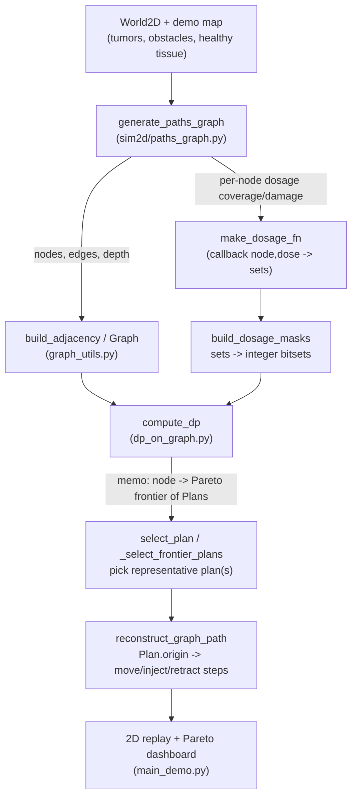
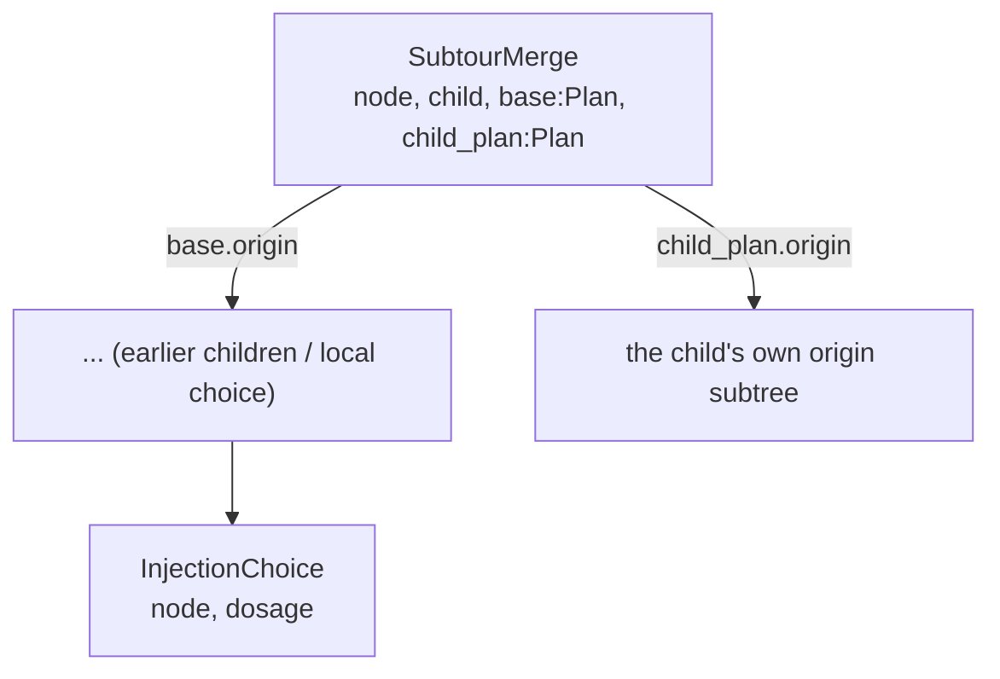
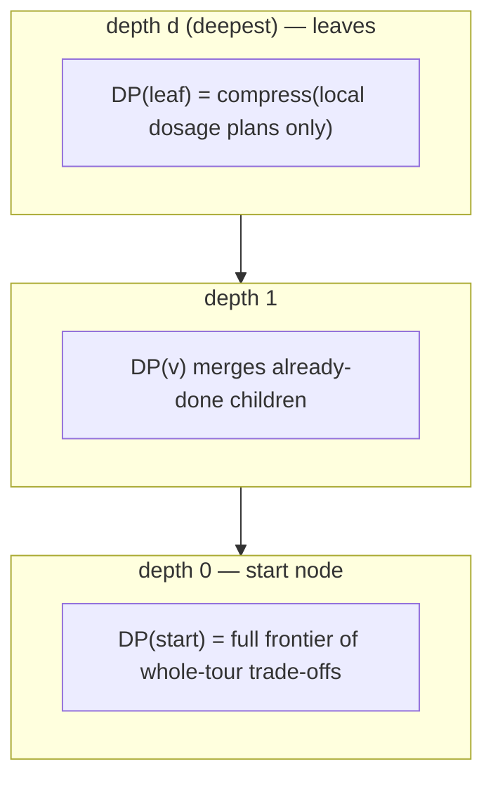
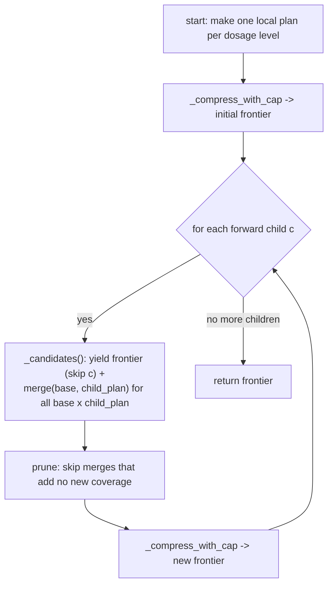
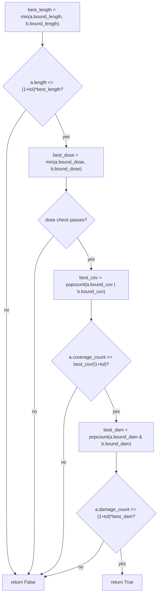
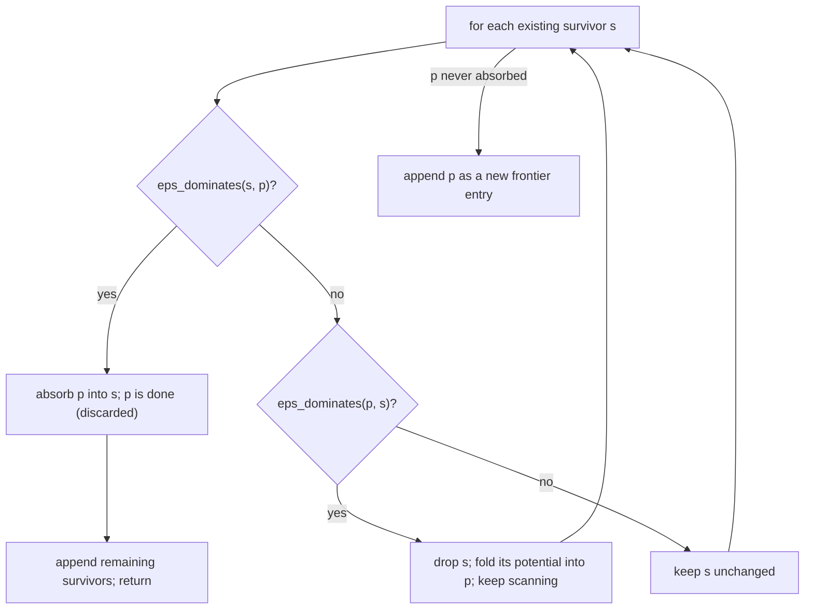
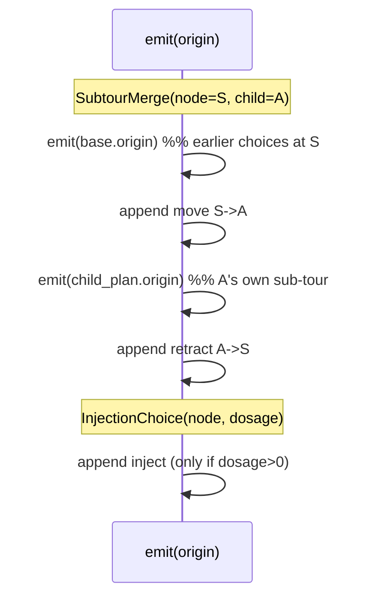
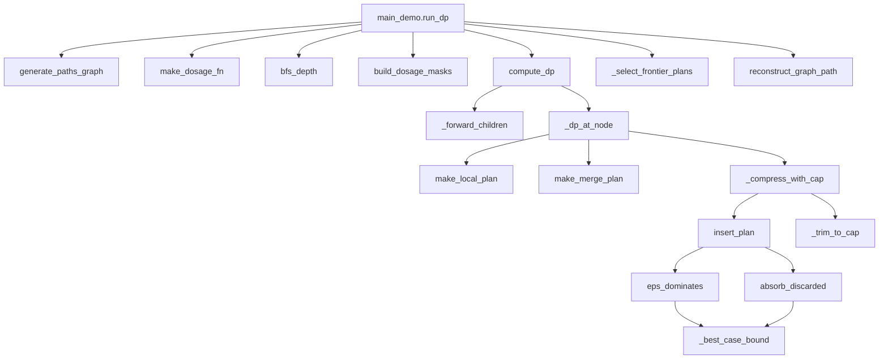
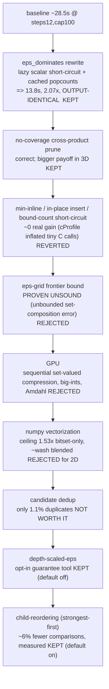

# Bottom-Up DP Therapy Planner — Complete Implementation Guide

This document explains the multi-objective dynamic-programming (DP) planner end to
end: the problem it solves, every data structure, every function and why it is
called, the recurrence, the subtle ε-dominance / bound machinery, the complexity,
and the full history of acceleration attempts (including the ones that failed and
*why*). It is written to be defended line-by-line.

Core files:
- `pareto_dominance.py` — pure math: `Plan`, ε-dominance, frontier compression. No graph/geometry.
- `dp_on_graph.py` — the DP itself: recurrence, memoization, path reconstruction. No geometry.
- `sim2d/paths_graph.py` — builds the roadmap graph + per-node dosage coverage/damage.
- `main_demo.py` — glue: world → graph → DP → select → visualize.

---

## 1. The problem

A steerable needle moves through tissue on a discrete roadmap. At chosen nodes it
can **inject** a dose of medicine. Each injection is a disk: it **treats** tumor
cells inside it (good) but **damages** healthy cells inside it (bad). We want a
*tour* (go out along the roadmap, inject at some nodes, retract back) that trades
off four competing objectives. There is no single best plan — there is a **Pareto
frontier** of non-dominated trade-offs.

### The four objectives

| Objective | Type | Direction | Composition when merging a sub-tour |
|---|---|---|---|
| `length` | float (hops) | minimize | adds (`base + child + round_trip`) |
| `coverage` | set of tumor cells (bitset) | **maximize** (set-inclusion) | **union** |
| `damage` | set of healthy cells (bitset) | minimize (set-inclusion) | **union** |
| `dose_count` | int | minimize | adds |

The two set-valued objectives composing by **union** is the single most important
fact in the whole design — it drives the bitset representation and it is the reason
several acceleration ideas fail (see §9).

### Physical / cost model

- The roadmap is a **layered DAG**: every edge is one motion primitive, cost `1`
  (`EDGE_HOP_COST = 1.0`). Visiting a child sub-tour and coming back is a **round
  trip** of cost `2.0`.
- Dosage `d` → disk radius `r(d) = 0.5 + 0.25·d` (single disk; same radius treats
  tumor and damages healthy — see `dosage_to_radius`). `d = 0` means no injection.

---

## 2. End-to-end pipeline



Who orchestrates this: `main_demo.run_dp` (the production path) calls
`generate_paths_graph` → `make_dosage_fn` → `bfs_depth` → `build_dosage_masks` →
`compute_dp` → `_select_frontier_plans` → `reconstruct_graph_path`. The one-call
convenience wrapper `generate_dp_plan_on_graph` does the same for a single plan.

---

## 3. Data structures

### 3.1 `Plan` (`pareto_dominance.py`) — the central object

A frozen, slotted dataclass. One candidate sub-tour rooted at a node.

```
Plan
├─ node                                  # which graph node this sub-tour is rooted at
│  actual objective values:
├─ length: float
├─ coverage: int        # tumor-cell bitset
├─ damage: int          # healthy-cell bitset
├─ dose_count: int
│  optimistic "bound" counterparts (see §6):
├─ bound_length, bound_coverage, bound_damage, bound_dose_count
│  cached popcounts of the ACTUAL bitsets (perf, see §8):
├─ coverage_count, damage_count
└─ origin: InjectionChoice | SubtourMerge   # how this plan was built -> path replay
```

**Why bitsets (Python big integers)?** Coverage/damage are *sets* of grid cells.
Storing them as integers lets union = `|`, intersection = `&`, and cardinality =
`int.bit_count()` — all single C-level operations. Composition (`base | child`) is
exactly the union the recurrence needs. Each cell gets one **global** bit index
(assigned in `build_dosage_masks`) so the same cell is the same bit in every plan,
which is what makes `|` across plans meaningful.

### 3.2 Origin types — the reconstruction tree



- `InjectionChoice(node, dosage)` — a **leaf**: "at `node` I chose `dosage`
  (0 = no injection); visited no children."
- `SubtourMerge(node, child, base, child_plan)` — "extend `base` (what was already
  decided at `node`) by going to `child`, running `child_plan` there, retracting."

The origin field makes a `Plan` a small **tree** that records the exact decisions,
so `reconstruct_graph_path` can replay it into physical steps.

### 3.3 `EpsVec` — per-objective approximation tolerance

`length_tol, coverage_tol, damage_tol, dose_count_tol` (fractions; 0.0 = exact
Pareto, 0.5 = "within 50% is close enough"). Separate per objective because they
live on wildly different scales (hops vs. thousands of cells vs. small ints).

### 3.4 `DosageMaskMap`

`node -> { dosage_level -> integer bitset }`. Two of them: one for coverage, one
for damage. Built once by `build_dosage_masks` before the DP runs.

### 3.5 `Graph`, `GraphPath`, `GraphPathStep` (`graph_utils.py`)

Geometry-free containers. `Graph` = nodes tuple + adjacency mapping. `GraphPath` =
the final ordered list of `GraphPathStep`s (`move` / `inject` / `retract`, each
with node/dosage info) used for 2D replay.

---

## 4. The recurrence (the heart of it)

For a node `v` with forward children `c1..cm`:

```
DP(v) = compress(
            { local dosage plan at v for each dosage level }      # visit no child
          ∪ { merge(base, child_plan)                             # visit a child
              for each child c, each base in the running frontier,
              each child_plan in DP(c) }
        )
```

- A **local plan** is "arrive at `v`, pick a dosage, go nowhere." `length = 0`
  (the cost of *reaching* `v` is paid by `v`'s parent via the round trip).
- A **merge** glues a child's already-computed sub-tour onto the current frontier:
  `length` adds + round trip 2.0, `coverage`/`damage` union, `dose_count` adds.
- **compress** throws away ε-dominated plans, leaving the Pareto frontier.

Because children are merged one at a time and the frontier carries the result
forward, after processing `c1..cm` the frontier implicitly contains **every subset
of children to visit** (skip-or-visit each), Pareto-compressed — without ever
enumerating subsets explicitly.

Processed **deepest-first**, so `DP(c)` is always finished before `DP(v)` needs it,
and each node is computed **exactly once** (memoized), no matter how many parents
reference it.



---

## 5. Function-by-function walkthrough

### 5.1 `bfs_depth(graph, start_node)`
Plain BFS giving each node its edge-distance from start. Provides the deepest-first
order. (On the real roadmap the depth already comes out of `generate_paths_graph`;
this exists for standalone/test use.)

### 5.2 `build_dosage_masks(graph, dosage_fn, dosage_levels)`
Two passes:
1. Call `dosage_fn(node, d)` for all nodes/doses; collect **every** coverage point
   and **every** damage point seen anywhere.
2. Assign each point a fixed global bit index (sorted → deterministic). Re-encode
   each node/dose's point set as an integer bitset.

Returns `(coverage_masks, damage_masks)`. This is what turns slow set operations
into fast integer bit operations, and guarantees union compatibility across plans.

### 5.3 `_forward_children(graph, depth)`
Filters each node's out-edges to **strictly-deeper** ones (`depth[child] ==
depth[node]+1`). The roadmap records an edge for *every* primitive move, including
moves that land back on a shallower/already-seen node (quantization collisions).
Those would break deepest-first ordering, so we drop them — recovering a clean
**layered DAG** that matches the "go deeper, then retract" model.

### 5.4 `make_local_plan(...)` and `make_merge_plan(...)` (`pareto_dominance.py`)
Constructors. A fresh plan has `bound_* == actual` and cached popcounts computed
once. `make_merge_plan` does the union/add composition and wraps a `SubtourMerge`
origin; `make_local_plan` wraps an `InjectionChoice` origin (`dose_count = 1` if
dosage > 0 else 0).

### 5.5 `_dp_at_node(v, ...)` — one node's frontier



Key detail — the **no-coverage prune** (`child_plan.coverage | base_coverage ==
base_coverage`): if visiting the child adds zero new tumor cells, the merge is
Pareto-dominated by `base` (same coverage, ≥ length, ⊇ damage, ≥ doses) and `base`
is already a candidate, so the merge can never survive. Skipping it is free
correctness *and* speed. `_candidates` is a **generator** so the up-to-`F×F`
candidates are produced lazily, never all held in memory at once.

### 5.6 `eps_dominates(a, b, eps)` — does `a` make `b` redundant?



It checks whether `a` is within tolerance of the **joint best-case** of `(a, b)` on
every objective. At **eps = 0** this degenerates to ordinary 4-objective Pareto
dominance: coverage superset, damage subset, length ≤, dose ≤. The cheap scalar
checks (length, dose) run first so a failure skips the expensive wide-bitset
OR/AND/popcount (this ordering is the main banked speedup, §8). A **zero** joint
best on coverage/damage/dose forces `a` to match exactly (you cannot grant a
tolerance around zero).

### 5.7 `_best_case_bound(a, b)` and `absorb_discarded(survivor, discarded)` — the bound machinery

This is the subtle part the instructor will probe.

`_best_case_bound` = `(min length, union coverage, intersection damage, min dose)`
computed on the **bound** fields — the optimistic best case if you had both plans.

When `survivor` dominates `discarded` and `discarded` is pruned, we do **not** just
delete it: `absorb_discarded` returns the survivor with its **bound** fields
widened to the joint best-case. Actual values, popcounts, and origin are unchanged
— it is still the same plan. Future dominance checks read the bounds, so the
survivor "remembers" the potential of everything pruned into it.

**Why?** ε-dominance is **not transitive**. Without carrying bounds forward, a
chain of ε-prunings could drift: B is pruned by A, C is pruned by B, and C ends up
far worse than A. Carrying the absorbed potential makes pruning *conservative* —
the survivor must out-dominate the accumulated optimistic potential of everything
it represents, preventing over-pruning. At eps = 0 bounds equal actuals and this is
a no-op.

### 5.8 `insert_plan(survivors, p, eps)` — one step of compression



Three outcomes per survivor: `s` dominates `p` (absorb `p`, stop), `p` dominates
`s` (drop `s`, fold into `p`, continue), or neither (keep both). This is the per-
plan kernel used by both `compress` and `_compress_with_cap`.

### 5.9 `compress` vs `_compress_with_cap`
- `compress` (in `pareto_dominance.py`): insert every plan; unbounded result size.
- `_compress_with_cap` (in `dp_on_graph.py`): same, but whenever the survivor list
  grows past `2 × cap` it calls `_trim_to_cap` immediately. This keeps every
  insertion cheap — otherwise a loose ε lets the *mid-run* frontier balloon to
  thousands before any final cap helps.

### 5.10 `_trim_to_cap(plans, cap)`
If over `cap`, sort by `(-coverage_count, damage_count, length, dose_count)` and
keep the top `cap`. **This is a hard, lossy heuristic cut** (it does *not* absorb
the dropped plans' bounds) — the one approximation in the system that is not
ε-controlled. See §9 for why we couldn't replace it with something principled, and
§10 for its current setting.

### 5.11 `compute_dp(...)` — the driver
Optionally depth-scales ε (§9). Builds `_forward_children`, sorts nodes
deepest-first, then loops calling `_dp_at_node` and storing each result in `memo`.
Optional progress counter. Returns `memo` (node → frontier).

### 5.12 `select_plan` / `_select_frontier_plans`
`memo[start]` is the whole-tour Pareto frontier — many trade-offs. `select_plan`
(default) picks max coverage, tie-break min length. The demo's
`_select_frontier_plans` instead picks **three** representatives — Max Coverage,
Min Damage, Min Length — each the true best-in-category plan among "treated"
plans (`dose_count > 0`). The only exclusion is the trivial "never inject"
plan every frontier contains (it trivially wins length/damage/dose-count by
doing nothing); without excluding it, Min Damage and Min Length would both
degenerate to that single no-op plan instead of a real treatment trade-off.
(An earlier version gated Min Damage/Min Length to a "high-coverage pool"
within a fixed percentage of best coverage — dropped because a hard
percentage cutoff silently mislabeled the picks: "Min Damage" wasn't always
the frontier's true minimum-damage plan, just the minimum within an arbitrary,
undisclosed subset, and it could degenerate to a single plan when the
frontier had a gap near the top of the coverage distribution.)

### 5.13 `reconstruct_graph_path(plan, start_node, seed)`
Recursively unfolds `plan.origin` into ordered physical steps:



Concrete trace — visit children A then B at S (dosage 0 at S):
`[move S→A, A's steps, retract A→S, move S→B, B's steps, retract B→S]`. That is the
correct physical "go deeper, inject, retract" order, recovered purely from the
origin tree.

---

## 6. ε-dominance + bounds: worked example

Two plans at the same node, eps_cov = 0.5:
- `A`: coverage = {1,2,3,4} (count 4), damage = {7,8} (count 2), length 10, dose 1
- `B`: coverage = {1,2} (count 2), damage = {7} (count 1), length 12, dose 1

Does `A` ε-dominate `B`? Joint best = (len 10, cov {1,2,3,4} count 4, dam {7} count 1, dose 1).
- length: 10 ≤ 1.5·10 ✓
- dose: 1 ≤ 1.5·1 ✓
- coverage: A.count 4 ≥ 4/1.5 = 2.67 ✓
- damage: A.count 2 ≤ 1.5·1 = 1.5 ✗ → **A does not dominate B** (A damages too much).

So both survive — a genuine trade-off (A covers more but damages more). If instead
A had damage {7} too, A would dominate B, and `absorb_discarded(A, B)` would widen
A's bounds to remember B's potential.

---

## 7. Call graph



---

## 8. Complexity & the cost equation

Let `n` = nodes, `b` = children per node, `F` = frontier size per node, `W` =
bitset width (universe size in cells).

- Per node, per child: build `F × F` merge candidates; inserting each scans up to
  `~F` survivors; each `eps_dominates` does wide-bitset work `O(W/64)`.
- ⇒ **`O(F³ · W/64)` per child**, total ≈ **`O(n · b · F³ · W/64)`**.

The `F³` (frontier size cubed) is the dominant term and the real scalability risk.
`F` is governed by ε and the cap. `W` is small-ish in 2D (tumor universe modest;
damage universe ~ whole map ≈ thousands of bits) but **explodes in 3D** (millions
of voxels) — see §9/§10.

---

## 9. Acceleration attempts — what worked, what failed, and why

This is the section to own. We were rigorous: every change had to **preserve the
validity of the approximated solution** (it stays a valid ε-approximation; the
reported path's cured/damaged cells are always exact), and we **measured**
everything against a frozen output hash and a benchmark.



### 9.1 ✅ `eps_dominates` rewrite — the one real win (2.07×, output-identical)
- Check the **cheap scalar** objectives (length, dose) first and bail early.
- Compute the expensive coverage-OR / damage-AND + popcount **lazily**, only if the
  scalars pass.
- **Cache** each plan's actual-value popcounts (`coverage_count`, `damage_count`)
  at construction; `absorb_discarded` carries them for free.
- Result: 28.5s → 13.8s on the bench, byte-identical output (verified by hash).

### 9.2 ✅ No-coverage cross-product prune
Skip merges where the child adds no new coverage (§5.5). Correct; modest in 2D,
larger in 3D where coverage saturates.

### 9.3 ✅ Depth-scaled ε (`scale_eps_for_depth`, opt-in, default off)
A bottom-up DP re-applies ε-compression at every level, so per-node error
**compounds**: the root is a `(1+ε)^depth` approximation, not `(1+ε)`. To get a
clean global `(1+ε)` you shrink the per-node tolerance to `ε' = (1+ε)^(1/depth) −
1` (the classic Ibarra–Kim/Hansen FPTAS trimming rule). This is available via
`--depth-scaled-eps`; off by default because tighter ε ⇒ bigger frontier ⇒ slower,
and it only gives a *clean* end-to-end bound when the cap isn't truncating.

### 9.4 ❌ Micro-optimizations that didn't pay (reverted)
Inlining `min()`, mutating `insert_plan` in place, and a cached-bound popcount
short-circuit all measured as **no real gain**. Lesson: cProfile inflates the
apparent cost of tiny high-frequency C calls (`min`, `append`) — they look
expensive under the profiler but are nearly free in wall time. We reverted them to
keep the code clean.

### 9.5 ❌ ε-grid frontier bound — proven a *trick* (the big one)
**Idea:** replace the arbitrary cap with a principled ε-grid: bucket each objective
geometrically by `(1+ε)`, keep one representative per grid cell → frontier size
bounded by ε, not an arbitrary number.

**Why it fails (proven, see `scratchpad/epsilon_grid_proof.md`):** the grid keys on
coverage/damage **counts**, but the DP composes coverage by **union**, which
depends on *which* cells, not how many. Two plans with equal coverage count but
**disjoint** cell-sets collide in one grid cell; keeping the wrong one makes a
parent's realized union off by an **unbounded** factor that ε cannot control
(counterexample: a depth-`d` comb where the optimum covers `Θ(d·k)` cells but the
grid keeps `Θ(k)`). The `absorb`/bound machinery does **not** rescue this, because
`make_merge_plan` reads *actual* sets, not bounds. Spatial locality of injection
disks makes the bad case *common*, not exotic. **Rejected** — we keep the existing
set-aware `eps_dominates` (which compares against the actual union and is therefore
sound).

**Deep consequence:** with exact sets you **cannot** have provable-bound + exact-
sets + speed simultaneously. Pick two. We chose exact sets + speed, with the cap as
a (lossy, labeled) safety valve.

### 9.6 ❌ GPU — wrong tool for this workload
The dominant cost is **Pareto compression**: irregular, data-dependent, branch-
divergent, with `absorb_discarded` creating sequential read-modify-write
dependencies. Python big-int bitsets have **no GPU type** (you'd pad to fixed-width
arrays at full universe size = the memory bomb in scarce GPU memory). And node-level
parallelism hits **Amdahl's law** — the heaviest nodes are the *few* near the root,
so there's little parallelism exactly where the time is. GPU rejected; if ever
parallelizing, CPU multiprocessing across same-depth nodes is the right shape.

### 9.7 ❌ numpy vectorization of the dominance scan — measured ceiling too low
Microbenchmark (`scratchpad/micro_vec.py`): numpy batch dominance vs the Python
loop on realistic widths.
- Mixed regime: numpy **0.88×** (slower) — because Python **short-circuits** on the
  cheap length/dose checks and never touches the wide damage bitset, while numpy
  does the full popcount unconditionally.
- Forced bitset-heavy regime: numpy **1.53×** — the *ceiling*, and only for the
  dominance op (not construction/absorb/trim).
Blended over a real mix it nets ≈ a wash, for a large, bug-prone, hard-to-keep-
identical rewrite. **Rejected for 2D.** KEY insight: numpy's (and roaring's)
advantage over big-ints **grows with bitset width**, so this is a **3D lever**
(millions of voxels), not a 2D one.

### 9.8 ❌ Candidate dedup — too few duplicates
Instrumented the real run: only **1.1%** of merge candidates are exact duplicates.
Deduping would save ~1% of inserts while the key-building costs more. Not worth it.

### 9.9 ✅ Practical lever: tune ε (the 13× you observed)
On the real map, all-ε = 0.5 ran ~40 min but all-ε = 0.6 finished in ~3 min (~13×),
because the natural frontier explodes right around 0.5. A coarser ε is still a
**valid** ε-approximation — parameter tuning beats further 2D code surgery. (This
interacts with the cap setting — see §10.)

### 9.10 ✅ Child-reordering (strongest-first merge order) — a real, modest win, with one honest caveat

**Idea:** `_dp_at_node` merges a node's children into the running frontier one at
a time, left-to-right through `children_of[v]`. The *final* frontier is not
order-dependent in the way you might fear (see the caveat below for the one place
it actually is) — but the *work* to reach it is. `insert_plan` rejects a
dominated newcomer immediately (cheap); a newcomer that *dominates* an existing
survivor causes that survivor's eviction plus an `absorb_discarded` call (more
work). So: merge the children whose plans are likely to *win* first, and weaker
children's later candidates tend to get dominated on first contact instead of
surviving into the frontier and being evicted once something better shows up.

**Implementation** (`_child_order_key` in `dp_on_graph.py`): before the merge
loop, sort a node's children by their *best already-computed plan* — reusing the
exact ranking `_trim_to_cap` already uses (`-coverage_count, damage_count,
length, dose_count`) — since every child's `memo[c]` is already fully computed
by the time a node processes it (deepest-first order guarantees this). Free to
compute: no new bitset work, just a comparison over each child's small
already-existing frontier. Controlled by `--no-reorder-children` (default:
reordering **on**).

**Measured** (real 2D map, steps=15, uncapped, eps=0.5 on all four objectives):

| | reorder off (original order) | reorder on (strongest-first) |
|---|---|---|
| Frontier size at start | 38 | 36 |
| Total `eps_dominates` comparisons | 4,973,616 | 4,675,342 (**−6.4%**) |
| Wall time | 3.76s | 3.54s (**−6.4%**) |

A real, positive, but *modest* win — consistent with this project's own §9.4
lesson that not every theoretically-sound idea pays off big in wall time. This
one does pay off, just not transformatively; it's a genuine "the constant factor
gets a bit smaller," not a complexity-class change.

**The honest caveat — eps-dominance is not transitive, so order can change *which*
valid frontier you get.** With exact dominance (`eps=0` on all four objectives),
dominance is a strict partial order (built from transitive subset/superset/`≤`
relations), so the *set* of final survivors is provably order-independent. But
this project's real, practical ε is never 0 — and `eps_dominates`'s tolerance
relaxation is **not guaranteed transitive** (A eps-dominates B, B eps-dominates C,
does not imply A eps-dominates C). Since `insert_plan` is a greedy incremental
algorithm over pairwise checks, a non-transitive relation means the *specific*
survivor set that greedy convergence lands on can depend on insertion order.
Measured directly: at eps=0.5 on the reference map, `reorder=True` converges to a
36-plan frontier and `reorder=False` to a 38-plan frontier — different plans, not
a subset/superset of each other, but **both are fully valid eps-approximate
Pareto frontiers** (every survivor passed the same `eps_dominates` check; nothing
was cut for size reasons the way the cap is). This is the same category of
"harmless approximation variation" §11 already documents for eps/cap in general —
reordering doesn't introduce a new kind of unsoundness, it just means you land on
a different (equally valid) member of the family of eps-valid frontiers than the
old graph-adjacency order did. **Practical upshot:** don't expect a frozen
output-hash benchmark to match byte-for-byte across a reorder toggle — compare
frontier *quality* (size, coverage/damage/length ranges), not exact plan
identity, when validating changes here.

---

## 10. The cap, and the current setting (important caveat)

`MAX_PLANS_PER_NODE` is the hard cap `_trim_to_cap` enforces. **It is currently set
to `100000`** in `dp_on_graph.py` — i.e. effectively *uncapped* for normal runs.
(The nearby code comment still says "cap=100"; that comment is now stale.)

Consequences to be ready to explain:
- With the cap effectively off, the frontier is the **pure ε-approximation** — no
  lossy truncation, so the result's *quality* is governed entirely by ε (good for
  validity).
- But the frontier can then **explode** when ε is small: this is exactly why ε =
  0.5 took 40 min on your real map (huge uncapped frontier) while ε = 0.6 took 3
  min. If you want a guaranteed time bound you lower the cap (accepting the lossy
  trim); if you want guaranteed quality you keep it high and tune ε.

---

## 10a. Running in 3D (`main_demo_3d.py --algo dp`, 2026-07)

`dp_on_graph.py` and `pareto_dominance.py` needed **zero code changes** to run
in 3D — direct confirmation of the "geometry-free" design this doc has argued
for throughout. `sim3d` supplies the same three inputs the DP planner has
always needed, just built from voxels instead of grid cells:

- Node keys: 4-tuples `(x, y, z, orientation)` instead of 2D's 3-tuples —
  irrelevant to `dp_on_graph.py`, which only ever treats `node` as an opaque
  `NodeId`.
- `coverage_masks`/`damage_masks`: bitsets over integer voxel indices
  `(ix, iy, iz)` instead of float cell centers `(x, y)` — see
  `sim3d.paths_graph3d.compute_dosage_coverage_and_damage_for_xyz`, which
  mirrors `sim2d.paths_graph.compute_dosage_coverage_and_damage_for_xy`
  exactly (same `dosage_to_radius` non-decreasing-radius contract).
- `depth`: `bfs_depth` runs unchanged over the 3D lattice's adjacency.

The one thing that *did* need new code was upstream of the DP planner: 3D had
no dosage levels or healthy-tissue damage concept at all before this (it only
supported single-radius IRIS-style coverage), so `sim3d/world3d.py` gained a
`healthy_mask` + `compute_healthy_mask()` mirroring `World2D`'s, and
`sim3d/paths_graph3d.py` gained the dosage-aware coverage/damage scan.

**Bitset scale, revisited:** the deferred-to-3D roaring/sparse-bitset lever
(§9, "Deferred to the 3D build") turned out not to be needed at the demo
scale — `World3D`'s default `[-15,15]^3` volume at `tumor_cell_size=1.0` is
only ~27,000 voxels, nowhere near the "millions of voxels" scenario that
motivated deferring roaring bitsets. Dense Python-int bitsets stay the right
representation unless someone shrinks the voxel cell size drastically; revisit
roaring only if that happens.

---

## 10b. Parameters -> time estimates (living reference)

Runtimes here are wildly sensitive to map, dimension, step count, and eps --
sensitive enough that a fixed number written into a code comment goes stale or
actively misleads (see the eps row below). Don't put timing numbers in code;
add a dated row here instead, with the exact params that produced it.

**Reference benchmark** (use this map/start for any new 3D timing row, so
rows stay comparable): `outputs/demo3d_seed0_steps10` map -- 1 box obstacle +
1 ball tumor (see `sim3d/demo_map3d.py`), start `(6, 0, -1)`, orientation
index 13, seed 0.

### 3D graph generation (`generate_paths_graph_3d`, DP-mode scan)

| steps | step_size | nodes | time (pre-windowing) | time (post-windowing, 2026-07) |
|---|---|---|---|---|
| 5 | 1.0 | 1,949 | 1.19s | 0.34s |
| 6 | 1.0 | 6,002 | 3.77s | 1.34s |
| 7 | 1.0 | 15,753 | 9.88s | 4.30s |
| 8 | 1.0 | 35,212 | -- | 9.04s |
| 10 | 1.25 | 99,570 | 92.74s | 29.77s |

"Windowing" = slicing the coverage/damage scan to a bounding box around each
node instead of the whole voxel grid (`World3D.window_bounds`, added 2026-07).
Node count still grows ~exponentially with `steps` regardless -- this only
makes each node cheaper, it doesn't change the growth curve.

### 3D DP compression, eps sensitivity (reference benchmark, steps=10/step_size=1.25, max_plans_per_node uncapped)

| eps (all 4 tolerances equal) | DP time | total (+29.77s graph gen) | frontier @ start |
|---|---|---|---|
| 0.5 | 523.65s | 553.42s | (see run.log) |
| 0.6 | 650.40s | 680.17s | 228 |
| 0.7 | 268.09s | 297.86s | 169 |

**This is the important finding that prompted this section.** In 2D (§9.9),
raising eps from 0.5 to 0.6 gave a clean ~13x speedup on a map where the
frontier "explodes" right around 0.5 -- monotonic and predictable. In 3D, on
*this* map, eps=0.6 is slower than eps=0.5, and eps=0.7 is faster than both.
**The eps-vs-runtime relationship is not monotonic and does not transfer
across dimensions/maps.** Do not assume a lever that worked once will work
again elsewhere -- measure on the actual map before recommending an eps
value, and record the result here.

### Other maps (not the reference benchmark -- recorded for general calibration only)

These rows use a *different* obstacle/tumor layout than the reference
benchmark above (the map editor overwrites `sim3d/demo_map3d.py` per-run), so
node counts and times below are **not** directly comparable to the tables
above -- only useful as rough order-of-magnitude data points across runs.

| date | map | steps | step_size | eps (all 4) | nodes | edges | graph gen | DP time | total |
|---|---|---|---|---|---|---|---|---|---|
| 2026-07-05 | user map: 2 box obstacles + 2 ball tumors, start (6,0,-1), ori 13, seed 0 | 10 | 1.5 | 1.0 | 83,004 | 240,078 | 42.08s | 85.91s | 127.99s |

eps=1.0 is well above the 0.5-0.7 range tested on the reference benchmark, and
this is the fastest DP time recorded so far -- consistent with "more
tolerance -> smaller frontier -> faster" in the cases where that relationship
holds, but per the finding above, don't assume it'll hold on every map.

### 10c. Where the time (and the frontier) actually go within one run (2026-07-25)

A full-scale 3D run generated via the map editor GUI -- `--algo dp --steps 12
--step-size 1.0 --seed 0 --start-x 6.0 --start-y 0.0 --start-z -1.0
--start-orientation 13 --eps-len 1.0 --eps-cov 1.0 --eps-dam 1.0 --eps-ndose
1.0`, 193,551 nodes, 666,035 edges, uncapped, reordering on -- gives the first
full six-phase breakdown at real scale (from that run's own `dp_stats.json`):

| phase | time | % of 897.1s total |
|---|---|---|
| `dp.compute` | 611.9s | 68% |
| `graph.generate` | 130.5s | 15% |
| `dp.masks_build` | 98.6s | 11% |
| `dp.dashboard_render` | 38.4s | 4% |
| `dp.replay` | 17.7s | 2% |
| `dp.select_frontier` | 0.004s | 0% |

Two things worth internalizing from this run's `dp_node_stats.csv` (193,551
rows, one per node):

- **The cost is extremely concentrated.** Sorting nodes by `time_seconds`
  descending, the priciest 1% of nodes account for 88% of all `dp.compute`
  time; the priciest 0.1% alone already account for 44%. This is not evenly
  spread "slow roadmap" cost -- it is a small number of genuine hot-spot nodes.
- **The hot spots sit in the middle of the tree, not at the root.** Both total
  comparisons and *peak local Pareto-frontier size*, aggregated per BFS depth,
  spike sharply around depth 5-6 of this 12-layer roadmap (local frontier size
  up to 144) before shrinking back down toward the root, where the final
  frontier is only 36 plans. Mid-tree nodes are expensive because they have
  already accumulated real trade-off diversity (unlike near-leaf nodes, whose
  frontier is trivial) *and* still have several children left to merge in
  (unlike the root, where $\vec\varepsilon$-compression on the way up has
  already collapsed most of that diversity back down). This is exactly the
  phenomenon §9.10's child-reordering optimization targets -- it doesn't
  remove this hot spot, only shrinks it, because merging the strongest child
  first lets weaker candidates from later children get dominated (and
  discarded) quickly instead of surviving into a growing running frontier that
  every subsequent child's candidates must then be compared against.
- The no-coverage candidate prune (§9.2) discards 30.1% of all candidates
  across the whole run, but is depth-dependent: least effective exactly at
  the expensive depth-5-6 layers (most children still contribute *some* new
  coverage there), most effective near the leaves (little left to newly
  cover).

None of this is a bug: dominance/compression is precisely why the frontier
*shrinks* from a local peak of 144 back down to 36 by the time it reaches the
root. But compression can only shrink what survives an `eps_dominates` check
-- it cannot avoid the cost of running that check on every candidate that
*doesn't* survive, and that per-candidate cost scales with the size of the
running frontier at the moment the candidate arrives. A smarter dominance
data structure (e.g. a spatial index over the eps-grid) was investigated and
found provably unsound under set-union composition (§9.5) -- this
concentration is the accepted cost profile of the greedy incremental
compression this project uses, not an oversight.

The full run's `dp_stats.json`/`dp_node_stats.csv`/dashboard/GIFs are
preserved under `examples/full_run_3d_steps12/` for anyone who wants to
reproduce this analysis (or reopen the dashboard) without recomputing.

---

## 11. Validity guarantee (what is and isn't exact)

- **Always exact:** the *output path's* cured/damaged cells. They are recomputed
  from the real injection list during reconstruction — the planner never fabricates
  coverage. Whatever plan it returns is a real, physically valid tour.
- **Approximated:** *which* plans survive compression (ε-dominance) and, if the cap
  bites, which are truncated. This affects *optimality* (you may get a near-best
  trade-off instead of the exact-best), never *validity*.

This separation is the crux: ε and the cap trade optimality for speed; they never
make the reported solution wrong.

---

## 11a. Profiling & instrumentation (every DP run, automatically)

Every `--algo dp` run (2D via `main_demo.py`'s `run_dp`, 3D via
`main_demo_3d.py`'s `build_world_and_path`) now writes two extra files into its
output directory alongside `path.json`/`dashboard.gif`/etc., built from the same
`DPStats`/`NodeStats` instrumentation in `dp_on_graph.py`:

**`dp_stats.json`** — aggregate view: per-phase wall time (`timing_seconds`:
`graph.generate`, `dp.masks_build`, `dp.compute`, `dp.select_frontier`,
`dp.replay`, `dp.dashboard_render`; 2D additionally breaks out `world.build` and
`map.render`, its own demo-map setup steps that 3D has no equivalent of), total
`eps_dominates` comparisons, candidates built vs. skipped by the no-coverage
prune (§9.2), peak and mean frontier size, peak memory (`tracemalloc`, scoped to
just the `compute_dp` call — real allocator activity, not a hand-rolled
object-size guess), and the 10 most expensive nodes by both wall time and
comparison count — the direct, per-run answer to "where did the time actually
go," rather than relying on the general map/steps-based estimates in §10b. Note
`total_time_seconds` is scoped to just the `compute_dp` call itself (same value
as `timing_seconds["dp.compute"]`), not a sum across all phases — the dashboard
render step is typically the single largest phase in a full run, so summing
would be misleading as a "DP cost" figure.

**`dp_node_stats.csv`** — one row per node (`node`, `depth`, `num_children`,
`local_frontier_size`, `final_frontier_size`, `peak_frontier_size`,
`candidates_built`, `candidates_skipped_no_coverage`, `comparisons`,
`plans_inserted`, `plans_absorbed`, `plans_rejected`, `time_seconds`) — the full
detail behind the JSON's top-10 samples, for anyone who wants to plot e.g.
frontier size vs. depth, or confirm the "few shallow nodes near the start
dominate runtime" claim (§8) on their own map.

`outputs/runs_index.csv` also gained five columns shared by both dimensions:
`dp_time_seconds`, `dp_total_comparisons`, `dp_peak_frontier_size`,
`dp_peak_memory_mb`, `dp_reordering_enabled` — so trends across many runs (e.g.
"does the eps=0.6 dip in §10b's 3D table hold on other maps too?") are a
spreadsheet filter away instead of re-opening each run's `dp_stats.json`
individually. (`_append_run_index` detects an out-of-date header from before
these columns existed and safely rolls the old file aside rather than silently
misaligning columns — see its docstring in `main_demo.py`.)

None of this instrumentation changes `compute_dp`'s actual behavior — `stats`
is a plain optional parameter that `insert_plan`/`compress`
(`pareto_dominance.py`) and `_dp_at_node` (`dp_on_graph.py`) update as a side
effect of work they were already doing (an extra integer increment per
comparison, one `NodeStats` object per node), not something that changes which
comparisons happen or which plans survive.

---

## 12. One-paragraph summary (for the viva)

We solve a 4-objective (length ↓, tumor-coverage ↑, healthy-damage ↓, dose-count ↓)
tour-planning problem with a bottom-up DP over a layered roadmap DAG. Each node's
value is the Pareto frontier of sub-tours rooted there, built by merging children's
frontiers and ε-compressing. Coverage/damage are bitsets composed by union;
dominance is ε-approximate with a conservative "bound" carry-forward to handle ε's
non-transitivity. We accelerated the inner dominance check ~2× (lazy scalar short-
circuit + cached popcounts, output-identical) and proved that the tempting ε-grid
frontier bound is unsound under set-union composition, that GPU/vectorization don't
pay in 2D (short-circuit beats batch; the win is a 3D lever), and that ε-tuning is
the practical speed knob. Validity of the returned path is always exact; ε and the
cap trade only optimality for speed.
