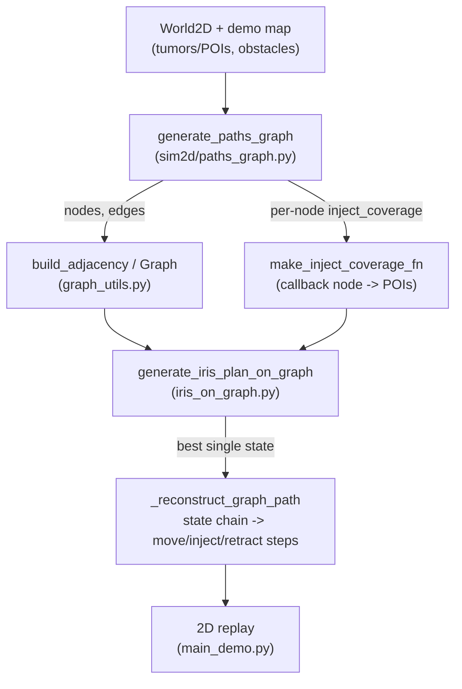
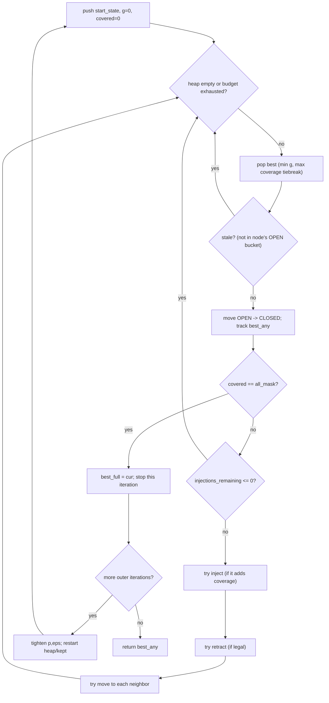
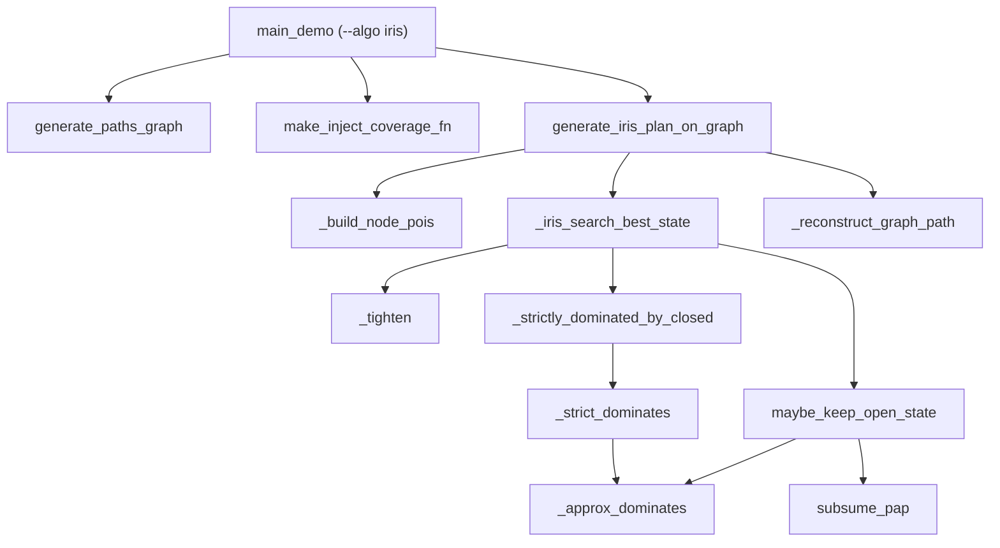

# Graph-IRIS Inspection Planner — Complete Implementation Guide

This document explains the `IrisPlanner` in `iris_on_graph.py` end to end: the
problem it solves, the paper it implements (and what it deliberately omits), every
data structure, every function and why it is called, the search algorithm, the
approximate-dominance machinery, and how it differs from the DP planner in this
repo. It is written to be defended line-by-line.

Core file:
- `iris_on_graph.py` — the whole planner: dominance, best-first search, path
  reconstruction. Geometry-free (works over any `Graph[NodeId]` + `coverage_fn`).

Related:
- `random_path_on_graph.py` — the naive baseline (random walk + periodic inject).
- [`DP_THERAPY_PLANNER.md`](DP_THERAPY_PLANNER.md) — the other planner in this repo,
  solving a *different, harder* problem (4-objective Pareto tours) over the same
  `Graph`/`GraphPath` plumbing. Read §9 of this doc for the comparison.

---

## 1. The problem

`IrisPlanner` implements the **graph inspection planning** half of:

> "Toward Asymptotically-Optimal Inspection Planning via Efficient Near-Optimal
> Graph Search" (Fu et al., arXiv:1907.00506)

The paper's full method densifies a roadmap (RRT/RRG) *and* searches it. This repo
**only implements the search** — the roadmap graph is assumed given (built
upstream by `sim2d/paths_graph.py`, same as the DP planner uses).

**Setup:** an agent moves over a roadmap graph `G`. Each vertex `v` has an
inspection set `S(v)` (a set of points-of-interest, POIs, visible/treatable from
`v`). A path `P` inspects the union `S(P) = ⋃_{v∈P} S(v)`. Unlike the DP planner,
here a POI is only "collected" when the planner takes an explicit **inject**
action at that node — moving through a node alone does not inspect it (a
repo-specific modeling choice, not in the paper).

### Objective (lexicographic, not multi-objective)

1. **Primary:** maximize the number of POIs covered.
2. **Secondary:** among plans achieving the same max coverage, minimize path
   length `g` (moves + injects + retracts, each cost 1).

This is the key contrast with the DP planner: IRIS returns **one** answer (a
best-effort optimum under this lexicographic order), not a Pareto frontier of
trade-offs. There is also a **finite injection budget**
(`MAX_INJECTIONS_PER_RUN`, default 7) — a repo-specific extension not in the
paper, needed because without it "inject everywhere" is trivially optimal for
coverage.

### Physical / cost model

- Every roadmap edge costs `1` (a **move**). **Inject** costs 1 and does not
  change position. **Retract** costs 1, pops one step off the move history (so
  you can only retract as far back as you've moved forward), and is only legal
  right after an inject or another retract.
- Heuristic `h ≡ 0` — the search is uniform-cost (Dijkstra-style best-first), not
  true A*. `g + h` in the priority tuple is therefore always just `g`.

---

## 2. End-to-end pipeline



Orchestrated by `main_demo.py` with `--algo iris`: `generate_paths_graph` →
`make_inject_coverage_fn` → `IrisPlanner.generate_iris_plan_on_graph` → 2D replay.

---

## 3. Data structures

### 3.1 `POI` / `CoverageBits`

A POI is any opaque, hashable value — `(x, y)` float tuples in 2D, `(ix, iy, iz)`
voxel indices in 3D. `_build_node_pois` used to hardcode `(float(p[0]),
float(p[1]))`, silently truncating 3-tuples and crashing on non-numeric POIs;
this was fixed (2026-07) to treat POIs as fully opaque, matching the
dimension-agnostic claim this doc always made. `CoverageBits` is a Python
big-int bitset over a **fixed POI index order** — same trick as the DP planner
(`build_dosage_masks`), for the same reason: `|` = union, `.bit_count()` =
cardinality, both O(1) C-level ops. Built once by `_build_node_pois` before
search starts.

### 3.2 `_State` — one search node

A frozen dataclass; one entry in the best-first search frontier.

```
_State
├─ node                        # current graph node
├─ g: int                      # path cost so far (realized)
├─ covered: CoverageBits       # POIs actually inspected so far (realized)
│  the Potentially-Achievable Path (PAP) summary — see §5.7:
├─ pap_g: int                  # <= g
├─ pap_covered: CoverageBits   # >= covered (superset)
├─ injections_remaining: int   # budget countdown
├─ trail: Tuple[NodeId, ...]   # move history, for retract
├─ last_action                 # "start"|"move"|"inject"|"retract"
├─ from_parent                 # which primitive produced this state (None at root)
└─ parent: Optional[_State]    # reconstruction link
```

`covered`/`pap_covered` mirror the DP planner's `Plan.coverage`/`bound_coverage`
split: `covered` is the exact realized value, `pap_*` is the optimistic bound
carried forward when a dominated state is pruned (see §5.7) — same *purpose* as
the DP planner's `bound_*` fields, same reason (ε/p-dominance is not
transitive), different name because this comes from a different paper.

### 3.3 OPEN/CLOSED partitions and the priority queue

`open_by_node`/`closed_by_node: Dict[NodeId, List[_State]]` — per-node lists of
states still eligible for expansion / already expanded, using **identity**
(`is`) membership checks. Global best-first ordering is a `heapdict` (`open_pq`,
keyed by the `_State` object itself), which supports real O(log n) removal —
replacing an earlier heapq + "lazily skip stale entries" pattern. `_State` is
declared `@dataclass(frozen=True, eq=False)` specifically so it hashes/compares
by **identity**, not by field values: the auto-generated structural hash would
recurse through `trail` and the whole `parent` chain (O(depth) per heapdict
op), and — more importantly — could let two distinct search branches that
happen to be field-identical silently collide as one heapdict key. This is
where (ε,p)-dominance pruning and PAP-subsumption happen (§5.5, §5.6).

---

## 4. The algorithm

Best-first search (a min-heap keyed on `(g+h, -covered.bit_count(), g, seq)`,
so among equal-cost states the one covering more is expanded first) with:

- **Approximate dominance** pruning within OPEN at each node (keeps the frontier
  small — this is the "efficient" part of "efficient near-optimal graph search").
- **Strict dominance** pruning against CLOSED (a new state that a finished state
  already strictly beats is discarded immediately, no PAP bookkeeping needed).
- An **outer loop** that runs the whole search `MAX_OUTER_ITERS` times, tightening
  `(p, ε)` toward `(1, 0)` (exact) each iteration — the paper's anytime/
  progressively-exact scheme.



### 4.1 Why an outer tightening loop at all?

A single search at loose `(p, ε)` is fast but only *approximately* optimal. Rather
than pick one fixed tolerance, the algorithm runs several full searches, each
starting from scratch with a tighter tolerance, and keeps the best solution seen
across all of them (`best_any`). Early loose iterations prune aggressively and
finish fast; later tight iterations (closer to exact dominance) are slower but
more accurate. This trades a constant multiplicative factor in runtime (× number
of outer iterations, default 3) for a fully anytime-tightening quality guarantee.

---

## 5. Function-by-function walkthrough

### 5.1 `_tighten(p, eps, f)`
One step toward exact: `p ← p + f·(1−p)` (climbs to 1), `eps ← eps + f·(0−eps)`
(decays to 0). `f` (`TIGHTENING_F`, default 0.05) is the step size — small `f` ⇒
many small steps ⇒ slow convergence but each outer iteration's search stays cheap
(dominance stays loose for longer, so the frontier stays small).

### 5.2 `_build_node_pois(graph, coverage_fn)`
Same two-pass pattern as the DP planner's `build_dosage_masks`: collect every POI
seen at any node, assign each a fixed global bit index (sorted → deterministic),
then re-encode each node's POI set as a `CoverageBits` bitset. Returns
`(node_masks, all_mask)` where `all_mask` is "every bit set" (the goal test).

### 5.3 `_approx_dominates(g_a, covered_a, injections_remaining_a, g_b, covered_b, injections_remaining_b, epsilon, p)`
The (ε,p)-dominance test from the paper, plus a repo-specific injection-budget
guard:

1. `injections_remaining_a < injections_remaining_b` → **False** immediately (extension: a state with fewer
   injections left can never dominate one with more — it would be a dead end for
   further coverage gains).
2. `g_a > (1+ε)·g_b` → **False** (cost check).
3. Otherwise compute `union = covered_a | covered_b`; **True** iff
   `covered_a.bit_count() >= p · union.bit_count()` (a covers at least a
   `p`-fraction of what the pair could jointly cover), or trivially **True** if
   the union is empty.

At `p=1, ε=0` this is exactly **strict dominance**: `a` needs `g_a <= g_b` and
`covered_a ⊇ covered_b` (union test degenerates to superset when `p=1`).

### 5.4 `_strict_dominates(...)`
Calls `_approx_dominates` with `epsilon=0.0, p=1.0`. Used only for CLOSED-set
pruning (§5.6), which is meant to be a cheap, exact "already strictly beaten"
check — no need for the tolerance machinery there.

### 5.5 `maybe_keep_open_state(kept, s, epsilon, p)` — insert into OPEN with pruning
Two passes over the node's current OPEN list, mirroring `insert_plan` in the DP
planner:

1. **Does an existing OPEN state dominate `s`?** If yes, `s` is discarded, but its
   PAP is *subsumed* into the dominator (`subsume_pap`, §5.7) and that updated
   dominator is re-returned so the caller can re-push it onto the heap (critical:
   see the note below).
2. **Otherwise**, sweep OPEN and drop every state `s` dominates, folding each
   dropped state's PAP into `s` via `subsume_pap` as it goes; keep everything
   else; append the (possibly PAP-enriched) `s`.

**Subtlety flagged in the code:** `subsume_pap` returns a **new** frozen `_State`
when it changes anything. If case 1 fires and the dominator's PAP actually
changes, the *old* heap entry for that dominator is now stale — the function
returns the updated state precisely so the caller re-pushes it, otherwise the
improved PAP would sit in the OPEN bucket but never get expanded (the heap only
knows about the object identity it was pushed with).

### 5.6 `_strictly_dominated_by_closed(bucket, s)`
Scans `bucket.closed` and rejects `s` if any already-expanded state at this node
strictly dominates it. This is checked **before** a candidate state is even
offered to `maybe_keep_open_state`, for inject, retract, and move successors
alike — cheap early rejection of provably-useless states.

### 5.7 `subsume_pap(dst, src)` — the bound-carrying operator
The paper's `⊕` operator for combining a survivor's path-pair with a pruned
state's: `pap_g ← min(dst.pap_g, src.pap_g)`, `pap_covered ← dst.pap_covered |
src.pap_covered`. Returns `dst` unchanged if nothing actually changed (avoids
spurious new objects / heap churn). Exact same *role* as the DP planner's
`absorb_discarded`: without carrying this forward, (ε,p)-dominance is not
transitive and pruning could drift arbitrarily far from optimal over a chain of
prunings.

### 5.8 `_iris_search_best_state(...)` — the search driver
Implements Algorithm 1 of the paper. Per outer iteration: fresh heap, fresh
`kept` buckets, push `start_state`. Loop while the heap is non-empty and under
`MAX_EXPANSIONS`:

- Pop the best; skip if stale (not present in that node's OPEN bucket — a cheap
  identity check, `_is_in_open`, replaces explicit heap decrease-key support).
- Move it OPEN → CLOSED; update `best_any` if it covers more (or ties on coverage
  with lower cost).
- **Goal check:** `covered & all_mask == all_mask` → full coverage found, stop
  this iteration's search (`best_full = cur; break`).
- If no injections remain, this state can never improve coverage further — skip
  expansion entirely (`continue`).
- Otherwise try, in order: **inject** (only if it would add at least one new POI
  — an inject that changes nothing is pointless and would just be dominated by
  its own parent), **retract** (only if `last_action` was inject/retract and the
  trail has ≥2 entries), **move** (to every graph neighbor, unconditionally).
- Each successor goes through `_strictly_dominated_by_closed` then
  `maybe_keep_open_state` before being pushed onto the heap.

After the loop, if a full-coverage state was found this iteration, it becomes the
new `best_any`. Then `p, eps` tighten and the next outer iteration starts from
scratch (fresh heap/kept — `best_any` is the only thing carried across
iterations).

### 5.9 `generate_iris_plan_on_graph(...)` — public entry point
Validates parameters (`p ∈ (0,1]`, `eps >= 0`, budgets `> 0`), resets the timing
counters, builds `(node_masks, all_mask)`. **Edge case:** if there are no POIs
anywhere (`all_mask == 0`), returns a trivial zero-step path immediately — no
search needed. Otherwise runs `_iris_search_best_state` and reconstructs the
winning state chain into a `GraphPath`.

### 5.10 `_reconstruct_graph_path(last, seed, start_node)`
Walks `parent` pointers from the winning state back to the root, reverses, then
replays `from_parent` on each transition into a `GraphPathStep`:
- `"move"` → `action="move"`, `node=prev`, `next_node=cur` (post-move position
  recorded explicitly, matching the DP planner's `GraphPathStep` convention).
- `"inject"` → `action="inject"`, `node=cur` (no dosage field — legacy binary
  inject, contrast with the DP planner's `dosage` levels).
- `"retract"` → `action="retract"`, `node=prev` (pre-retract position),
  `previous_node=cur` (post-retract position) — deliberately the *opposite*
  node/previous_node convention from `"move"`; see the docstring note in
  `graph_utils.GraphPathStep`.

### 5.11 `_trail_dominates(trail_a, trail_b)` and `allow_retract` (2026-07)

Dominance based only on `(g, coverage, injections_remaining)` is **unsound**
once retract is allowed: two states can tie on those three fields while having
been reached via different move histories (`trail`), and pruning one in favor
of the other silently discards whichever *retract options* only the pruned
trail had. `_trail_dominates(trail_a, trail_b)` gates dominance on: trail heads
matching, and for every node `v` on `trail_b`, a cheap-enough hybrid path
(retract partway along `trail_a` to a shared anchor, then walk forward along
`trail_b`) reaching `v` within `(1 + TRAIL_DOMINANCE_EPSILON)` of `trail_b`'s
own retract-only cost. `_approx_dominates`/`_strict_dominates` take a
`check_trail_dominance` flag that's only `True` when `allow_retract=True` (no
retracting ⇒ trail history is irrelevant ⇒ skip the check entirely).

**Performance caveat:** `_trail_dominates` is expensive (worst-case
`O(trail_length²)` per dominance check, called on every OPEN/CLOSED
comparison), and real coverage-seeking searches with `allow_retract=True`
(the default) can become dramatically slower than before this was added —
in one real-map test, a search that took ~0.03s with `allow_retract=False`
did not finish in 30s with retract (and therefore trail-dominance) enabled.
`generate_iris_plan_on_graph(..., allow_retract=False)` is a fast escape hatch
that skips retract states (and trail-dominance) entirely — this is exactly why
`main_demo_3d.py` defaults its own `--retract` flag to *off*. If 2D runs feel
slow after this change, try `allow_retract=False` first.

---

## 6. Worked example — why the injection-budget guard matters

Two states at the same node, `p=0.8, ε=0`:
- `A`: `g=5`, `covered` = 3 POIs, `injections_remaining=0`
- `B`: `g=5`, `covered` = 2 POIs, `injections_remaining=2`

Without the `injections_remaining_a < injections_remaining_b` guard, `_approx_dominates(A, B, ...)` would return
**True** (same cost, `A` covers a superset once `p·union ≤ |covered_a|`) and `B`
would be pruned. But `B` can still reach new POIs via its 2 remaining injections;
`A` cannot reach any more, ever. Pruning `B` here would be **unsound** — the
paper's original (ε,p)-dominance doesn't have this failure mode because it
doesn't model a finite injection budget at all; this repo added the guard
specifically to keep dominance sound under that extension.

---

## 7. Call graph



---

## 8. Complexity

Let `n` = nodes, `b` = out-degree, `K` = injection budget, `O` = OPEN bucket size
per node (governed by `(p, ε)`), `iters` = `MAX_OUTER_ITERS`.

- Each expansion does O(1) inject/retract successors plus `b` move successors;
  each successor pays `O(O)` for dominance scanning against that node's OPEN
  bucket, plus `O(closed size)` against CLOSED.
- Total expansions per outer iteration are bounded by `MAX_EXPANSIONS`
  (default 1,000,000 — a hard safety valve) but in practice by
  `n × (states distinguishable at that node under the current tolerance)`.
- Total cost ≈ `iters × expansions × (b + O)`. Tighter `(p, ε)` in later
  iterations grows `O` (fewer states look "the same"), so later iterations are
  the expensive ones — mirrors the DP planner's ε/frontier-size tradeoff.

---

## 9. IRIS vs. the DP planner — same repo, different problem

Both planners share `Graph`/`GraphPath`/`GraphPathStep` (`graph_utils.py`) and the
same "move / inject / retract" primitive vocabulary, and both use an (ε- or
(ε,p)-)approximate dominance test with a bound-carrying absorb/subsume operator
to keep pruning sound. Beyond that they solve genuinely different problems:

| | IRIS (`iris_on_graph.py`) | DP (`dp_on_graph.py`) |
|---|---|---|
| Objectives | 2, **lexicographic** (coverage, then length) | 4, **simultaneous Pareto** (length, coverage, damage, dose_count) |
| Output | one best-effort state | a whole frontier of trade-offs; caller picks |
| Search shape | best-first over the *whole* graph (cycles allowed via retract-to-any-visited-node) | bottom-up DP over a **layered DAG** (BFS-depth-filtered edges), each node solved once |
| Coverage composition | union, per inject action | union, per node visited (`Plan.coverage`) |
| "Damage" concept | none | first-class objective (`Plan.damage`) |
| Approximation knob | `(p, ε)` with an outer tightening schedule toward exact | fixed per-run `EpsVec`, optional depth-scaling (`scale_eps_for_depth`) |
| Frontier cap | none (bounded implicitly by `MAX_EXPANSIONS` and dominance pruning) | explicit `max_plans_per_node` (now `Optional[int]`; `None` = uncapped) |

If you only need "visit as much as possible, as cheaply as possible" with no
notion of collateral damage, IRIS is the right tool and is generally cheaper (2
objectives vs. 4, single answer vs. a frontier). If you need the length/coverage/
damage/dose trade-off surface, use the DP planner.

## 10. Running in 3D (`main_demo_3d.py --algo iris`, 2026-07)

Runs unchanged over `sim3d`'s lattice: `coverage_fn` supplies `(ix, iy, iz)`
voxel-index POIs instead of 2D's `(x, y)` float tuples, and `_build_node_pois`
(§5.2, fixed 2026-07) treats both as fully opaque, so nothing here needed to
change for 3D. `allow_retract` defaults to `False` in both `main_demo.py` and
`main_demo_3d.py` — trail-dominance (§5.11) is expensive enough that real
coverage-seeking search can be dramatically slower with retract on; pass
`--retract` to opt back in.
